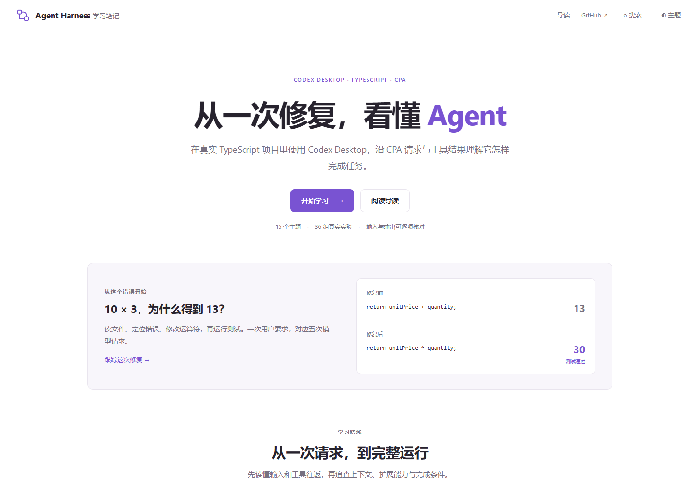

# Codex 的一次完整运行

在一个真实 TypeScript 小项目里使用 Codex Desktop，沿 CPA 日志看清模型收到了什么、工具怎样执行，以及任务为什么能够完成。

[开始学习](https://chrichuang218.github.io/agent-harness-notes/) · [讲义导读](https://chrichuang218.github.io/agent-harness-notes/#/guide) · [真实修复时间线](https://chrichuang218.github.io/agent-harness-notes/#/lesson/03-agent-loop?section=agent-loop-timeline) · [Hooks 专章](https://chrichuang218.github.io/agent-harness-notes/#/lesson/10-hooks) · [实验起始项目](examples/01-baseline/README.md)

[](https://chrichuang218.github.io/agent-harness-notes/)

项目起初把单价 10 元和数量 3 相加，输出 13 元；测试要求得到 30 元。教程从一句“你好”开始，经过读取文件和修复错误，再在同一个项目里学习上下文、规则、技能、MCP、计划和协作。

## 阅读路线

首页按四个阶段展示 16 个主题及每章的问题。章节采用左目录与正文两栏，当前章的小节直接显示在左侧；沿主文看操作、结果与解释，需要时再展开“深入核对”。内嵌工作台提供完整输入输出。

第 3 章提供修复时间线。五次请求分别展示模型收到什么、提出什么调用，以及结果进入了哪一次请求；节点上的链接直接定位对应证据。完整日志可以展开、复制和下载。

| 阶段 | 章节 |
| --- | --- |
| 看懂一次运行 | [01 请求与提示词](course/01-request.md) · [02 工具系统](course/02-tools.md) · [03 Agent Loop](course/03-agent-loop.md) |
| 信息从哪里来 | [04 任务与会话](course/04-session.md) · [05 上下文管理](course/05-context.md) · [06 AGENTS.md](course/06-agents.md) · [07 Skills](course/07-skills.md) · [08 记忆](course/08-memory.md) |
| 扩展能力与控制执行 | [09 MCP](course/09-mcp.md) · [10 Hooks](course/10-hooks.md) · [11 权限](course/10-permissions.md) · [12 Plan Mode](course/11-plan.md) · [13 多 Agent](course/12-multi-agent.md) |
| 完成复杂任务与复盘 | [14 目标与续跑](course/13-autonomy.md) · [15 流式输出](course/14-streaming.md) · [16 架构与验证](course/15-architecture.md) |

[术语与实例](GLOSSARY.md)用于查阅字段和概念。

## 跟着做一次

需要 Codex Desktop、Node.js 24 或更高版本，以及已经转发 Desktop 请求并开启日志的 CPA。

1. 把 [examples/01-baseline](examples/01-baseline) 复制到自己的独立目录。
2. 在复制后的目录运行下面的命令，确认起始故障。
3. 将目录加入 Codex Desktop 项目区，新建任务，发送“你好”，从[第一章](course/01-request.md)开始对照请求。

```powershell
npm ci
npm start
npm run typecheck
npm test
```

起始程序输出 13，类型检查通过，测试以 `13 !== 30` 失败。第 3 章修复这个错误，后续分别提供[修复版](examples/07-fixed/README.md)、[MCP 版](examples/13-mcp/README.md)和[折扣版](examples/14-discount/README.md)作为对照。

Hooks、后台命令、补丁恢复和文字进度的脚本与测试见[运行状态练习](examples/runtime-lab/README.md)，其中分别提供起始文件和结果文件。

每章会说明所用任务和项目状态。复现时的措辞、调用次数可能变化，需要对照自己的输入、文件和执行结果。

## 怎样对照日志

[实验索引](evidence/desktop-lab/index.json)关联 43 组实验、110 个请求阶段，其中 3 次为预热。每个阶段可以查看客户端请求、CPA 上游请求、流式事件、完成事件和输出项。

截图展示操作和结果，工作台可切换请求、输出、工具往返和完整文件。判断工具是否执行、文件是否改变，还需要核对本地事件、文件内容与退出码。

第 10 章集中讲解 Hooks：先区分它与 AGENTS、Skills 的作用，再沿配置与信任状态，观察提交时的编号注入、工具执行前的补丁拦截和执行后的结果记录。第 14 章继续观察后台进程回收和补丁错误恢复。

[第 8 章](course/08-memory.md)先看项目文件笔记，再追踪一条偏好的原生记忆提取、整合与新任务召回。整合前的“不知道”和整合后的开关对照都有对应请求；可以沿记忆摘要查到答案的来源。

`output-items.json` 从流式事件中提取完整输出项。有些完成事件的 `output` 为空，回答和工具调用仍可在此前的流式事件中找到，第 15 章会解释它们的关系。

## 本地阅读与贡献

在本仓库根目录运行：

```powershell
npm ci
npm run dev
```

网站使用 Vite、Markdown 和按需加载的证据文件。[course/catalog.json](course/catalog.json)定义章节顺序，`course/` 保存正文，`evidence/desktop-lab/` 保存实验证据。

欢迎补充另一个版本的复现结果，或指出某段解释与证据不符。提交问题时，请附章节、操作、实际结果及脱敏后的相关片段。

[发布记录](CHANGELOG.md) · [维护记录](PROGRESS.md)
