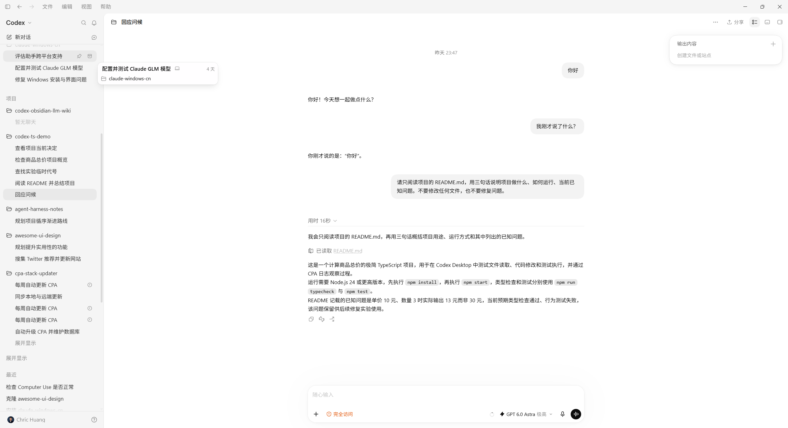
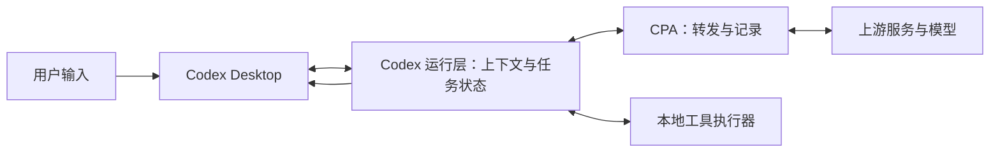

# 只说一句“你好”，实际发送了什么？

输入框里只有一句“你好”，实际请求却已经带上工具定义、开发者指令、技能目录、规则和环境。本章沿着这一次交互，从 Desktop 的输入输出一直拆到请求里的每一项，先建立阅读后续工具循环所需的坐标。

你可以直接阅读本章的公开证据，也可以将[初始 TS 项目](../examples/01-baseline/README.md)作为独立项目加入 Codex Desktop，在新任务中复现。先保留项目里的计算错误；本章不读代码、不运行测试。

## 一次最小操作

在项目中新建任务，通过 Desktop 输入框发送：

```text
你好
```

本次输入由 Computer Use 操作输入框完成。它进入请求时是普通 `user` 消息；另一个任务通过委派工具传入的内容可能有不同包装，不能混作这个样本。



这是用户提供的真实 Desktop 截图，包含本教程前三轮：问候、追问上一句话、读取 README。截图说明界面展示了什么；下面用 CPA 记录确定每轮实际发送了什么。第三轮在界面中出现读取动作，对应第 3 章的工具调用与回传，不能据截图把前三轮都算成“每轮只有一个模型请求”。

界面最终显示：

> 你好！今天想一起做点什么？

## 从界面到模型，中间有哪些职责？

下图按职责组织，不代表每个框都是独立进程。Desktop 接收输入并显示回答；Codex 运行层组织上下文、保存会话并安排工具；CPA 转发和记录模型流量；上游服务处理请求并返回模型输出。本章网络日志不能单独证明各职责在本机映射到哪几个进程。



这次还没有走到本地工具执行分支。模型只返回问候，运行层把它交给界面。后面读取文件时，才会看到“模型提出调用 → 本地执行 → 结果再次送给模型”。

## 两个网络阶段，各自做了什么？

CPA 记录了 1 次预热和 1 次正式请求，没有模型主动发起的工具调用。预热带有 `generate: false`，单独列出，不计入本章正式请求统计。

| 阶段 | 请求内容 | 模型输出 | 调用与结果的位置 |
| --- | --- | --- | --- |
| `00-prewarm` | 2 项：工具定义与基础开发者指令，`generate: false` | 没有生成输出项 | 没有 `call_id`，也没有工具回传；[请求](../evidence/desktop-lab/01-hello/00-prewarm.request.json)、[完成事件](../evidence/desktop-lab/01-hello/00-prewarm.response.json) |
| `01-request` | 完整初始上下文，共 7 项，最后是“你好” | 一项最终助手消息 | 无工具调用；正文来自[输出项完成事件的汇集](../evidence/desktop-lab/01-hello/01-request.output-items.json)，原始顺序见[事件](../evidence/desktop-lab/01-hello/01-request.events.json) |

两阶段的 `input[0]` 和 `input[1]` 深比较相同。正式请求再补上本次应用、规则、环境与用户输入，不是把预热请求当成一次用户问候。预热完成事件也报告 18,673 输入 token、0 输出 token，所以“没有生成文本”不等于“用量一定为零”。

预热[事件序列](../evidence/desktop-lab/01-hello/00-prewarm.events.json)只有 `response.created`、`response.in_progress`、`response.completed` 三项；正式问候的事件序列才出现消息与文本增量。这是区分两阶段的另一份直接证据。

| 本次正式请求 | 数值 |
| --- | --- |
| `input` 项数 | 7 |
| 输入 token | 32,774 |
| 输出 token | 13 |
| 工具调用 | 0 |

这些数值属于这次版本、规则和环境组合；你的结果可以不同。Token 是模型用量单位，这里不是费用估算。

## 先看外层：请求配置与消息内容分开放

[正式请求](../evidence/desktop-lab/01-hello/01-request.request.json)最外层有下面这些实际字段。这里按原值节选，省略 `input`、元数据等其他字段：

```json
{
  "type": "response.create",
  "model": "gpt-6-astra",
  "tool_choice": "auto",
  "parallel_tool_calls": false,
  "store": false,
  "stream": true
}
```

`type` 标识一次创建响应的请求；`model` 是客户端请求的模型标识；`stream: true` 要求流式返回。`tool_choice` 和 `parallel_tool_calls` 是工具调用配置，不是“已经调用了哪些工具”的记录。`model` 字段也不能单独证明上游实际部署身份。

**这份客户端请求没有顶层 `instructions` 字段，没有顶层 `tools` 字段，`input` 中也没有任何 `role: "system"`。** 不要为了套入某个通用聊天示例，凭空补出一条 system 消息。

本次工具放在 `input[0].tools`，应用行为指令放在多个 `developer` 消息中。完成事件的 `response.instructions` 为 `null`，`response.tools` 回显工具配置。请求里的缺失字段、响应里的空值、输入中的指令正文，是三个不同位置。

日常说的“系统提示词”有时泛指应用附加的所有规则，但读协议时必须保留实际角色。本章观察到的是 **developer 指令和客户端附加的 user 内容**；这不表示模型没有更高层约束，只表示这段可见请求里没有 system 角色。

## 7 项 input：逐项看来源和作用

`input` 是有序输入项数组，并非只有聊天消息。下面展开全部 7 项及消息中的全部 11 个 `content` 块；索引从 0 开始。

| 位置 | 实际类型与角色 | 记录中的内容 | 作用及来源判断 |
| --- | --- | --- | --- |
| `input[0]` | `additional_tools` / `developer` | 4 个工具命名空间的定义 | 告诉模型可提交哪些调用；它没有 `content` 数组 |
| `input[1].content[0]` | `message` / `developer`，块为 `input_text` | 以 `You are Codex, an agent based on GPT-6` 开头的基础说明 | 应用附加的工作方式、沟通与执行约定，不是项目 README |
| `input[2].content[0]` | `message` / `developer` | `<app-context>` | Desktop 特有能力、任务与面板等应用环境说明 |
| `input[2].content[1]` | 同上 | `<skills_instructions>` | 技能使用规则、根路径别名、可用技能名称、描述和文件位置 |
| `input[2].content[2]` | 同上 | `<permissions instructions>` | 本次文件系统与审批配置的文字说明；不能仅据文字证明某个操作实际被拦截 |
| `input[2].content[3]` | 同上 | `<collaboration_mode>` | 当前是 `Default` 模式，不是计划模式 |
| `input[3].content[0]` | `message` / `developer` | `<multi_agent_role>` | 当前 Agent 角色、委派和协作工具的运行说明 |
| `input[4].content[0]` | `message` / `developer` | `<multi_agent_mode>` | 本次多 Agent 使用约束；出现说明不等于已经创建子 Agent |
| `input[5].content[0]` | `message` / `user` | `<recommended_plugins>` | 可推荐、尚未安装的插件清单；不是已调用插件的结果 |
| `input[5].content[1]` | 同上 | `# AGENTS.md instructions` 与 `<INSTRUCTIONS>` | 这次组装进来的全局规则；第 4 章再加入项目规则做对照 |
| `input[5].content[2]` | 同上 | `<environment_context>` | 工作目录、Shell、日期、时区和工作区信息 |
| `input[6].content[0]` | `message` / `user` | `你好\n` | 本轮输入框实际提交的文字 |

这里有两个容易混淆的层次。`role` 是消息的协议角色，`content` 内的块是内容载体；其中的 `<app-context>`、`<INSTRUCTIONS>` 等标签是文本包装，不会把 `user` 变成 `system`。同一条 `input[5]` 把三个来源的内容打包在一起，不能只读 `role` 就认定它们全部由人手工输入。

来源的判断也有边界：网络记录直接证明这些文本已被组装进请求，具体由客户端哪个函数加载、是否经过缓存，不在这份 JSON 中。

`input[1].content[0].text` 的开头原文是：

```text
You are Codex, an agent based on GPT-6. You and the user share one workspace, and your job is to collaborate with them until their intended goal is completely handled.
```

后面包含 `Autonomy and persistence`、`Working with the user`、`Rules for getting work done`、`Using skills` 等章节，规定应用中的工作方式。这是本次 `developer` 正文的一部分。与之不同，`input[5].content[1]` 是本地 AGENTS 约定，`input[2].content[1]` 则是技能使用说明和目录。把三者都简称“系统提示词”，会失去它们的来源、所在角色以及何时进入请求这些关键信息。

## 工具定义已经存在，为什么工具调用还是 0？

`input[0].tools` 包含 `functions`、`clock`、`collaboration`、`mcp__cua_repl` 四个命名空间，里面共有 13 个可见工具条目。`functions` 中的 `exec` 是 `custom` 工具，接受按 grammar 描述的代码输入；`wait` 等则是 `function` 工具，带参数 schema。这里只数可见注册条目，不把 `exec` 能调用的下层能力也混进这个数量。

下面节选 `input[0].tools[0]`，只保留 `exec` 的几个原始字段，其他工具、描述和 grammar 正文省略：

```json
{
  "type": "namespace",
  "name": "functions",
  "tools": [
    {
      "type": "custom",
      "name": "exec",
      "format": { "type": "grammar", "syntax": "lark" }
    }
  ]
}
```

这解释了后面为什么会看到 `custom_tool_call` 的 `input` 是一段代码，而不是所有调用都长成 `function_call.arguments` 的 JSON 参数。先看本次注册的工具接口，再解释模型输出，才能避免把不同协议形态混在一起。

模型本次没有输出 `custom_tool_call` 或 `function_call`，因此工具调用仍然为 0。**定义描述“可以做什么”，调用表示“这次要求做什么”，执行结果才说明“实际发生了什么”。** 同理，技能目录在输入中，不等于所有技能文件都被读过。

## 在请求中找到“你好”

打开[正式请求](../evidence/desktop-lab/01-hello/01-request.request.json)，定位 `input[6]`。下面节选这一项的类型、角色和内容，省略消息 `id` 及其他请求项：

```json
{
  "type": "message",
  "role": "user",
  "content": [
    {
      "type": "input_text",
      "text": "你好\n"
    }
  ]
}
```

`role` 表示消息角色，`content` 是内容块数组。末尾的 `\n` 是样本里实际存在的换行。`input[6]` 从零计数，所以是第七项。

向前看，`input[0]` 是工具信息，其他项包含应用指令、技能目录、权限、项目环境及规则。先认出它们的存在，不必现在逐字读完。尤其注意：`input[5]` 也使用 `user` 角色，却是客户端附加的环境与规则，不能把每条 `user` 消息都当成人在输入框里亲手写的文字。

## 回复在哪里？

在[流式事件](../evidence/desktop-lab/01-hello/01-request.events.json)中搜索 `response.output_item.done`，可以找到那句问候。事件按顺序描述输出怎样形成；它们并非多轮独立回答。

该事件的 `item` 中，下面这些字段把“角色、阶段、文本”连接起来。这里节选原字段，省略内部元数据与文本块中的附加字段：

```json
{
  "type": "message",
  "role": "assistant",
  "phase": "final_answer",
  "content": [
    {
      "type": "output_text",
      "text": "你好！今天想一起做点什么？"
    }
  ]
}
```

用户输入使用 `input_text`，模型输出使用 `output_text`；它们共同属于消息内容块，但方向不同。`phase: "final_answer"` 表示这条助手消息在本次记录中是最终回答。后面还会看到 `commentary` 进度消息，以及不是消息文本的工具调用项。

这次[完成事件](../evidence/desktop-lab/01-hello/01-request.response.json)的 `response.output` 是空数组。它不表示没有回答，因为消息已出现在前面的输出事件里。为了便于阅读，我们另存了[输出项汇集](../evidence/desktop-lab/01-hello/01-request.output-items.json)，明确标注从事件提取；没有把推导内容补回原始完成事件。

## CPA 两侧和几种文件，怎样对应？

| 文件 | 内容 | 不能拿它替代什么 |
| --- | --- | --- |
| `request.json` | Codex → CPA 的请求正文 | 不包含 HTTP 认证头，也不代表客户端内部所有状态 |
| `upstream.json` | CPA → 上游的请求正文 | 不是额外的一次用户请求 |
| `events.json` | 客户端侧 `response.*` 事件与记录时间 | 多个 delta 不等于多次模型请求 |
| `response.json` | 原始 `response.completed` 事件 | 本样本不能只从其空 `output` 获取回答 |
| `output-items.json` | 从 `response.output_item.done` 收集的输出项 | 这是标注来源的衍生汇集，不冒充原始响应 |
| `manifest.json` | 线程、轮次、响应 ID、原文件行号及脱敏说明 | 它的统计和统一展示字段不是网络请求新增字段 |

对本章[客户端正式请求](../evidence/desktop-lab/01-hello/01-request.request.json)与[上游正文](../evidence/desktop-lab/01-hello/01-request.upstream.json)按 JSON 值比较，字段及内容相同；预热两侧也相同。这是本样本的结果，不沿用其他版本里“代理新增某个字段”的旧结论。两侧各记录一次转发，也不能把正式请求数从 1 算成 2。

## 现在能得出什么结论

已经观察到：Desktop 组织了一份带有额外上下文的请求，模型返回了文本。本章没有工具调用；工具定义出现在请求中，不代表工具已经执行。类似地，技能目录出现了，也不代表读取过每个技能正文。

CPA 展示经过代理的请求与响应，本地操作是否真的发生，后续还需要文件和执行结果佐证。公开 JSON 保留结构，移除了认证头，并对个人目录、凭据和部分标识脱敏；[实验清单](../evidence/desktop-lab/01-hello/manifest.json)记录了来源和处理方式。

阅读时先找到一个具体字段，再提出解释。截图适合确认界面行为，日志适合核对请求结构；两份材料回答的问题不同，可以相互补充。

## 自己定位一次

只打开本章正式请求，不看上面的表，为它画一张自己的输入地图：标出工具定义、应用开发者指令、AGENTS 规则、技能目录和真正的用户输入。再说明“这里没有 system 角色”与“这里没有任何应用规则”为什么是不同判断。

<details>
<summary>参考解释</summary>

工具定义在 `input[0].tools`；基础开发者指令在 `input[1]`，其他应用说明分布于 `input[2..4]`；技能目录在 `input[2].content[1]`；AGENTS 在 `input[5].content[1]`；输入框文字在 `input[6]`。本次没有 `role: "system"`，但有大量实际 `developer` 指令和客户端附加的规则文本。`input[5]` 与 `input[6]` 都是 `user` 角色，也不能因此把来源混在一起。

</details>

[回到首页](../README.md) · [下一章：再说一句话，怎样接着聊？](02-context.md)
