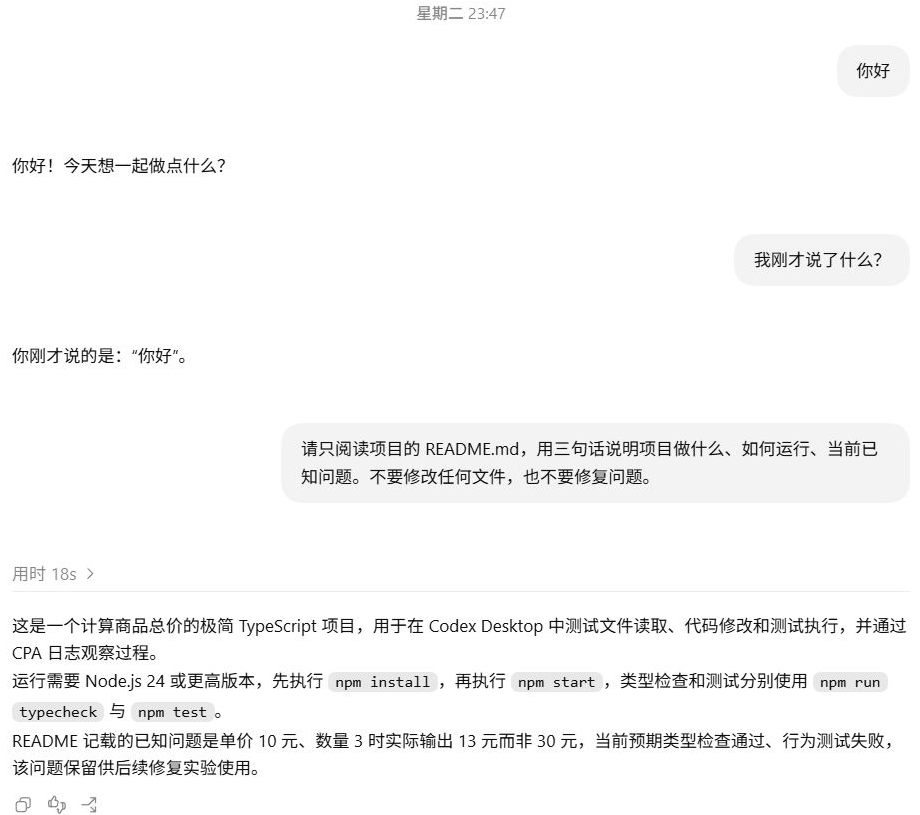

# 一次请求与提示词组装

在 `codex-ts-demo` 项目中新建任务，发送“你好”。界面上的回答很短：

> 你好！今天想一起做点什么？

打开[这次正式请求](../evidence/desktop-lab/01-hello/01-request.request.json)：输入框里只有一句问候，请求的 `input` 却有 7 项。其余内容从哪里来？

## 先对上界面里的消息



图中是重新打开的真实历史对话，本章对应第一轮问候，后两轮用于工具与会话的讲解。消息由 Computer Use 在输入框提交。[问候记录](../evidence/desktop-lab/01-hello/manifest.json)与实验者最初提供的[完整截图](../docs/images/desktop-hello-readme.png)仍可查阅。

问候位于 `input[6]`，也就是数组第七项。下面节选它的类型、角色和内容，省略消息 ID：

```json
{
  "type": "message",
  "role": "user",
  "content": [
    {
      "type": "input_text",
      "text": "你好\n"
    }
  ]
}
```

`role` 标识消息角色，`content` 保存内容块，`text` 是输入框里的具体文字，末尾换行也保留在记录中。

## 其余六项在告诉模型什么？

模型处理这句问候时，还会收到应用的工作说明、可用工具、项目环境等内容。它们在本次请求里的位置如下：

| 输入位置 | 内容 | 为什么一起发送 |
| --- | --- | --- |
| `input[0]` | 工具定义 | 描述可使用的接口和参数 |
| `input[1]` 到 `input[4]` | Codex 工作说明、Desktop 能力、技能目录、权限与协作说明 | 给出当前应用的工作方式和可用条件 |
| `input[5]` | 推荐插件、AGENTS 规则、工作目录等环境信息 | 提供本次任务所在环境的约定和背景 |
| `input[6]` | “你好” | 本轮要处理的用户输入 |

`input[5]` 也标为 `user`，里面却是客户端附加的规则和环境。`user` 这个标签不能单独证明文字来自输入框，要结合具体内容判断。

这份可见请求没有 `role: "system"` 消息。应用的主要工作指令出现在 `developer` 消息中，AGENTS 则在前述 `user` 消息的内容块里。日常讨论中的“系统提示词”可能泛指应用附加指令；核对日志时应保留这些实际角色和字段位置。

附加内容也可以来自运行时脚本。第 6 章的[编号 Hook 实验](06-agents.md)会追踪一个输入框中没有写出的编号：它由本地脚本生成，作为 `developer` 消息进入请求。

## 回复在哪份记录里？

工作台的“模型输出”可以找到那句问候，原文来自[输出项记录](../evidence/desktop-lab/01-hello/01-request.output-items.json)。它是一条助手消息，`role` 为 `assistant`，`phase` 为 `final_answer`。

这次没有工具调用。模型直接生成文字，运行程序将它显示在 Desktop 中。请求中的工具定义只提供可用接口，本轮没有使用它们。

本样本完成事件的 `response.output` 是空数组，文字已在前面的流式事件中返回。工作台从这些事件提取输出项，原记录仍然保留。第 14 章会解释这两种记录的关系。

<details>
<summary>深入核对：7 项输入里的所有内容块</summary>

### 消息与内容块的边界

`input[0]` 的类型是 `additional_tools`，它没有 `content` 数组。其余消息合计包含 11 个内容块。

| 位置 | 角色 | 实际内容 |
| --- | --- | --- |
| `input[0].tools` | developer | 4 个工具命名空间的定义 |
| `input[1].content[0]` | developer | 以 `You are Codex, an agent based on GPT-6` 开头的工作说明 |
| `input[2].content[0]` | developer | `<app-context>`，Desktop 能力说明 |
| `input[2].content[1]` | developer | `<skills_instructions>`，技能规则、名称、描述和位置 |
| `input[2].content[2]` | developer | `<permissions instructions>`，权限配置说明 |
| `input[2].content[3]` | developer | `<collaboration_mode>`，本次为 Default |
| `input[3].content[0]` | developer | `<multi_agent_role>`，当前 Agent 的协作角色说明 |
| `input[4].content[0]` | developer | `<multi_agent_mode>`，本次协作使用约束 |
| `input[5].content[0]` | user | `<recommended_plugins>`，推荐插件清单 |
| `input[5].content[1]` | user | `# AGENTS.md instructions` 与 `<INSTRUCTIONS>` 包装的全局规则 |
| `input[5].content[2]` | user | `<environment_context>`，工作目录、Shell、日期、时区等 |
| `input[6].content[0]` | user | `你好\n` |

其中 `<app-context>` 等标签是文本里的包装，不能据此更改消息的协议角色。此时 demo 尚未加入后续实验的项目 AGENTS 文件，因此规则块只有本次全局约定；第 6 章会比较加入项目约定后的变化。

工具定义位于 `input[0].tools`，包含 `functions`、`clock`、`collaboration`、`mcp__cua_repl` 四个命名空间，共 13 个可见工具条目。这里没有把外层 `exec` 能编排的下层能力算成额外注册条目。

### 请求级配置与来源

下面是本次请求的外层字段节选，其余字段可在工作台展开：

```json
{
  "type": "response.create",
  "model": "gpt-6-astra",
  "tool_choice": "auto",
  "parallel_tool_calls": false,
  "store": false,
  "stream": true
}
```

请求没有顶层 `instructions` 或 `tools`；完成事件的 `response.instructions` 为 `null`，`response.tools` 回显工具配置。这些位置要分别查看。`model` 是请求中的模型标识，单凭它无法确认上游实际部署身份。

[客户端请求](../evidence/desktop-lab/01-hello/01-request.request.json)与[CPA 上游快照](../evidence/desktop-lab/01-hello/01-request.upstream.json)的字段和值相同。它们说明 CPA 这一段链路上可见的数据，无法展示上游服务内部未记录的处理。

</details>

<details>
<summary>深入核对：预热、正式响应与用量</summary>

CPA 还记录了一次[预热请求](../evidence/desktop-lab/01-hello/00-prewarm.request.json)，其中 `generate: false`，只有工具定义与基础工作说明两项输入，没有生成普通回答。它们与正式请求的前两项深比较相同。

| 阶段 | 输入项 | 输入 token | 输出 token | 工具调用 |
| --- | ---: | ---: | ---: | ---: |
| 预热 | 2 | 18,673 | 0 | 0 |
| 正式问候 | 7 | 32,774 | 13 | 0 |

预热单独计数，没有混进正式请求数量。Token 是服务报告的用量单位，这组数字也受到当时规则和技能目录规模的影响。

[流式事件](../evidence/desktop-lab/01-hello/01-request.events.json)中的 `response.output_item.done` 保存了最终问候；[完成事件](../evidence/desktop-lab/01-hello/01-request.response.json)保留其原始空 `output`。[输出项文件](../evidence/desktop-lab/01-hello/01-request.output-items.json)注明它来自事件提取，具体来源和脱敏记录见[实验清单](../evidence/desktop-lab/01-hello/manifest.json)。

</details>

## 自己找到两条 user 消息

展开正式请求中的 `input[5]` 和 `input[6]`。它们的角色相同，但来源不同。各找一个内容特征，说明哪条来自输入框，哪条是客户端附加信息。

<details>
<summary>核对答案</summary>

`input[6]` 包含“你好”，与截图中的输入对应；`input[5]` 包含 AGENTS 规则、工作目录和环境标签。判断来源需要看内容，不能只凭 `role: "user"`。

</details>

[回到导读](introduction.md) · [下一章：工具系统](02-tools.md)
