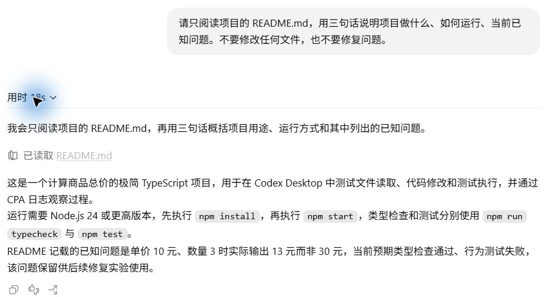

# 工具系统：谁读取了 README？

模型收到项目路径以后，还需要读取 README，才能根据它介绍项目。“你好”任务的第三轮提出了这个要求：

```text
请只阅读项目的 README.md，用三句话说明项目做什么、如何运行、当前已知问题。不要修改任何文件，也不要修复问题。
```

Desktop 随后显示一次读取操作，最终说明项目用于计算商品总价，并提到“应得到 30 元，实际输出 13 元”。这次没有运行程序，数字来自 README 的记载。



界面的“已读取 README.md”对应[本轮记录](../evidence/desktop-lab/03-readme/manifest.json)中的一次工具调用与返回。

## 文件内容在什么时候出现？

```text
请求模型介绍项目
    ↓
模型提出读取 README 的工具调用
    ↓
本地执行读取，取得文件正文
    ↓
把结果交给模型，再生成项目介绍
```

[第一份输出](../evidence/desktop-lab/03-readme/00-request.output-items.json)中的 `custom_tool_call` 要求执行读取。本机命令取得正文后，运行程序把结果放进[下一份请求](../evidence/desktop-lab/03-readme/01-request.request.json)，模型才据此生成介绍。因此，这一次用户输入产生了两次模型请求。

工具定义、调用和结果分别出现在不同位置：

| 对象 | 本次在哪里 | 它提供什么 |
| --- | --- | --- |
| 工具定义 | 初始请求的 `input[0].tools` | 可以调用的接口、用途和参数要求 |
| 工具调用 | 第一次模型输出中的 `custom_tool_call` | 本次要执行的具体动作 |
| 工具结果 | 第二次请求中的 `custom_tool_call_output` | 实际执行状态和读取到的内容 |

上一章的问候也带着工具定义；这次输出里出现了具体调用，运行程序才安排读取。

## 用同一个编号找到返回结果

在本轮第一次输出中，找到类型为 `custom_tool_call` 的项目。它的 `name` 是 `exec`，`call_id` 是：

```text
call_a288dLl8tyNv8JFlTJgNdtfK
```

再打开第二次请求，查看 `input[0]`。这一项的类型是 `custom_tool_call_output`，`call_id` 与上面相同。这个编号把模型提出的动作与运行程序交回的结果对应起来。

结果里有执行状态，也有 README 正文。解析 `input[0].output[1].text` 后，能看到 `exit_code: 0`，以及文件中的这句话：

```text
当前测试场景：单价为 10 元、数量为 3，预期总价为 30 元，程序实际输出 13 元。
```

退出码表明读取命令正常结束，回答中的数字来自 README。下一章会实际运行测试，确认程序当前是否仍然输出 13。

## 第二次请求怎样接着处理？

第二次请求只新增了刚才的工具结果。它通过 `previous_response_id` 引用第一次响应，接续用户要求，因此无需重写“三句话”和“不要修改”。

`call_id` 用来找某个动作的返回，`previous_response_id` 用来接续之前的响应。第四章会比较响应引用与历史重发。

模型随后生成[三句话的介绍](../evidence/desktop-lab/03-readme/01-request.output-items.json)，没有再提出工具调用，本轮结束。下一章的修复则会在收到结果后继续执行其他动作。

<details>
<summary>深入核对：exec 怎样执行到 PowerShell？</summary>

下面是第一份输出中的真实字段节选，省略了状态与内部元数据：

```json
{
  "type": "custom_tool_call",
  "call_id": "call_a288dLl8tyNv8JFlTJgNdtfK",
  "name": "exec",
  "input": "text(await tools.exec_command({cmd:\"Get-Content -LiteralPath 'E:\\\\Develop\\\\github\\\\codex-ts-demo\\\\README.md' -Raw\",\"max_output_tokens\":10000}));\n"
}
```

把 `input` 的 JSON 字符串还原，就得到这段实际工具代码：

```javascript
text(await tools.exec_command({cmd:"Get-Content -LiteralPath 'E:\\Develop\\github\\codex-ts-demo\\README.md' -Raw","max_output_tokens":10000}));
```

`exec` 接收这段 JavaScript，再由其中的 `exec_command` 安排本地命令。PowerShell 的 `Get-Content -Raw` 返回文件文本，`text(...)` 将返回值装入外层输出。这几层执行属于同一次模型工具调用，记录中没有名为 `read_file` 的调用。

`max_output_tokens: 10000` 限制这次工具返回的输出规模。本次结果没有截断标记；它与模型的上下文窗口、整个任务的预算分别属于不同范围。

工具返回的 `output[0].text` 是包含 `Script completed` 的执行包装，`output[1].text` 则是一个 JSON 字符串，解析后有 `exit_code`、`original_token_count`、`output` 等字段。文件正文保存在内层的 `output` 中。

</details>

<details>
<summary>深入核对：两份请求的字段与来源</summary>

| 阶段 | 请求 | 模型输出 |
| --- | --- | --- |
| R0，阅读代号 | [13 项输入](../evidence/desktop-lab/03-readme/00-request.request.json)，未携带响应引用 | [提出读取调用](../evidence/desktop-lab/03-readme/00-request.output-items.json) |
| R1，阅读代号 | [1 项工具返回](../evidence/desktop-lab/03-readme/01-request.request.json)，引用 R0 | [三句话介绍项目](../evidence/desktop-lab/03-readme/01-request.output-items.json) |

R0 的输入包含前两轮对话和一条“我会只阅读……”的助手进度文字。后者已在这份快照的输入中，不能再计作该响应新增的输出。新建任务复现时，请求项数可能不同。

R1 的 `previous_response_id` 原值为 `resp_0e37249022131978016abbe1b0762087d08637b9adb365b489`，与 [R0 完成事件](../evidence/desktop-lab/03-readme/00-request.response.json)中的 `response.id` 相同。

两份完成事件的 `output` 都是空数组。读取调用和最终文字保存在各自的流式输出项完成事件中，工作台的“模型输出”由这些事件提取。原始顺序见 [R0 事件](../evidence/desktop-lab/03-readme/00-request.events.json)和 [R1 事件](../evidence/desktop-lab/03-readme/01-request.events.json)，第 15 章再拆解事件如何组成输出。

两次输入用量分别为 33,015 和 33,407 token，合计 66,422；输出合计 185。第二次只新增一项结果，但还接续此前上下文，因此不能把输入 token 全算在 README 身上。

</details>

## 自己配对一次

先关掉最终回答，只看本轮调用和下一份请求。找到对应的 `call_id`，再找出 README 正文与命令退出码。用这两份记录说明：模型什么时候才获得这次读取的文件内容？

<details>
<summary>核对答案</summary>

第一次模型输出提出调用，本地执行以后，README 正文进入第二次请求的 `custom_tool_call_output`。调用和返回共用 `call_a288dLl8tyNv8JFlTJgNdtfK`；内层结果的 `exit_code` 为 0。最终介绍是第二次模型生成的结果。

</details>

[上一章：一次请求与提示词组装](01-request.md) · [下一章：Agent Loop](03-agent-loop.md)
