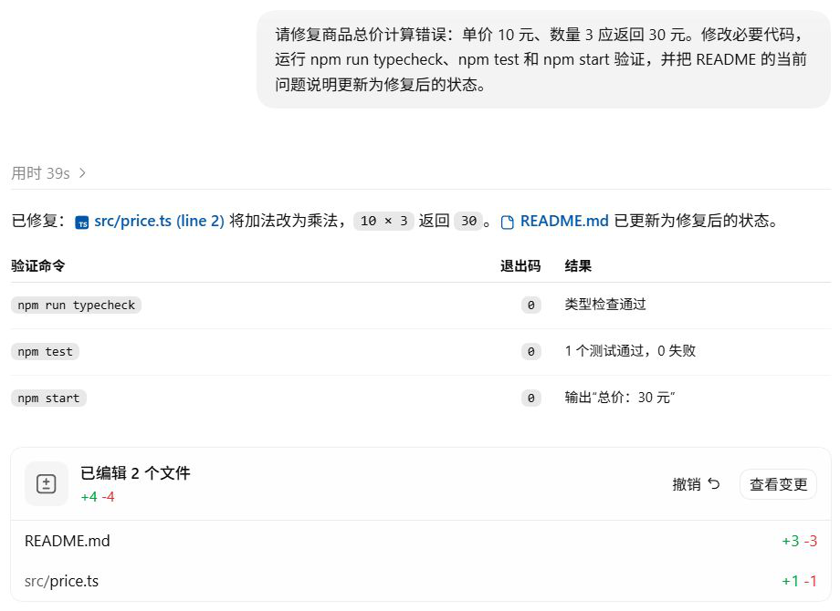

# Agent Loop：一次修复怎样完成？

读 README 经过了一次工具往返，修复总价错误则用了五次请求。模型拿到文件以后，还要确认修改位置、提出补丁，再检查运行结果。

起始项目将单价 `10` 和数量 `3` 相加，得到 `13`，测试要求得到 `30`。这是[故障快照](../examples/01-baseline/README.md)中的真实状态。先前的[检查实验](../evidence/desktop-lab/06-tests/manifest.json)已经留下结果：类型检查通过，行为测试失败，报错包含 `13 !== 30`。两个变量的类型都是 `number`，所以类型检查没有发现运算规则写错。

用户随后提出：

```text
请修复商品总价计算错误：单价 10 元、数量 3 应返回 30 元。修改必要代码，运行 npm run typecheck、npm test 和 npm start 验证，并把 README 的当前问题说明更新为修复后的状态。
```

按这条要求，完成修复时应能确认：函数算对总价，原测试通过，示例输出 30，README 与修复后的状态一致。

## 五次请求怎样接在一起？

[时间线](https://chrichuang218.github.io/how-codex-works/#/lesson/03-agent-loop?section=agent-loop-timeline)用 R0 至 R4 标记五次正式模型请求，对应证据文件的 `00-request` 至 `04-request`。每个工具结果都会进入下一次请求，供模型决定下一步。四次工具往返之后，R4 给出完成说明，没有再提出调用。

这次修复所在的任务已经加载了项目规则和技能，第一批读取也包含一份本机技能说明。它们的作用见第 6、7 章。

## 读到实现之后，先确认改哪里

[R0 输出](../evidence/desktop-lab/07-fix/00-request.output-items.json)安排读取项目文件。返回结果进入 [R1 请求](../evidence/desktop-lab/07-fix/01-request.request.json)，模型这时才取得本次读取的函数和测试内容。

下一次调用搜索 `calculateTotal`，找到实现、示例入口和测试中的调用，以便在修改共享函数前确认可能受影响的位置。

随后模型提出补丁，将函数中的加法改为乘法。修复前后的代码差异如下：

```diff
 export function calculateTotal(unitPrice: number, quantity: number): number {
-  return unitPrice + quantity;
+  return unitPrice * quantity;
 }
```

原测试仍然要求 `calculateTotal(10, 3)` 等于 30，没有为了通过检查而更改预期值。README 中关于故障状态的说明也随之更新。完整补丁在 [R2 输出](../evidence/desktop-lab/07-fix/02-request.output-items.json)。

## 修改返回以后，还需要检查什么？

[R3 请求](../evidence/desktop-lab/07-fix/03-request.request.json)收到了修改工具的返回，其中没有完整的最终文件正文。Codex 接着重读函数和 README，并执行用户指定的三条命令。

| 检查 | 实际结果 | 它核对的内容 |
| --- | --- | --- |
| `npm run typecheck` | 退出码 0 | TypeScript 类型检查通过 |
| `npm test` | 退出码 0，1 项测试通过 | 现有总价测试得到预期结果 |
| `npm start` | 退出码 0，输出“总价：30 元” | 示例程序实际运行的结果 |

这些结果一起进入 [R4 请求](../evidence/desktop-lab/07-fix/04-request.request.json)，重读内容也确认函数已使用乘法、README 已更新。模型据此给出[最终说明](../evidence/desktop-lab/07-fix/04-request.output-items.json)，完成本轮要求的总价修复。折扣功能在后续独立实验中提出并验证。

<details>
<summary>查看 Desktop 中的修复结果</summary>



完成报告列出三项检查，下面是两个文件的编辑入口。检查结果对应[修复实验](../evidence/desktop-lab/07-fix/manifest.json)中的工具返回。

</details>

## 循环为什么没有停在第一次输出？

第一次输出提出读取要求时，模型尚未取得这次读取的文件内容。修改之后，它还要拿到验证结果，才能按用户给出的条件判断完成；补丁返回本身不能说明测试是否通过。

Agent Loop 按这样的反馈继续生成后续动作。请求次数取决于执行过程：本轮用了五次，读取 README 用了两次；工具失败还可能带来错误处理。沿 `call_id` 配对动作与结果，再看下一次输出，就能追踪每一步的依据。

<details>
<summary>深入核对：四次调用与五份请求的完整对应</summary>

时间线保留四次调用的原始编号，可直接打开调用输出和下一请求中的结果。四次外层调用的真实类型都是 `custom_tool_call`，结果类型都是 `custom_tool_call_output`。下面按读取、搜索、修改、验证的顺序，分别简称 C1 至 C4。

[R0 请求](../evidence/desktop-lab/07-fix/00-request.request.json)只有一项新的用户输入，并引用此前失败测试轮次的最终响应。R1 至 R4 也各新增一项工具结果，通过 `previous_response_id` 接续前一响应。工具往返与历史接续使用不同的编号。

C1 的结果有四个输出块：执行包装、本机 `ponytail` 技能、文件清单与 Git 状态、项目文件。Git 状态检查因 demo 没有初始化仓库而返回退出码 1，其他读取结果仍然可用。该技能属于当时的机器环境，复现这个计算错误不要求读者安装它。

C2 返回函数的定义和调用位置。C3 调用外层 `exec` 中的 `tools.apply_patch`，其回传除执行包装外只有字符串 `"{}"`，因此不能仅靠这份返回复述最终文件正文。

C4 一次安排了三条验证命令及文件重读。R4 的 `input[0].output[0]` 是执行包装，`output[1]` 至 `output[4]` 依次对应类型检查、测试、示例运行和文件重读。各块 `text` 解析后可查看 `value.exit_code` 与 `value.output`。外层的 `fulfilled` 表示这项异步操作返回，具体命令是否成功仍要看退出码。

每次请求与输出的完整记录见[实验清单](../evidence/desktop-lab/07-fix/manifest.json)及工作台。

</details>

<details>
<summary>深入核对：用项目快照复现修复</summary>

在[修复前的检查](../evidence/desktop-lab/06-tests/01-request.request.json)中，类型检查退出码是 0，测试退出码是 1，并报告 `13 !== 30`：类型正确的代码仍可能算错结果。

[故障快照](../examples/01-baseline/README.md)与[修复快照](../examples/07-fixed/README.md)可以独立运行。复现时先复制故障版到自己的目录，保留测试的预期值。已经修好的目录无法重新产生原来的故障。

</details>

## 先判断，再打开最终回答

只查看 R3 与 R4 的记录：R3 刚收到修改返回时，还缺哪些完成证据？R4 收到结果后，能否确认用户要求已经满足？分别指出文件和测试结果的位置，再对照模型的最终说明。

<details>
<summary>核对答案</summary>

R3 的简短修改返回没有证明最终函数、README 和三条验证命令的结果。R4 补齐这些内容：函数使用乘法，README 已更新，类型检查和测试退出码均为 0，示例输出 30。它们支持本轮约定范围内的修复完成。

</details>

## 阶段练习：独立追踪另一段工具往返

这次换用尚未在正文拆解的[修复前检查记录](../evidence/desktop-lab/06-tests/manifest.json)。这是保留的真实实验，项目仍有加法错误。先看[第一次请求](../evidence/desktop-lab/06-tests/00-request.request.json)、[模型调用](../evidence/desktop-lab/06-tests/00-request.output-items.json)和[返回结果所在请求](../evidence/desktop-lab/06-tests/01-request.request.json)，暂时不看最终回答。

完成三个判断：从请求中找到本轮用户要求；用 `call_id` 对上动作与返回；说明类型检查通过、测试失败分别支持什么结论。最后判断这些记录是否足以证明错误已修复，并指出你的依据。

<details>
<summary>核对思路</summary>

用户要求运行检查；模型输出提出工具调用，下一份请求带回相同 `call_id` 的结果。返回中类型检查退出码为 0，测试退出码为 1，并出现 `13 !== 30`。这只能确认当前类型检查通过、已有行为测试失败，没有修改和修复后验证的证据，因此不能声称已修复。可以打开[该轮最终回答](../evidence/desktop-lab/06-tests/01-request.output-items.json)对照自己的解释。

</details>

接下来把视角从一轮修复移到多轮对话：修复结束后再问一句，原来的信息怎样继续进入模型？

[上一章：工具系统](02-tools.md) · [下一章：任务与会话](04-session.md)
