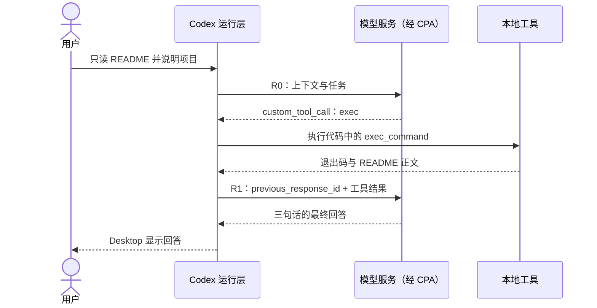

# 请它读 README，谁执行了操作？

模型怎样知道磁盘上写了什么？本章把一次文件读取拆成可核对的闭环：模型提出工具调用，运行环境执行命令，工具结果进入下一次请求，模型据此回答。

仍在同一个 Desktop 任务中操作。项目保持[初始状态](../examples/01-baseline/README.md)，这次只读说明，不修复总价错误。

## 精确限定任务

发送：

```text
请只阅读项目的 README.md，用三句话说明项目做什么、如何运行、当前已知问题。不要修改任何文件，也不要修复问题。
```

Codex 先说明将阅读 README，随后执行 PowerShell 的 `Get-Content`，最后给出三句话：项目计算商品总价；需要 Node.js 24，并列出运行与检查命令；README 记载总价输出 13 而预期 30。

本轮有 **2 次正式模型请求、1 次工具调用**。一条用户消息并不等于一次模型请求：收到文件内容后，模型还需要继续处理。

## 先展开这一轮的两个请求

第一章的[真实 Desktop 截图](../docs/images/desktop-hello-readme.png)中，“读取 README”的可见动作位于第三轮。下面按该轮已经关联的两个响应 ID 拆开，`R0`、`R1` 是阅读代号，不是新增协议字段。

| 阶段 | 请求中的新输入 | 本次模型输出 | 执行结果到哪里 |
| --- | --- | --- | --- |
| R0：`00-request` | 13 项；工具/指令/规则、前两轮对话、本轮任务及一条助手进度文字；没有 `previous_response_id` | 一个 `custom_tool_call`，要求 `exec` 运行读取代码 | 实际结果进入 R1 的 `input[0]`；[R0 请求](../evidence/desktop-lab/03-readme/00-request.request.json)、[输出项](../evidence/desktop-lab/03-readme/00-request.output-items.json) |
| R1：`01-request` | 1 项 `custom_tool_call_output`，引用 R0 响应 | 一条 `final_answer` 消息，三句话介绍项目 | 没有新的工具调用；[R1 请求](../evidence/desktop-lab/03-readme/01-request.request.json)、[输出项](../evidence/desktop-lab/03-readme/01-request.output-items.json) |

R0 的 `input[0..9]` 保留上章已有内容，`input[10]` 是上章最后回答，`input[11]` 是本轮问题，`input[12]` 已包含“我会只阅读……”的进度文字。这是该次实际请求的快照；不能因为它出现在 `input`，又把它当成本次 R0 新产生的一条输出。



图中的模型没有直接打开 Windows 文件。它生成一项调用要求；运行层根据工具接口执行，再把得到的文本装回下一次请求。这个“生成 → 执行 → 回传 → 再生成”的往返，就是后面逐渐展开的 Agent Loop。

## 从调用找到结果

第一次请求包含 13 项 `input`，包括前面的对话、本轮问题和助手进度文字。模型随后返回一个工具调用。下面节选[第一阶段输出项](../evidence/desktop-lab/03-readme/00-request.output-items.json)中的实际字段，省略了状态与内部元数据：

```json
{
  "type": "custom_tool_call",
  "call_id": "call_a288dLl8tyNv8JFlTJgNdtfK",
  "name": "exec",
  "input": "text(await tools.exec_command({cmd:\"Get-Content -LiteralPath 'E:\\\\Develop\\\\github\\\\codex-ts-demo\\\\README.md' -Raw\",\"max_output_tokens\":10000}));\n"
}
```

这里的 `exec` 是外层工具，传入的代码调用 `tools.exec_command`，再执行读取命令。本样本没有名为 `read_file` 的调用，也不是 `function_call` 类型。讲解时应沿用实际协议，避免用一个通用示意替换证据。

把上面 JSON 的 `input` 字符串还原为代码，实际执行层级就清楚了：

```javascript
text(await tools.exec_command({cmd:"Get-Content -LiteralPath 'E:\\Develop\\github\\codex-ts-demo\\README.md' -Raw","max_output_tokens":10000}));
```

这是实际工具输入，不是我们新写的 Harness。`exec` 接收 JavaScript；`exec_command` 接收 `cmd` 等参数并安排本地命令；PowerShell 的 `Get-Content -Raw` 返回文件文本；`text(...)` 再把返回值放入外层工具输出。调用层数多，不表示中间又调用了多次模型。

`max_output_tokens: 10000` 是这次工具结果的输出上限，不是整个任务的 token 预算，也不是模型的上下文窗口。本次返回中没有截断标记。

命令执行后，下一次请求的 `input[0]` 使用 `custom_tool_call_output`，并携带完全相同的 `call_id`。它的 `output` 是内容块数组，包含执行信息和 README 正文。编号让我们把“提出的调用”与“返回的结果”配对，而不只依赖显示顺序。

| 配对点 | 实际位置 | 值与含义 |
| --- | --- | --- |
| 提出调用 | R0 输出项 `call_id` | `call_a288dLl8tyNv8JFlTJgNdtfK` |
| 回传调用结果 | R1 `input[0].call_id` | 相同编号，证明这份结果对应刚才的调用 |
| 外层状态 | R1 `input[0].output[0].text` | `Script completed` 及耗时等执行包装 |
| 命令结果 | R1 `input[0].output[1].text` | 一个 JSON 字符串，解析后有 `exit_code`、`output` 等字段 |

解析最后那个字符串，可看到以下真实字段节选：

```json
{
  "exit_code": 0,
  "original_token_count": 263
}
```

同一个解析后的对象中，`output` 保存 README 正文。例如其中写着：

```text
当前测试场景：单价为 10 元、数量为 3，预期总价为 30 元，程序实际输出 13 元。
```

因此模型在 R1 中获得的是“执行信息 + 文件内容”，不是只得到一个抽象的“读取成功”。它能据正文组织三句话，也能区分 README 的叙述与亲自运行测试得到的事实。

## 为什么第二次请求只有一项？

打开[第二次请求](../evidence/desktop-lab/03-readme/01-request.request.json)，其中这个字段原样记录为：

```json
{
  "previous_response_id": "resp_0e37249022131978016abbe1b0762087d08637b9adb365b489"
}
```

这是字段节选，不是完整请求。它恰好指向[第一次完成事件](../evidence/desktop-lab/03-readme/00-request.response.json)的 `response.id`。第二次 `input` 只有一项工具结果，历史通过响应引用接续。上一章观察到的是历史重发；这一次，同一任务的工具回传走了引用方式。

这里有两条同时存在、但作用不同的连接：

- `call_id` 连接**调用与执行结果**，回答“这份 README 是哪次读取返回的”。
- `previous_response_id` 连接**新模型请求与先前响应**，回答“模型继续处理哪段历史”。

如果只保留 `call_id` 而不理解历史接续，就解释不了 R1 为什么还能遵守最初的“三句话、不修改”要求；如果只看响应引用而不配对调用，就可能把其他操作的结果错当成这次读取结果。

R0 输入用量为 33,015，R1 为 33,407。R1 虽然只传回一项，服务仍报告三万多输入 token，与它接续既有上下文相符，不代表一份 README 本身有三万多 token。

最终三句话位于[第二阶段输出项](../evidence/desktop-lab/03-readme/01-request.output-items.json)。读到这里，可以完整连起来：

```text
第一次请求 → custom_tool_call
执行 Get-Content → custom_tool_call_output
第二次请求（引用第一次响应）→ 最终回答
```

这张流程是依据本次事件整理的概括，完整字段仍以链接中的 JSON 为准。

## 读取证明了什么，没证明什么

工具结果的 `exit_code` 为 0，并带回 README 内容，支持“读取成功”的判断。README 说测试应失败，仍只是文件中的说明；本轮没有运行测试，不能宣称已经重新验证过故障。

本轮[首阶段事件](../evidence/desktop-lab/03-readme/00-request.events.json)产生调用，[第二阶段事件](../evidence/desktop-lab/03-readme/01-request.events.json)产生最终文字。两份 `response.completed` 的 `output` 都为空，正文与调用需要看 `response.output_item.done`；这沿用了第一章介绍的证据形态，不能只扫描完成事件的空数组就断言没有读取。

两次正式响应合计输入 token 66,422、输出 token 185，排除预热。这个求和用于观察工作过程中的用量，不是费用，也不代表两份互不重复的上下文。

## 独立配对一次

只看本轮两阶段证据，分别找出 `call_id` 和 `previous_response_id`。它们各自连接哪两个对象？再指出哪一个值能证明命令成功退出。

<details>
<summary>参考解释</summary>

`call_id` 连接工具调用与工具结果；`previous_response_id` 连接第二次模型请求与第一次模型响应。工具结果内的 `exit_code: 0` 表示这次命令成功退出。三者作用不同，不能互相替代，也不能用它们证明本轮没有执行过的测试通过。

</details>

[上一章：再说一句话，怎样接着聊？](02-context.md) · [下一章：给项目加一条规则，会发生什么？](04-agents.md)
