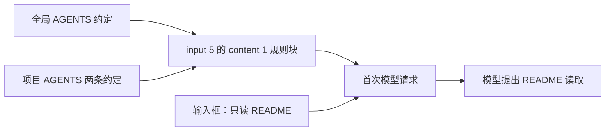

# 给项目加一条规则，会发生什么？

同样的阅读任务，怎样让项目约定参与回答？本章给 TS 项目加入两条很容易核对的规则，再从实际请求与输出两端检查它们。

## 准备一条看得见的约定

在 demo 根目录创建 `AGENTS.md`，本次文件内容如下：

```markdown
# 项目约定

- 当用户要求介绍本项目时，回复以“项目观察：”开头，再说明用途和运行方法。
- 用户没有要求修改时，只读取文件，不修改业务源码。
```

随后在这个项目中新建 Desktop 任务，发送与上一章完全相同的输入：

```text
请只阅读项目的 README.md，用三句话说明项目做什么、如何运行、当前已知问题。不要修改任何文件，也不要修复问题。
```

新建任务使我们能检查一次新的初始上下文。这里没有让模型先执行“读取 AGENTS.md”的命令，也没有在输入框中重复“项目观察”这项约定。

## 同样是 7 项 input，变化发生在内部

这次初始请求仍有 7 项，不能只看项数就断言“上下文没变”。变化集中在 `input[5].content[1].text`，也就是第一章已经出现过的规则块。

| 阶段 | 请求内容 | 输出与调用 | 结果回传位置 |
| --- | --- | --- | --- |
| `00-request` | 7 项初始上下文，已包含全局与项目规则，本轮问题在 `input[6]` | 进度消息 + 一个读取 README 的 `custom_tool_call`；`call_6ZAj4HZ4EYG6zE8yzenIHVk0` | 下一请求 `input[0]`；[请求](../evidence/desktop-lab/04-agents/00-request.request.json)、[输出项](../evidence/desktop-lab/04-agents/00-request.output-items.json) |
| `01-request` | 1 项工具结果，引用第一响应 `resp_040c808d0f406bc6016abbe279625087d09292441722b15d2b` | 最终说明以“项目观察：”开头，没有新增工具调用 | [请求](../evidence/desktop-lab/04-agents/01-request.request.json)、[输出项](../evidence/desktop-lab/04-agents/01-request.output-items.json) |

这仍然是“请求 → 读取 README → 结果回传 → 回答”的工具循环。新增项目规则并没有引入一次模型主动读取 `AGENTS.md` 的调用；规则在第一次模型生成前就已经可见。

原始输出顺序见[首阶段事件](../evidence/desktop-lab/04-agents/00-request.events.json)与[第二阶段事件](../evidence/desktop-lab/04-agents/01-request.events.json)。第二阶段还含一个加密内容已脱敏的 `reasoning` 项；它不等于可读的完整内部思考，不能拿来替代文件和行为证据。

## 输入框没写，实际请求里有

在[第一次请求](../evidence/desktop-lab/04-agents/00-request.request.json)中，`input[5]` 仍是一条 `role: "user"` 的 `message`，包含三个 `input_text` 块：

| 位置 | 包装与内容 | 和 AGENTS 的关系 |
| --- | --- | --- |
| `content[0]` | `<recommended_plugins>` 推荐插件目录 | 不是规则文件正文，也不是已安装插件清单 |
| `content[1]` | `# AGENTS.md instructions for E:\Develop\github\codex-ts-demo` + `<INSTRUCTIONS>` | 全局约定与项目约定在这里接合 |
| `content[2]` | `<environment_context>` 中的 cwd、Shell、时间等 | 描述任务所在环境，不是 `AGENTS.md` 的另一个章节 |

不能把这整条消息简称成“AGENTS 文件”，也不能因为块内有指令文字，就把协议角色改叫 `system`。本次规则块使用 `user` 角色；前面的应用行为说明仍各自位于 `developer` 消息。

以下按原文节选规则块，统一显示换行，并用方括号明确标注中间省略的内容。这是文本节选，不是一份完整请求：

```text
# AGENTS.md instructions for E:\Develop\github\codex-ts-demo

<INSTRUCTIONS>
# AGENTS.md

## 沟通

- 面向用户的叙述默认使用简体中文；代码、命令和技术标识保持英文。
[此处省略全局规则的其余段落]

--- project-doc ---

# 项目约定

- 当用户要求介绍本项目时，回复以“项目观察：”开头，再说明用途和运行方法。
- 用户没有要求修改时，只读取文件，不修改业务源码。

</INSTRUCTIONS>
```

全局部分包含“沟通、指令与规则来源、自主执行与任务范围、澄清与批准、实现与调试、验证与清理、完成与阻塞”七个章节。去掉外层包装并统一换行后，这一部分与第一章的全局规则正文相同；新加入的是 `--- project-doc ---` 后的两条项目约定。历史项目文件可在[实验项目规则快照](../examples/07-fixed/AGENTS.md)中对照。

因此本次证据说明：**项目规则在首次模型请求发出时已经进入上下文。** 这与模型之后主动调用工具读取文件，是不同的进入路径。



这是依据网络内容整理的组装关系，不是对客户端内部函数调用顺序的实测。它直接回答“哪些规则发给了模型”，还没有回答“客户端怎样搜索磁盘找到这些规则”。

再看相邻的 `input[6]`。下面节选这一项的类型、角色和内容，省略消息 `id` 及其他请求项：

```json
{
  "type": "message",
  "role": "user",
  "content": [
    {
      "type": "input_text",
      "text": "请只阅读项目的 README.md，用三句话说明项目做什么、如何运行、当前已知问题。不要修改任何文件，也不要修复问题。\n"
    }
  ]
}
```

输入框里的任务与客户端附加的规则，是分开的输入项。它们一起影响这一轮工作，但来源可以通过实际内容区分。

## 回答有没有使用规则？

模型调用 `exec`，其中的 `tools.exec_command` 执行 `Get-Content` 读取 README，工具结果随后进入第二次请求。最终说明的第一句是：

> 项目观察：这是一个计算商品总价的极简 TypeScript 项目，用于在 Codex Desktop 中测试文件读取、代码修改和测试执行，并通过 CPA 日志观察过程。

可以在[第二阶段输出项](../evidence/desktop-lab/04-agents/01-request.output-items.json)核对。与[上一章输出](../evidence/desktop-lab/03-readme/01-request.output-items.json)相比，本次最终说明出现了约定的开头。

还有一个细节值得保留：模型在读取前发出的进度文字以“我会只读取”开头，并没有加“项目观察：”。因此准确结论是“最终介绍遵循了开头约定”，不能扩大成“所有助手消息都遵循了同一格式”。

## 沿工具结果检查，而不只看开头

第一响应的工具代码仍通过 `exec → exec_command → Get-Content` 读取 README。第二请求中：

- `input[0].type` 是 `custom_tool_call_output`；
- `input[0].call_id` 等于 `call_6ZAj4HZ4EYG6zE8yzenIHVk0`；
- `output[0]` 是外层执行包装，`output[1].text` 解析后包含退出码与 README 正文；
- 请求的 `previous_response_id` 引用刚才提出读取的模型响应。

也就是说，项目规则规定了回答方式，工具结果提供了项目事实，历史引用让这两类信息在第二次生成时一起可用。最终前缀与规则一致，是行为层证据；文件内容与答案一致，是事实层证据，二者不能互相替代。

## 官方机制与本次观察，分开理解

[官方 AGENTS.md 文档](https://learn.chatgpt.com/docs/agent-configuration/agents-md)描述了规则发现机制：全局配置位置优先使用 `AGENTS.override.md`，否则使用 `AGENTS.md`；项目范围按从项目根到当前目录的路径逐层收集，每层至多选择一份规则文件，更靠近当前目录的规则作用更具体。

这些是官方机制说明。本实验的可见事实是“全局正文与项目正文被拼接进请求”，并没有跟踪客户端的目录遍历、文件选择函数或缓存命中。也没有创建嵌套目录冲突实验，所以不能把文档描述的每种覆盖情形都写成本次已验证行为。

这次全局规则本身也写着“项目级 AGENTS.md 仅在其适用目录范围内补充或覆盖全局规则”。它是发给模型的约定文字；确定某项具体操作是否被系统权限阻止，还要看后面权限实验中的真实工具结果。

## 规则不是执行锁

本轮记录了 2 次正式请求、1 次读取工具调用，未观察到修改文件的调用。输入 token 合计 66,169，输出 token 合计 297；统计排除预热，按正式响应求和，不代表费用。

仅凭这一轮没有修改代码，不能证明第二条规则单独阻止了修改，因为用户输入也明确要求不修改。这是实验中的另一个约束来源。要测规则的独立影响，需要设计更有区分度的任务。

`AGENTS.md` 是参与上下文的工作约定，不是操作系统权限。它的存在不等于某项操作从技术上无法执行。规则的适用范围、用户本轮要求以及实际权限，还需要分别检查。

## 换个前缀试一次

将第一条规则的开头改成一个新词，在项目中新建任务，发送相同问题。请分别在请求和最终回答中找到这个词；如果只在一端找到，能得出什么结论？

<details>
<summary>参考解释</summary>

请求中找到新词，证明本次加载了这条规则；最终回答也使用它，才有遵循行为的证据。只看回答可能混淆其他信息来源，只看请求也不能保证模型一定照做。若没有进入请求，应先核对目录、文件内容和任务上下文，再讨论模型是否遵循。

</details>

[上一章：请它读 README，谁执行了操作？](03-readme.md) · [下一章：把检查流程写成 Skill，怎样被用上？](05-skills.md)
