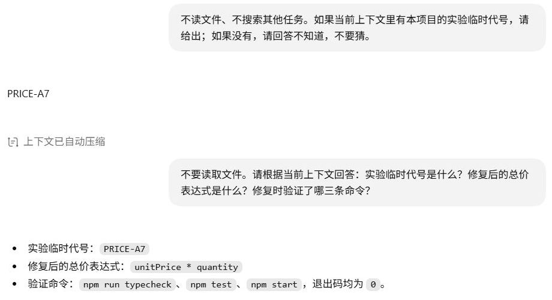

# 上下文管理：历史变长以后，怎样继续工作？

修复过程留下了文件内容、搜索结果、补丁与测试输出。我们在原任务中触发压缩，再追问临时代号、修复表达式和验证命令。模型仍答出了这三项。本章追查哪些历史被替换，哪些信息保留下来。

## 先分清当前输入中的信息来源

前几章的历史通过 `input` 重发，或由 `previous_response_id` 引用。无论哪种方式，“项目要求相乘，但代码写成加法”这条判断，都要追到 README 的需求和 `src/price.ts` 的读取结果。

规则、技能和环境也会加入上下文。它们有的在首次生成前附加，有的通过工具回传；消息的 `user` 角色无法单独说明来源。压缩前先分清这些入口，才知道摘要使用了什么材料。

<details>
<summary>深入核对：从请求追查规则、技能与源码的来源</summary>

下面复用三组既有实验。规则与技能的用途会在接下来两章展开，这里只定位入口：

| 信息 | 真实入口 | 位置 |
| --- | --- | --- |
| 用户要求 | 输入框消息 | [规则实验首请求](../evidence/desktop-lab/04-agents/00-request.request.json)的 `input[6]` |
| 项目约定 | 运行环境附加的规则块 | 同请求 `input[5].content[1].text` |
| 可用技能说明 | 技能目录 | [技能首请求](../evidence/desktop-lab/05-skills/00-request.request.json)的 `input[2].content[1].text` |
| 显式选用的技能正文 | 附加的 `<skill>` 块 | 同请求 `input[7]` |
| README 与源码 | 读取文件后的工具结果 | [技能第二请求](../evidence/desktop-lab/05-skills/01-request.request.json)的 `input[0].output` |

技能首请求提到 `src/price.ts`，但尚未带入 `unitPrice + quantity` 实现。第二请求的对应内容块解析后有以下字段，省略执行耗时等信息：

```json
{
  "file": "src/price.ts",
  "status": "fulfilled",
  "value": {
    "exit_code": 0,
    "output": "export function calculateTotal(unitPrice: number, quantity: number): number {\n  return unitPrice + quantity;\n}\n\r\n"
  }
}
```

这份结果证明当时读取到了加法实现。若文件后来被修改，要判断当前实现就应重新读取。

读 README、加入规则、显式技能检查各有两次正式请求。这六份客户端请求与对应上游请求的 `input` 和 `previous_response_id` 一致，例如[技能首次上游请求](../evidence/desktop-lab/05-skills/00-request.upstream.json)与[后续上游请求](../evidence/desktop-lab/05-skills/01-request.upstream.json)。本地工具负责读取；CPA 转发的是已经包含读取结果的请求。

</details>

## 点击压缩，看见了什么

我们在包含修复过程和临时代号的原任务里，通过输入框的 `/` 菜单点击“压缩”。操作前，界面显示“压缩此聊天的上下文（已使用 5%）”；完成后显示“上下文已压缩”和“上下文用量：1%”。[界面观察记录](../evidence/desktop-lab/ui-observations.json)保留了这些文字。

这次通过原生菜单手动触发，没有等待容量达到自动压缩阈值。5% 与 1% 是界面取整后的用量比例，不能当作精确的 token 节省率。

CPA 随后捕获到一份[压缩请求](../evidence/desktop-lab/10-compaction/00-request.request.json)。末尾要求以 `You are performing a CONTEXT CHECKPOINT COMPACTION` 开头，前面带着要整理的历史，包括修复前后的工具结果和临时代号。

模型的[摘要输出](../evidence/desktop-lab/10-compaction/00-request.output-items.json)保留了这些事实：计算已从加法改成乘法、测试文件没有改、修复前后验证的结果，以及 `PRICE-A7`。它没有再次修改或测试文件；本次输出没有工具调用。

## 从摘要到真正替换历史

模型写出摘要之后，应用是否真的用它接替了详细历史，还需要另一份证据。[本地压缩事件](../evidence/desktop-lab/10-compaction/compaction.json)记录了 `compacted` 事件，其中的 `compaction_response_id` 与 CPA 压缩响应的 ID 一致。

事件里的 `replacement_history` 有 6 项：5 条原用户消息，以及一条带接续说明的摘要消息。修复中的每次搜索和工具输出，没有作为原来的完整序列保留在这六项里。


摘要响应说明模型写出了总结；`compacted` 事件说明应用记录了历史替换。下一步要查的是后续请求有没有用到这些替换材料。

<details>
<summary>深入核对：压缩请求的元数据与 35 项输入</summary>

`client_metadata["x-codex-turn-metadata"]` 是 JSON 字符串，解析后相关字段为：

```json
{
  "request_kind": "compaction",
  "compaction": {
    "trigger": "manual",
    "reason": "user_requested",
    "implementation": "responses",
    "phase": "standalone_turn",
    "strategy": "memento"
  }
}
```

它标记了手动压缩与本次 Responses 实现，不能据此要求所有版本都经过一个固定命名的独立 HTTP 接口。

请求没有 `previous_response_id`，而是带上 35 项 `input`：

| 位置 | 内容 |
| --- | --- |
| `input[0..5]` | 工具定义、应用指令、项目环境等基础上下文 |
| `input[6..12]` | 技能检查要求、附加正文、调用、结果与回答 |
| `input[13..17]` | 运行检查的要求、调用、失败测试结果与回答 |
| `input[18..29]` | 修复要求、读取、搜索、补丁、验证与最终回答 |
| `input[30..33]` | 设置代号及追问的两组消息 |
| `input[34]` | 本次压缩要求 |

这些是数组下标，35 项不等于 35 条新用户消息。原历史中同时有 `custom_tool_call` 和 `custom_tool_call_output`，摘要可以依据修复前后的实际反馈。

本地事件的 `window_number` 变为 1。`replacement_history` 的摘要消息长 1,349 个 JavaScript 字符串长度单位，记录完成状态、改动、验证、约束和代号。

</details>

## 压缩以后还能回答什么

随后在同一任务发送：

```text
不要读取文件。请根据当前上下文回答：实验临时代号是什么？修复后的总价表达式是什么？修复时验证了哪三条命令？
```

实际回答给出 `PRICE-A7`、`unitPrice * quantity`，以及 `npm run typecheck`、`npm test`、`npm start`，并指出三条命令退出码均为 0。这次也没有工具调用。



界面写着“上下文已自动压缩”，但当次[压缩请求](../evidence/desktop-lab/10-compaction/00-request.request.json)记录 `trigger: "manual"`，操作记录也是菜单点击。触发方式应以这些记录为准；下方回答对应[压缩后追问](../evidence/desktop-lab/10-compaction-check/manifest.json)。

打开[追问请求](../evidence/desktop-lab/10-compaction-check/00-request.request.json)，能找到原用户消息与刚生成的摘要。它共有 13 项输入，没有 `previous_response_id`。摘要被放在 `input[7]`，后面还附加当前应用指令、项目规则和新问题。这里使用的是重建后的输入。

三道问题答对，验证了这三项事实仍可使用。摘要没有保留完整搜索输出和每份文件正文；要核对其中一行，应查原始记录或重新读取。

<details>
<summary>深入核对：替换材料怎样进入下一请求</summary>

| 追问请求位置 | 来源 |
| --- | --- |
| `input[0..1]` | 工具定义与基础 developer 指令 |
| `input[2..6]` | `replacement_history[0..4]`，五条原用户消息 |
| `input[7]` | `replacement_history[5]`，摘要与接续说明 |
| `input[8..11]` | 当前应用、协作、项目规则与环境 |
| `input[12]` | 新问题 |

`input[7].role` 为 `user`，文字以 `Another language model started...` 开头。这是运行环境包装的接续材料，没有对应一次用户手写这段总结的操作。六项消息的 `id`、`role` 和 `content` 都与本地 `replacement_history` 对应相同，本地的内部消息元数据没有随请求重发。这样可以确认接续材料实际进入了下一次生成。答案见[追问输出](../evidence/desktop-lab/10-compaction-check/00-request.output-items.json)。

压缩响应报告 25,806 输入 token、661 输出 token；后续追问报告 33,723 输入、63 输出，均无工具调用、排除预热。前者生成摘要，后者还带有当前运行环境并回答新问题，不能直接相减当作压缩节省量。

</details>

## 重发、引用、缓存各自改变什么

有时 `input` 只有一条新结果，完成事件却报告数万输入 token。第三章修复的最后阶段就是如此：请求通过响应引用接上历史，当前只新增验证结果，服务报告的输入仍为 39,982 token。

历史完整写进 JSON，也可能命中缓存。“我刚才说了什么”的请求重发历史，服务同时报告 `cached_tokens: 13568`。携带历史的方式与缓存计数可以分别核对：

| 机制 | 从日志能看见什么 |
| --- | --- |
| 历史重发 | 旧消息再次写入当前 `input` |
| 响应引用 | `previous_response_id` 接到已有响应，当前可只带新增内容 |
| 压缩 | 详细历史整理成接续材料，本次另有本地替换事件 |
| 缓存 | `usage.input_tokens_details.cached_tokens` 报告输入中的缓存计数 |

缓存计数不会说明哪条规则被理解了，也不能证明信息会跨任务保存。工具输出过长被截断，则是另一处信息损失：它可能在结果进入模型之前就已发生，不需要等整个对话压缩。

<details>
<summary>深入核对：工具结果截断与用量计算</summary>

后面的工具目录查询实验中，[返回结果](../evidence/desktop-lab/13-mcp/01-request.request.json)出现了 `Warning: truncated output (original token count: 41577)`。这是一次工具结果的截断提示，不能当作当前任务已经触发原生上下文压缩的证据。相反，第二章读取 README 的调用虽设置 `max_output_tokens: 10000`，返回里没有截断标记。输出上限、实际截断、模型上下文窗口需要分别判断。

三个正式响应的统计如下：

| 样本 | 输入 token | 其中缓存输入 | 输出 token |
| --- | ---: | ---: | ---: |
| [首次问候](../evidence/desktop-lab/01-hello/01-request.response.json) | 32,774 | 0 | 13 |
| [接着追问](../evidence/desktop-lab/02-context/00-request.response.json) | 32,930 | 13,568 | 12 |
| [修复最后阶段](../evidence/desktop-lab/07-fix/04-request.response.json) | 39,982 | 38,912 | 151 |

追问完成事件的 `response.usage` 节选：

```json
{
  "input_tokens": 32930,
  "input_tokens_details": {
    "cache_write_tokens": 0,
    "cached_tokens": 13568
  },
  "output_tokens": 12,
  "total_tokens": 32942
}
```

缓存输入包含在输入总数中，不能再加一次。这里的总 token 为 32,930 + 12 = 32,942。缓存为零也不代表没有上下文；问候请求仍有规则、工具和环境。

修复五个阶段每次只新增 1 项输入，但内容依次是修复要求、读取结果、搜索结果、修改反馈与验证结果：

| 阶段 | 输入 token | 缓存输入 | 输出 token |
| --- | ---: | ---: | ---: |
| [00](../evidence/desktop-lab/07-fix/00-request.response.json) | 35,472 | 35,072 | 291 |
| [01](../evidence/desktop-lab/07-fix/01-request.response.json) | 38,485 | 35,328 | 162 |
| [02](../evidence/desktop-lab/07-fix/02-request.response.json) | 38,822 | 38,272 | 255 |
| [03](../evidence/desktop-lab/07-fix/03-request.response.json) | 39,101 | 38,656 | 197 |
| [04](../evidence/desktop-lab/07-fix/04-request.response.json) | 39,982 | 38,912 | 151 |

输入合计 191,862，缓存输入合计 186,240，输出合计 1,056。求和会重复计入各次使用的历史，不表示五份互不重叠的知识。最后一阶段输入减缓存为 1,070，也不能当成本轮用户输入长度，因为新增的是工具结果。

以上排除预热，所选事件中的 `cache_write_tokens` 均为 0。这没有展示内部缓存存储、匹配算法或实际提速，也不足以推出系统从不写缓存。费用还取决于服务与适用计费规则，本章不从这些计数推算费用。

</details>

## 先预测，再核对摘要

先不看压缩后的回答，只读本地 `replacement_history`。预测模型能否回答：临时代号是什么、修复时用了哪三条命令，以及某次搜索输出的完整原文是什么。给每个预测指出依据，再与后续请求和回答对照。

<details>
<summary>核对思路</summary>

代号和三条验证命令明确保留在摘要中，实际追问也回答了它们。完整搜索输出没有作为原来的工具序列保留，不能仅凭摘要期待逐字复原；这道问题没有在原实验中实际追问。若要继续检验，需要另做实验，并保留新请求与输出。当前材料也未验证达到容量阈值后的自动压缩或自动截断策略。

</details>

[上一章：任务与会话](04-session.md) · [下一章：AGENTS.md](06-agents.md)
