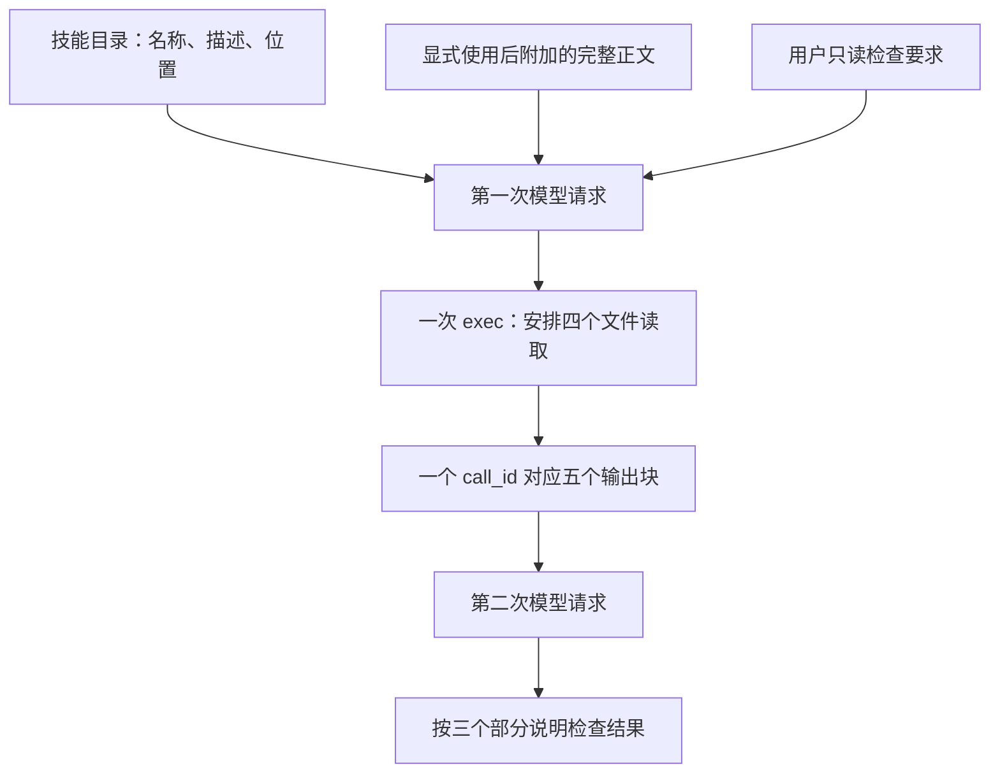

# 把检查流程写成 Skill，怎样被用上？

项目约定描述持续适用的工作要求，Skill 则可以包装一次可重复的具体流程。本章把“查看用途、命令和实现差异”写成技能，观察目录信息、技能正文和工具执行分别在哪里出现。

## 准备一个小技能

在项目的 `.agents/skills/price-project-check/SKILL.md` 中放入以下内容。本次实验使用的正文是：

```markdown
---
name: price-project-check
description: 对商品总价项目做只读概览检查，核对用途、运行方式与实现是否符合 README。用于用户要求项目概览检查时，不用于运行测试或修复代码。
---

# 商品总价项目检查

读取项目根目录的 README.md、package.json 和 src/price.ts。

输出三个部分：用途、可用命令、实现与需求的差异。每个部分指出依据的文件。

只报告实际读到的信息；未运行测试时，明确写“未运行测试”。不要修改文件，也不要执行 npm 命令。
```

`name` 和 `description` 提供名称与适用说明，正文提供具体步骤和约束。这里只做只读检查，保留计算错误给后面的修复实验。

新建项目任务，显式发送：

```text
$price-project-check 请对当前项目做一次只读概览检查。
```

## 一次显式使用，拆成两次模型请求

| 阶段 | 本次请求中的内容 | 模型输出 | 工具结果与下一步 |
| --- | --- | --- | --- |
| `00-request` | 8 项输入；已有规则和技能目录，`input[6]` 是显式调用，`input[7]` 是附加技能正文 | 进度消息 + 一次 `exec` 调用，`call_liyjTQFrR1JWvixVysn2Xm73` | 一批读取 4 个文件；[请求](../evidence/desktop-lab/05-skills/00-request.request.json)、[输出项](../evidence/desktop-lab/05-skills/00-request.output-items.json) |
| `01-request` | 1 项 `custom_tool_call_output`，其 `output` 有 5 个内容块；引用前一响应 `resp_0061bd7340416e34016abbe2dbb46487d0af4b34ab5dd4d0a3` | reasoning 项与最终检查说明，没有新的工具调用 | 4 份文件内容支撑三个检查部分；[请求](../evidence/desktop-lab/05-skills/01-request.request.json)、[输出项](../evidence/desktop-lab/05-skills/01-request.output-items.json) |

和第 4 章的 7 项初始输入相比，这次额外出现一条技能正文消息。与此同时，技能目录本身也已包含新技能条目；不是只把输入框里的 `$` 当成一个没有其他上下文作用的普通字符。

逐事件核对可看[首阶段事件](../evidence/desktop-lab/05-skills/00-request.events.json)与[第二阶段事件](../evidence/desktop-lab/05-skills/01-request.events.json)。表中的输出项来自各自 `response.output_item.done`，不是从空的 `response.completed.output` 中猜出来的。

## 正文在工具调用之前就出现了

打开[第一阶段请求](../evidence/desktop-lab/05-skills/00-request.request.json)，可以找到三个不同位置：

| 位置 | 实际内容 |
| --- | --- |
| `input[2].content[1].text` | 可用技能目录，列出名称、描述和路径 |
| `input[6].content[0].text` | 输入框中的显式调用 |
| `input[7].content[0].text` | `<skill>` 块，含名称、路径与完整正文 |

因此本次显式调用时，Desktop 已经把技能正文附加到初始请求。我们不需要假设模型先从目录推断步骤，也不能把后续读取当成“第一次获得技能正文”。

技能目录中的实际条目是：

```text
- price-project-check: 对商品总价项目做只读概览检查，核对用途、运行方式与实现是否符合 README。用于用户要求项目概览检查时，不用于运行测试或修复代码。 (file: r14/price-project-check/SKILL.md)
```

其中名称与描述帮助选择适用流程，路径指出说明文件在哪里。`r14` 是本次技能根目录别名；这里不意味着存在一个叫 `price-project-check` 的模型工具接口。工具注册仍在 `additional_tools` 中，技能条目则是 `developer` 消息里的文本目录，两者层次不同。

再看 `input[7]`：它实际是 `type: "message"`、`role: "user"`，一个 `input_text` 内容块。该块开头和结尾如下，正文部分已在前面的源码块完整列出，这里用注记省略：

```text
<skill>
<name>price-project-check</name>
<path>E:\Develop\github\codex-ts-demo\.agents\skills\price-project-check\SKILL.md</path>
[此处是上述 SKILL.md 全文，含 YAML 元数据与正文]
</skill>
```

因此模型首次生成之前，已经同时看到了“技能存在、何时适用”和“具体怎样检查”。`<skill>` 是该文本的包装，不是新增协议角色，也不是一次工具执行结果。

“目录里出现技能”和“正文进入上下文”是两件可分别核对的事。本样本证明显式调用这条路径的行为；没有测试模型只凭描述自动选择技能时，正文会怎样加载。

[官方 Skills 文档](https://learn.chatgpt.com/docs/build-skills)将这类组织方式解释为按需提供信息：先让名称、描述和位置可被发现，再在需要时使用正文。官方说明帮助理解设计目的；具体到本次 `$price-project-check`，我们直接观察到的是正文由客户端随首请求附加，不能统一改写成“必须先由模型调用工具才能加载”。第 7 章的本机 `ponytail` 使用则会出现另一条实际读取路径。

## 四条命令，为什么只算一次工具调用？

模型返回一个 `custom_tool_call`。下面节选[输出项](../evidence/desktop-lab/05-skills/00-request.output-items.json)的三个原始字段，其余字段省略：

```json
{
  "type": "custom_tool_call",
  "call_id": "call_liyjTQFrR1JWvixVysn2Xm73",
  "name": "exec"
}
```

其 `input` 代码使用 `Promise.allSettled` 发起四个 `tools.exec_command`，读取 `SKILL.md`、`README.md`、`package.json` 和 `src/price.ts`。这次读取技能是再次核对文件；其他三个文件也在同一批代码中安排读取。

| 同一次 `exec` 内的命令 | 读取目的 | 第二请求中的内容块 |
| --- | --- | --- |
| `Get-Content -LiteralPath '.agents/skills/price-project-check/SKILL.md' -Raw` | 核对当前技能文件 | `input[0].output[1]`，标记 `file: "SKILL.md"` |
| `Get-Content -LiteralPath 'README.md' -Raw` | 获取项目用途和需求 | `input[0].output[2]`，标记 `file: "README.md"` |
| `Get-Content -LiteralPath 'package.json' -Raw` | 核对真实 npm 脚本 | `input[0].output[3]`，标记 `file: "package.json"` |
| `Get-Content -LiteralPath 'src/price.ts' -Raw` | 核对实际计算实现 | `input[0].output[4]`，标记 `file: "src/price.ts"` |

`output[0]` 是统一的执行状态包装，所以 4 份文件结果加上它，共有 5 个内容块。每份文件结果的 `text` 又是 JSON 字符串，解析后结构为 `file`、`status` 和 `value`，其中 `value.exit_code` 与 `value.output` 分别提供命令退出状态和文件正文。

这批代码由 `Promise.allSettled` 收集结果；它说明多个读取在一次工具代码中被安排和汇总，不能把 4 个命令误算成 4 次模型决策。若要比较底层执行是否在同一毫秒真正重叠，还需要命令时间数据，不能只从列表顺序推出。

所以 Desktop 展示的四次命令执行，与 CPA 记录的一次外层工具调用并不矛盾。执行完成后，四份结果合在一个 `custom_tool_call_output` 中，使用同一个 `call_id` 回传。没有“模型先读完技能，再发起另一轮请求决定读三个文件”这个中间阶段。



图中有两条不同的技能正文路径：首请求已有正文，随后工具又读回磁盘版本。文件再次读取可以核对当前内容，但它不会倒过来改变“模型在调用之前就已知道检查步骤”这个事实。

## 流程怎样影响输出

最终回答按“用途、可用命令、实现与需求的差异”组织，并明确写出“未运行测试”。它指出代码把 `unitPrice` 与 `quantity` 相加，而 README 要求相乘。你可以在[最终输出项](../evidence/desktop-lab/05-skills/01-request.output-items.json)逐项核对。

这里的 `10 + 3 = 13` 是依据源码进行静态推算，不是本轮运行程序或测试得到的结果。技能要求“不执行 npm 命令”，实际工具结果也只包含文件读取。下一章再专门观察测试执行。

最终输出也保留了上一章的“项目观察：”前缀。项目规则约束介绍方式，技能约束本次检查步骤，文件结果提供事实；这三类输入共同参与同一次生成。不能把“使用 Skill”理解为它接管了整个系统、创建了新 Agent，或让项目规则自动失效。

本轮共 2 次正式模型请求、1 次外层工具调用，输入 token 合计 67,312，输出 token 合计 707。统计排除预热，按模型响应求和；四条内部命令不会被写成四次模型工具调用，也不据此直接估算费用。

## 自己检查一次分层

在第二阶段请求里找到四份文件结果。它们是否拥有四个不同的 `call_id`？再回到第一阶段请求，说明为什么模型在读取文件之前就能够知道技能要求检查哪三个项目文件。

<details>
<summary>参考解释</summary>

第二阶段只有一个 `custom_tool_call_output` 和一个 `call_id`，其内容块包含四份执行结果。第一阶段的 `input[7]` 已附加完整技能正文，其中列出了三个项目文件。模型此次又读取了 Skill，但不能把读取发生的时点误当成正文首次进入上下文的时点。

</details>

[上一章：给项目加一条规则，会发生什么？](04-agents.md) · [下一章：测试失败了，Codex 怎样知道？](06-tests.md)
