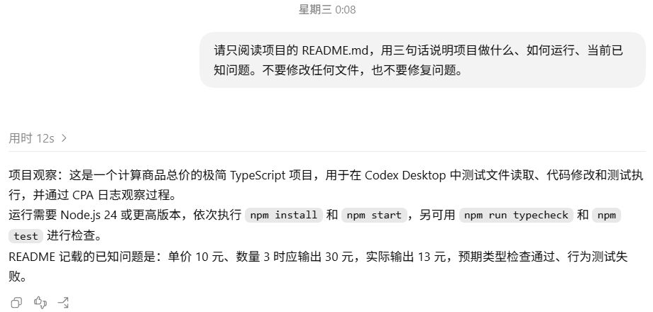
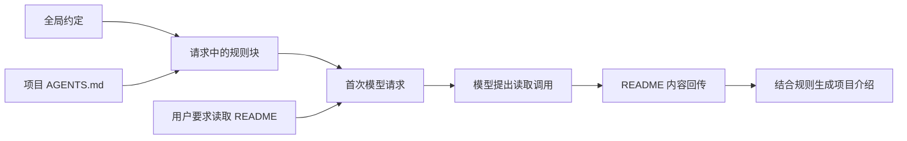

# AGENTS.md：项目规则怎样进入请求？

读同一份 README，能不能让介绍使用固定前缀？我们加入项目规则，再发送第二章的阅读要求。回答多了“项目观察：”，而输入框里没有这几个字。

此时总价仍是 `13`。复现规则加载时，可以使用[起始项目](../examples/01-baseline/README.md)；修复后的项目也能测试前缀，但项目状态的回答会不同。

## 在文件里写约定，在输入框里提任务

实验时在项目根目录创建了 `AGENTS.md`，内容如下：

```markdown
# 项目约定

- 当用户要求介绍本项目时，回复以“项目观察：”开头，再说明用途和运行方法。
- 用户没有要求修改时，只读取文件，不修改业务源码。
```

然后在这个项目中新建 Desktop 任务，发送：

```text
请只阅读项目的 README.md，用三句话说明项目做什么、如何运行、当前已知问题。不要修改任何文件，也不要修复问题。
```

输入框里没有“项目观察：”这个前缀，也没有要求模型读取 `AGENTS.md`。模型先提出读取 README，获得文件内容后，最终介绍以这句话开头：

> 项目观察：这是一个计算商品总价的极简 TypeScript 项目，用于在 Codex Desktop 中测试文件读取、代码修改和测试执行，并通过 CPA 日志观察过程。



输入里仍是原来的阅读要求，最终介绍出现了项目规则指定的前缀，见[规则实验](../evidence/desktop-lab/04-agents/manifest.json)。

可以对照[未添加项目规则时的输出](../evidence/desktop-lab/03-readme/01-request.output-items.json)和[本次最终输出](../evidence/desktop-lab/04-agents/01-request.output-items.json)。前缀的来源在第一次请求里。

## 规则在第一次生成前已经送达

打开[首请求](../evidence/desktop-lab/04-agents/00-request.request.json)，搜索“项目观察：”。它出现在 `input[5].content[1].text`。下面保留外层包装与项目部分，明确省略全局规则中间段落，并统一显示换行：

```text
# AGENTS.md instructions for E:\Develop\github\codex-ts-demo

<INSTRUCTIONS>
# AGENTS.md

## 沟通

- 面向用户的叙述默认使用简体中文；代码、命令和技术标识保持英文。
[此处省略全局规则的其余段落]

--- project-doc ---

# 项目约定

- 当用户要求介绍本项目时，回复以“项目观察：”开头，再说明用途和运行方法。
- 用户没有要求修改时，只读取文件，不修改业务源码。

</INSTRUCTIONS>
```

全局约定与项目约定被放进同一个规则块，项目部分从 `--- project-doc ---` 开始。它们已经在首请求中，早于模型提出读取 README 的调用。本轮没有一次单独读取 `AGENTS.md` 的工具调用。

相邻的 `input[6]` 才是输入框里的阅读要求。当前任务和项目约定一起进入模型，但来源不同。



请求显示了全局约定与项目规则的组装结果，客户端内部怎样遍历目录查找文件，还需其他记录才能判断。

<details>
<summary>深入核对：规则块的角色与相邻内容</summary>

首请求仍有 7 项 `input`，与“你好”的首请求项数相同。变化发生在项内，不能用项数判断内容是否改变。

`input[5]` 是 `role: "user"` 的消息，其中三个 `input_text` 块分别是：

| 位置 | 内容 |
| --- | --- |
| `content[0]` | `<recommended_plugins>` 推荐插件目录，并非已安装清单 |
| `content[1]` | `# AGENTS.md instructions...` 与 `<INSTRUCTIONS>` 中的规则 |
| `content[2]` | `<environment_context>` 中的工作目录、Shell、时间等 |

这整条消息不等于一份 AGENTS 文件。环境与插件目录也不是项目规则的章节。规则块虽含指令文字，协议角色在本样本中仍是 `user`；应用行为说明另在前面的 `developer` 消息中。

去掉外层包装、统一换行后，全局规则正文与第一章相同，包含沟通、指令与规则来源、自主执行与任务范围、澄清与批准、实现与调试、验证与清理、完成与阻塞七部分。新增的两条项目约定也保存在[规则快照](../examples/07-fixed/AGENTS.md)中。

用户任务项的节选如下，省略消息 `id`：

```json
{
  "type": "message",
  "role": "user",
  "content": [
    {
      "type": "input_text",
      "text": "请只阅读项目的 README.md，用三句话说明项目做什么、如何运行、当前已知问题。不要修改任何文件，也不要修复问题。\n"
    }
  ]
}
```

</details>

## 规则约束回答方式，文件提供项目事实

第一次响应经 `exec` 和 `tools.exec_command` 执行 `Get-Content`，第二请求带回 README 正文。回答的前缀来自规则，项目用途来自读取结果。规则要求“说明用途”，用途本身仍需文件提供。

读取前的进度文字以“我会只读取”开头，没有前缀；本次遵循格式的是最终介绍。至于“只读”要求，规则和用户消息里都有，仅凭没有修改调用，无法判断是哪一处单独起作用。

`AGENTS.md` 提供参与模型决策的约定，不能据此认定某项操作在程序层面无法执行。实际权限限制会在第十一章用工具拒绝结果检验。

<details>
<summary>深入核对：两次请求与读取结果的连接</summary>

| 阶段 | 请求与输出 | 对应记录 |
| --- | --- | --- |
| `00-request` | 7 项输入；输出进度消息和一个读取调用 | [请求](../evidence/desktop-lab/04-agents/00-request.request.json)、[输出项](../evidence/desktop-lab/04-agents/00-request.output-items.json) |
| `01-request` | 1 项读取结果；输出最终说明，没有新增调用 | [请求](../evidence/desktop-lab/04-agents/01-request.request.json)、[输出项](../evidence/desktop-lab/04-agents/01-request.output-items.json) |

读取的 `call_id` 是 `call_6ZAj4HZ4EYG6zE8yzenIHVk0`，它在第二请求的 `input[0].call_id` 中再次出现。`input[0].type` 为 `custom_tool_call_output`，`output[0]` 是外层执行包装，`output[1].text` 解析后包含退出码和 README 正文。

第二请求的 `previous_response_id` 是第一响应的 `resp_040c808d0f406bc6016abbe279625087d09292441722b15d2b`。事件顺序可以在[首阶段](../evidence/desktop-lab/04-agents/00-request.events.json)与[第二阶段](../evidence/desktop-lab/04-agents/01-request.events.json)检查。第二阶段还包含加密 `reasoning` 项，不能将它当作可读的完整内部思考。

本轮共 2 次正式请求、1 次外层读取调用，输入 token 合计 66,169，输出合计 297，排除预热。

</details>

<details>
<summary>深入核对：官方规则发现机制与本次实测范围</summary>

[官方 AGENTS.md 文档](https://learn.chatgpt.com/docs/agent-configuration/agents-md)说明，全局配置位置优先使用 `AGENTS.override.md`，否则使用 `AGENTS.md`；项目范围沿项目根到当前目录逐层收集，每层至多选择一份规则文件，更靠近当前目录的规则作用更具体。

本次看到全局正文与项目正文接合进请求，没有跟踪目录遍历、文件选择函数或缓存，也没有设置嵌套目录中的冲突规则。文档解释其他情形怎样设计；这份实验只验证展示出来的组装结果。

</details>

## 自己换一次前缀

下面是读者待做的实验，现有日志没有记录这个改动：在自己的项目副本中，将第一条规则里的“项目观察：”改成一个新词，新建任务并发送同样的阅读问题。分别在请求和最终回答中搜索新词。

如果词只出现在请求中，说明规则已经送达，但这次最终回答没有按要求使用。若请求里找不到它，应先检查目录、文件内容和任务上下文。只看到回答使用了新词，也还需要检查它是否来自其他输入。

保存自己的请求与回答，标出规则进入的位置和回答使用前缀的位置。

## 补充实验：每轮生成的编号从哪里来？

项目约定之外，本地 Hook 也能在提交时附加内容。它生成的编号怎样进入请求，见[第 10 章 Hooks](10-hooks.md)。

<details>
<summary>提交路径、信任状态与字段核对</summary>

[UserPromptSubmit 实验](10-hooks.md)对照了新旧任务的字段位置。输入框与工具提交走不同路径，不能直接作为单变量的信任状态对照。

</details>

[上一章：上下文管理](05-context.md) · [下一章：Skills](07-skills.md)
