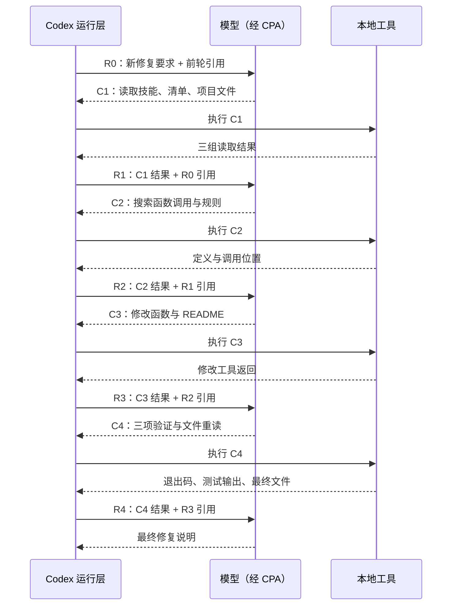

# 总价算错了，怎样完成修复？

前六章分别看过请求、上下文、规则、技能和工具结果。现在把它们连成一次完整工作：从已复现的故障出发，修改代码，运行验证，再用证据判断任务是否完成。

本章保留了[修复前项目](../examples/01-baseline/README.md)与[修复后项目](../examples/07-fixed/README.md)。可先阅读全部记录，再复制初始项目自行复现；不要用已修好的版本重新证明原始故障。

## 给出现象、预期与完成条件

在上一章任务中继续发送：

```text
请修复商品总价计算错误：单价 10 元、数量 3 应返回 30 元。修改必要代码，运行 npm run typecheck、npm test 和 npm start 验证，并把 README 的当前问题说明更新为修复后的状态。
```

这个任务不直接指定“把加号改成乘号”，而是给出可验证的行为和交付物：代码满足要求、三条命令提供验证、README 与当前状态一致。上一章失败的测试已经留下了修复前证据。

## 一条用户消息，五次正式请求

实际记录包含 5 次正式模型请求和 4 次外层工具调用。每次工具执行之后，结果进入下一次模型请求，模型再决定后续动作。

| 阶段 | 模型获得什么 | 接下来发生什么 |
| --- | --- | --- |
| `00` | 用户修复要求及响应引用 | 一批读取：本机 Skill、文件清单、项目文件 |
| `01` | 上一批读取结果 | 搜索 `calculateTotal` 的定义、调用和项目规则 |
| `02` | 搜索结果 | 修改计算函数与 README |
| `03` | 修改工具结果 | 运行三项验证，并重新读取修改后的文件 |
| `04` | 验证与文件内容 | 汇报完成及三条命令的结果 |

这张表是依据真实事件整理的导读，各阶段的请求与响应可从[实验清单](../evidence/desktop-lab/07-fix/manifest.json)进入。接下来不跳过中间步骤，逐一看模型在每次请求中新增了什么信息，再决定了什么动作。

四次外层调用不等于四条命令。例如最后一次 `exec` 内部就安排了三条验证命令和一次文件读取。区分模型请求、外层工具调用与内部命令，才能正确计数。

## 先建立本轮的两套关联编号

下面用 `R0`～`R4` 表示五次模型响应，用 `C1`～`C4` 表示四次工具调用。字母只是讲解代号，原始 JSON 仍保留真实 ID。

| 代号 | 实际 `call_id` | 调用来自 | 结果进入 |
| --- | --- | --- | --- |
| C1 | `call_cJsfAlSozeFn4AYEwMQ8jCMX` | R0 的 `custom_tool_call` | R1 `input[0]`，4 个输出块 |
| C2 | `call_7FgPlfDNwHrla7MfaxQ2IviI` | R1 的 `custom_tool_call` | R2 `input[0]`，2 个输出块 |
| C3 | `call_GpRIplrClvzLfrtkkMHGVzEA` | R2 的 `custom_tool_call` | R3 `input[0]`，2 个输出块 |
| C4 | `call_6YUxjdksnb3eIeh5ySJjO2p8` | R3 的 `custom_tool_call` | R4 `input[0]`，5 个输出块 |

每一次回传的类型都是 `custom_tool_call_output`。同时，R1～R4 的请求分别用 `previous_response_id` 引用 R0～R3。前一套编号解决“这份执行结果属于哪次调用”，后一套解决“这次模型生成继续哪段上下文”。两条线一起读，才能把整轮串起来。

各阶段原始事件：[R0](../evidence/desktop-lab/07-fix/00-request.events.json)、[R1](../evidence/desktop-lab/07-fix/01-request.events.json)、[R2](../evidence/desktop-lab/07-fix/02-request.events.json)、[R3](../evidence/desktop-lab/07-fix/03-request.events.json)、[R4](../evidence/desktop-lab/07-fix/04-request.events.json)。已经逐阶段核对：输出项汇集与 `response.output_item.done` 一致；五份完成事件的 `output` 仍均为空，所以不能把空数组当成没有调用的依据。



这不是预先固定好的“五步程序”。每次模型生成一个动作，运行层把实际结果送回，下一次生成再继续。本例恰好用了五次请求；更简单的任务可能更少，工具失败或发现新问题也可能更多。

## R0：当前要求进入已有上下文

[R0 请求](../evidence/desktop-lab/07-fix/00-request.request.json)的 `input` 只有一条新用户消息，`previous_response_id` 引用第六章最终响应。最初的项目规则、技能目录、已经读过的文件和失败测试，没有在这个 JSON 中全部重写，但会话接续仍然需要这些信息。

[R0 输出](../evidence/desktop-lab/07-fix/00-request.output-items.json)先说明将使用本机 `ponytail` 技能并做最小修复，随后生成 C1。C1 内部安排了三组读取：

| 内部动作 | 用途 | R1 中的返回位置 |
| --- | --- | --- |
| 读取 `ponytail/SKILL.md` | 获取本机编码技能正文 | `input[0].output[1]`，`read: "ponytail skill"` |
| 查看位置、文件清单与 Git 状态 | 确认项目环境 | `input[0].output[2]`，`read: "file inventory and status"` |
| 读取 AGENTS、README、配置、源码和测试 | 核对当前实现及约束 | `input[0].output[3]`，`read: "project files"` |

`output[0]` 仍是统一执行包装。这一轮没有独立的“先把技能读完，再做一次模型请求才读取代码”阶段；三个动作已经包含在同一次 C1 代码里。与第 5 章显式 Skill 正文随首包附加的样本区分开，本次可直接看见模型选择了读取另一份本机技能文件。

`ponytail` 是当前机器安装的技能，不是修复这个 bug 的普遍必需步骤，也不是读者复现实验的必装前置条件。这里保留它，是为了说明运行环境中的技能目录会影响模型选择的动作，而不是把这条具体路径包装成所有 Codex 任务的固定流程。

## R1：读取结果进入模型，先查调用位置

[R1 请求](../evidence/desktop-lab/07-fix/01-request.request.json)只新增 C1 的回传结果。它同时包含正常文件内容，以及 `git status` 因目录没有 Git 仓库而返回的退出码 1。模型没有把所有结果笼统当成失败，也没有把失败条目隐藏起来。

[R1 输出](../evidence/desktop-lab/07-fix/01-request.output-items.json)生成 C2，用 `rg -n` 搜索 `calculateTotal` 并查找项目规则。这个步骤得到函数在实现、示例和测试中的位置，目的是确认修改共享计算函数会影响哪些调用，而不是只改当前终端显示的 13。

## R2：用搜索结果定位修改

[R2 请求](../evidence/desktop-lab/07-fix/02-request.request.json)带回 C2 的结果，包含这些实际命中：

```text
.\src\price.ts:1:export function calculateTotal(unitPrice: number, quantity: number): number {
.\tests\price.test.ts:6:  assert.equal(calculateTotal(10, 3), 30);
.\src\index.ts:5:const total = calculateTotal(unitPrice, quantity);
```

这是搜索输出的行节选，其他命中省略。R2 随后提出 C3 补丁，修改函数运算符和 README 的状态说明。直到这个阶段，才出现实际修改项目文件的工具要求。

源码改动很小。下面是对修复前后文件整理的差异，不是冒充原始工具协议：

```diff
 export function calculateTotal(unitPrice: number, quantity: number): number {
-  return unitPrice + quantity;
+  return unitPrice * quantity;
 }
```

实际修改通过外层 `exec` 内的 `tools.apply_patch` 完成，可在[阶段 02 输出项](../evidence/desktop-lab/07-fix/02-request.output-items.json)查看补丁。同时更新 README，把“实际输出 13”改为“实际输出 30”，并说明错误已修复。

测试的预期值没有为了让检查变绿而降低。前后快照中的测试文件相同，仍要求 `calculateTotal(10, 3)` 等于 30；改变的是业务实现。

## R3 → R4：用实际结果验证修改

阶段 03 的请求收到修改工具结果，但那份工具返回很简短，只有 `{}`。单看它不够解释最终文件变成了什么。随后模型重新读取 `src/price.ts` 和 README，并运行三条命令，补齐了实际结果。

具体地说，[R3 请求](../evidence/desktop-lab/07-fix/03-request.request.json)的 `input[0]` 对应 C3，`output[0]` 是执行包装，`output[1].text` 是字符串 `"{}"`。这与“工具返回了一份完整代码 diff”不是一回事，不能补造并不存在的文件内容。

[R3 输出](../evidence/desktop-lab/07-fix/03-request.output-items.json)于是提出 C4，安排类型检查、测试、示例运行和修改文件重读。四项工作都在同一次外层代码中；模型在 R4 才一起看到它们的结果。

| 验证 | 退出码 | 结果 |
| --- | --- | --- |
| `npm run typecheck` | `0` | 类型检查通过 |
| `npm test` | `0` | 1 个测试通过，0 失败 |
| `npm start` | `0` | 示例输出“总价：30 元” |

这些结果在[阶段 04 请求](../evidence/desktop-lab/07-fix/04-request.request.json)的 `input[0].output` 中。下面是解析测试结果内容块后得到的字段节选，省略完整输出与耗时：

```json
{
  "check": "npm test",
  "status": "fulfilled",
  "value": {
    "exit_code": 0
  }
}
```

R4 的五个输出块各有明确作用：

| R4 请求中的位置 | 解包后的标记 | 能支持的判断 |
| --- | --- | --- |
| `input[0].output[0]` | 外层执行状态 | 批处理代码已经返回 |
| `input[0].output[1]` | `check: "npm run typecheck"` | `value.exit_code: 0`，类型检查通过 |
| `input[0].output[2]` | `check: "npm test"` | `exit_code: 0`，输出 `pass 1`、`fail 0` |
| `input[0].output[3]` | `check: "npm start"` | `exit_code: 0`，实际输出“总价：30 元” |
| `input[0].output[4]` | `check: "changed files"` | 重读后的函数使用乘法，README 描述已修复状态 |

例如最后一块的 `value.output` 包含修复后的函数：

```typescript
export function calculateTotal(unitPrice: number, quantity: number): number {
  return unitPrice * quantity;
}
```

[R4 输出](../evidence/desktop-lab/07-fix/04-request.output-items.json)随后给出最终说明，没有再提出工具调用。最终回答中的三行检查表，分别能在刚才的工具结果中找到依据；“已修复”是对这些结果的归纳，不是仅凭模型写出了补丁就自动成立。

结合工具输出中的 `pass 1`、`fail 0`，以及重读后的乘法实现，可以支持这个已定义场景修复完成。单个测试没有覆盖折扣、小数金额、负数或异常输入；本次也没有声称解决这些尚未提出的业务要求。

## 上下文怎样接上这五次请求？

本轮首请求只有一项新用户输入，并通过 `previous_response_id` 接上之前的响应。后面四次请求各自携带工具结果，并引用前一次响应。每个 `call_id` 连接调用与回传结果，每个 `previous_response_id` 连接模型请求之间的上下文。

因此“当前 `input` 很短”与“整个有效上下文很小”不能画等号。本轮五次正式响应的输入 token 合计 191,862、输出 token 合计 1,056，排除预热。求和包含反复使用的上下文，也不直接等于费用。

| 阶段 | 新 `input` 项数 | 输入 token | 缓存输入 token | 输出 token |
| --- | ---: | ---: | ---: | ---: |
| R0 | 1 | 35,472 | 35,072 | 291 |
| R1 | 1 | 38,485 | 35,328 | 162 |
| R2 | 1 | 38,822 | 38,272 | 255 |
| R3 | 1 | 39,101 | 38,656 | 197 |
| R4 | 1 | 39,982 | 38,912 | 151 |

每一行都来自该阶段 `response.usage`。`input` 一项可能装着多份命令结果，再通过响应引用接上此前历史，因此“1”不是内容规模单位。缓存是输入计数的一部分，不应再加到输入总数上。

## 用这一轮理解 Agent Loop 的完成边界

读到这里，可以把 Harness 在本次流程中承担的工作具体化：组装上下文，向模型提交请求，接收输出项，执行模型提出的工具调用，按 `call_id` 组织回传，并维护下一次请求的响应引用。CPA 为这个往返留下了可检查的网络记录。

模型负责在每次收到的上下文中生成下一步调用或回答；工具执行器负责实际读写和检查；最终是否满足用户要求，要由文件变化、命令结果和任务范围共同判断。模型并没有因为“看起来懂了 bug”而绕过工具直接改变磁盘。

本次完成意味着：已定义的总价错误修复、原测试通过、类型检查通过、示例输出正确、README 更新。它不意味着所有可能金额输入都已经设计完善，也不意味着后续折扣功能可以直接宣称受支持。教程下一阶段正是基于这个已验证状态继续提出新任务。

## 自己完成一次证据审查

先不看最终回答，只用本章链接回答：哪份记录证明实现变成乘法，哪份证明原来的行为测试通过，哪份证明示例程序实际输出 30？最后判断，仅有“已修复”三个字为什么不够。

<details>
<summary>参考解释</summary>

补丁说明修改意图，阶段 04 请求中的“changed files”结果与修复后快照说明实际文件内容；同一请求内的测试结果记录 `pass 1`、`fail 0` 与退出码 0；`npm start` 结果记录“总价：30 元”。最终回答是对这些证据的归纳，不能替代文件和执行结果。

</details>

[上一章：测试失败了，Codex 怎样知道？](06-tests.md) · [下一章：继续旧任务和新建任务，有什么不同？](08-session.md)
