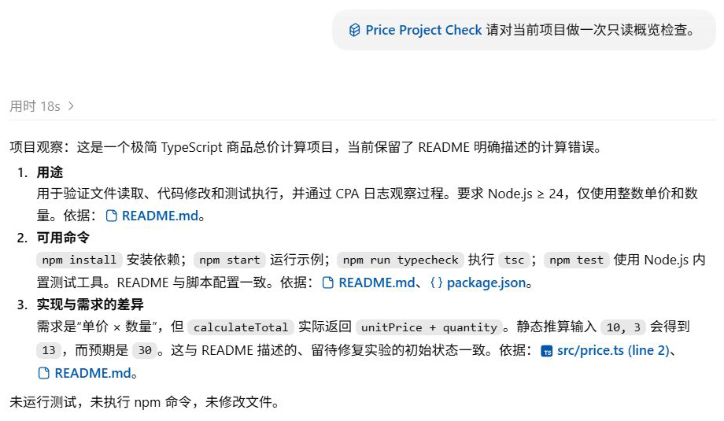

# Skills：一套检查步骤怎样被用上？

Skill 可以保存重复使用的检查步骤。这次项目技能要求读取指定文件，核对实现是否符合 README，再按固定格式报告。检查发生在修复前，代码仍使用加法，最终回答指出了它与乘法需求的差异。

## 把只读检查写成一个技能

实验在 `.agents/skills/price-project-check/SKILL.md` 保存了以下内容：

```markdown
---
name: price-project-check
description: 对商品总价项目做只读概览检查，核对用途、运行方式与实现是否符合 README。用于用户要求项目概览检查时，不用于运行测试或修复代码。
---

# 商品总价项目检查

读取项目根目录的 README.md、package.json 和 src/price.ts。

输出三个部分：用途、可用命令、实现与需求的差异。每个部分指出依据的文件。

只报告实际读到的信息；未运行测试时，明确写“未运行测试”。不要修改文件，也不要执行 npm 命令。
```

文件开头的 `name` 与 `description` 说明技能叫什么、适用什么任务；后面的正文给出具体步骤。这次检查需要用 README 核对需求，用 `package.json` 核对命令，再看实现是否符合要求。

在新建的项目任务中发送：

```text
$price-project-check 请对当前项目做一次只读概览检查。
```

最终回答按“用途、可用命令、实现与需求的差异”组织，还明确写出“未运行测试”。调用记录只有文件读取，与这个说法一致。



技能在界面中的名称是 `Price Project Check`，完整的正文与调用记录见[技能实验](../evidence/desktop-lab/05-skills/manifest.json)。

## 首次请求里已经有完整正文

在[第一份请求](../evidence/desktop-lab/05-skills/00-request.request.json)中搜索 `price-project-check`，可以找到目录条目、用户选择和技能正文：

| 位置 | 内容 | 模型从这里得知什么 |
| --- | --- | --- |
| 技能目录 | 名称、描述、文件路径 | 这个技能存在，适用只读概览 |
| 用户消息 | `$price-project-check` 与当前要求 | 用户选择了这个技能 |
| 附加的 `<skill>` 块 | 名称、路径与完整 `SKILL.md` | 检查哪几份文件，怎样报告，哪些操作不执行 |

客户端组装首请求时已经附上完整正文。随后模型又读取了 `SKILL.md` 和三个项目文件，取得磁盘内容；这次工具读取并非正文首次送达。

<details>
<summary>深入核对：目录、用户消息和附加正文的字段</summary>

三处分别位于 `input[2].content[1].text`、`input[6].content[0].text` 和 `input[7].content[0].text`。本次共有 8 项输入，比上一章加入规则的首请求多出一条技能正文消息；技能目录本身也新增了对应条目：

```text
- price-project-check: 对商品总价项目做只读概览检查，核对用途、运行方式与实现是否符合 README。用于用户要求项目概览检查时，不用于运行测试或修复代码。 (file: r14/price-project-check/SKILL.md)
```

`r14` 是本次技能根目录的别名。这个条目位于 `developer` 消息的文本目录中，并非一个名为 `price-project-check` 的工具接口；工具注册仍位于 `additional_tools`。

`input[7]` 是 `type: "message"`、`role: "user"`，只有一个 `input_text` 内容块，包装如下。正文已经在前面完整展示，此处用注记省略：

```text
<skill>
<name>price-project-check</name>
<path>E:\Develop\github\codex-ts-demo\.agents\skills\price-project-check\SKILL.md</path>
[此处是上述 SKILL.md 全文，含 YAML 元数据与正文]
</skill>
```

`<skill>` 是文本包装，没有增加协议角色，也不是工具结果。[官方 Skills 文档](https://learn.chatgpt.com/docs/build-skills)说明，客户端先提供名称、描述与位置，再按需使用正文。本次显式选择技能后，客户端在首请求中就附加了正文。

</details>

## 步骤怎样变成文件读取

本轮的两次请求经过下面的流程：

```text
首请求：技能目录 + 用户选择 + 完整步骤
    ↓
一次 exec：安排技能文件和三个项目文件的读取
    ↓
第二请求：一项工具结果，带回各份文件内容
    ↓
按技能要求报告用途、命令与实现差异
```

[第一次输出](../evidence/desktop-lab/05-skills/00-request.output-items.json)用一个 `exec` 一并安排技能文件和三个项目文件的读取。四份结果合在一个 `custom_tool_call_output` 中，进入[第二份请求](../evidence/desktop-lab/05-skills/01-request.request.json)，随后生成[最终说明](../evidence/desktop-lab/05-skills/01-request.output-items.json)。读取技能与读取项目文件之间没有另一轮模型决策。

<details>
<summary>深入核对：四条命令怎样回到同一个调用</summary>

外层调用的字段节选为：

```json
{
  "type": "custom_tool_call",
  "call_id": "call_liyjTQFrR1JWvixVysn2Xm73",
  "name": "exec"
}
```

代码使用 `Promise.allSettled` 收集四个 `tools.exec_command` 的返回：

| 命令 | 第二请求中的内容块 |
| --- | --- |
| `Get-Content -LiteralPath '.agents/skills/price-project-check/SKILL.md' -Raw` | `input[0].output[1]`，`file: "SKILL.md"` |
| `Get-Content -LiteralPath 'README.md' -Raw` | `input[0].output[2]`，`file: "README.md"` |
| `Get-Content -LiteralPath 'package.json' -Raw` | `input[0].output[3]`，`file: "package.json"` |
| `Get-Content -LiteralPath 'src/price.ts' -Raw` | `input[0].output[4]`，`file: "src/price.ts"` |

`output[0]` 是统一执行包装，因此总计 5 个内容块。文件结果的 `text` 为 JSON 字符串，解析后有 `file`、`status` 和 `value`，其中 `value.exit_code` 是命令退出码，`value.output` 是文件正文。四份结果共用 `call_liyjTQFrR1JWvixVysn2Xm73`，没有四个独立的外层 `call_id`。

四条命令来自同一次模型决策。代码负责安排并收集读取结果；要判断底层命令的执行时间是否重叠，还需时间记录。

第二请求通过 `previous_response_id` 引用第一响应 `resp_0061bd7340416e34016abbe2dbb46487d0af4b34ab5dd4d0a3`。原始事件见[第一阶段](../evidence/desktop-lab/05-skills/00-request.events.json)与[第二阶段](../evidence/desktop-lab/05-skills/01-request.events.json)。两份完成事件的 `output` 为空，具体输出在各自的 `response.output_item.done` 中。

两次正式请求输入 token 合计 67,312，输出合计 707，均排除预热。

</details>

## 看输出有没有按步骤工作

回答指出了需求与实现的差异，并注明文件依据：README 要求总价相乘，`src/price.ts` 使用 `unitPrice + quantity`。

回答中的 `10 + 3 = 13` 来自源码的静态推算。本轮工具只读文件，没有执行 npm 命令，“未运行测试”因此符合实际记录。第三章看到的失败测试和后续修复，是另一次授权后发生的操作。

最终介绍还保留了项目规则规定的“项目观察：”前缀。规则约定介绍方式，技能提供检查步骤，读取结果提供事实；这些内容都在同一个任务中使用。

## 没有点名技能时，也要看实际加载路径

第三章修复时，用户只要求修 bug，没有点名技能。模型的进度文字却说将使用本机 `ponytail`，随后的读取调用也包含该技能文件。

可用技能目录也会影响模型选择。本章显式使用 `$price-project-check` 时，首请求已经带上完整正文；修复任务中则能看到模型自行选择并读取技能。要判断正文何时进入上下文，需要检查具体请求，不能把其中一种路径当成固定流程。

<details>
<summary>深入核对：修复任务中的 ponytail 读取</summary>

[修复第一输出](../evidence/desktop-lab/07-fix/00-request.output-items.json)生成调用 `call_cJsfAlSozeFn4AYEwMQ8jCMX`，其中同时安排三组读取：`ponytail/SKILL.md`、文件清单与 Git 状态、项目文件。

[下一请求](../evidence/desktop-lab/07-fix/01-request.request.json)的 `input[0].output[1]` 标记 `read: "ponytail skill"`，包含技能读取结果。没有一轮单独等待技能后才决定读取代码的模型请求；这些动作已在同一次调用里安排。

`ponytail` 是实验机器安装的技能，不是修复这个总价错误的必装依赖。现有记录也没有系统测试技能触发冲突、禁用或多个技能之间的优先选择。

</details>

## 判断正文何时进入

先看显式技能实验的首请求和第二请求。分别找出第一次附加的正文，以及工具再次读取的正文。假如只保留第二请求，你会漏掉关于加载时机的什么事实？再为最终回答中的“未运行测试”找到执行依据。

<details>
<summary>核对答案</summary>

首请求 `input[7]` 已含完整技能正文，第二请求的 `input[0].output[1]` 又带回文件内容。只看后者会误以为工具读取是首次加载。调用代码和四份返回只涉及文件读取，没有 npm 执行；最终回答明确说“未运行测试”，与本轮执行范围一致。

</details>

[上一章：AGENTS.md](06-agents.md) · [下一章：记忆与持久信息](08-memory.md)
