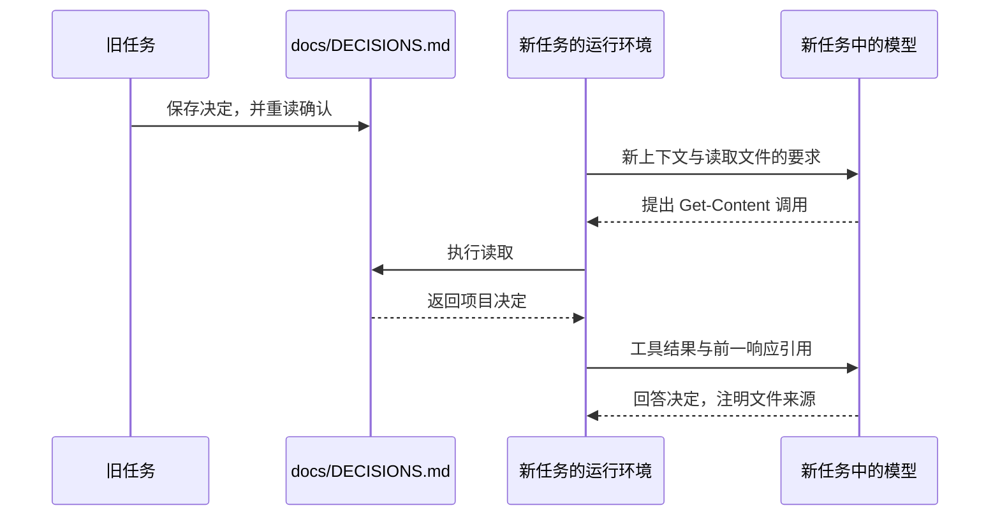

# 记忆与持久信息：新任务怎样得知旧决定？

第四章只把临时代号留在原任务里，新任务没有得到它。这次把项目决定写进文件，新任务读取后就能回答。信息跨过任务边界的路径在哪里？

决定记录的是当时的状态：“使用元，暂不支持折扣。”后面提出折扣需求时，这条记录也随实现更新。

## 先把决定写到磁盘

在原任务中发送：

```text
把这条项目约定写入 docs/DECISIONS.md：当前商品总价使用元，暂不支持折扣。只记录这一条，不修改业务代码。
```

Codex 检查项目规则与目标文件是否存在，用 `apply_patch` 创建文档，再重新读取确认。文件只有一条：

```markdown
- 当前商品总价使用元，暂不支持折扣。
```

[修改输出](../evidence/desktop-lab/12-memory-write/02-request.output-items.json)记录了补丁，[最后请求](../evidence/desktop-lab/12-memory-write/04-request.request.json)带回实际重读的正文和退出码 0。决定已经保存在项目文件中，即使新任务不接续原对话，也可以通过读取取得它。

<details>
<summary>深入核对：一行笔记的五次请求</summary>

这轮共 5 次正式请求、4 次外层工具调用，输入每次新增 1 项，并通过 `previous_response_id` 接续历史：

| 阶段 | 新获得的信息 | 模型提出的动作 |
| --- | --- | --- |
| [00](../evidence/desktop-lab/12-memory-write/00-request.request.json) | 写入决定的用户要求 | 搜索规则与已有 `DECISIONS.md` |
| [01](../evidence/desktop-lab/12-memory-write/01-request.request.json) | 搜索得到项目 `AGENTS.md` 等信息 | 读取规则，检查 `docs` 和目标文件是否存在 |
| [02](../evidence/desktop-lab/12-memory-write/02-request.request.json) | 规则与存在性检查结果 | 用 `apply_patch` 创建文件 |
| [03](../evidence/desktop-lab/12-memory-write/03-request.request.json) | 修改工具返回 `{}` | 重新读取文件 |
| [04](../evidence/desktop-lab/12-memory-write/04-request.request.json) | 文件正文与退出码 0 | 汇报已记录 |

阶段 02 的调用编号 `call_DSJ0OJJ2QNh19LfsKRsx1o5A` 在下一请求的返回中出现。简短的 `{}` 不包含完整落盘正文，所以随后又读取确认。至此，旧任务历史记录了写入过程，磁盘文件也保存了决定。

</details>

## 新任务从文件取得内容

随后在同一项目下新建任务，发送：

```text
读取 docs/DECISIONS.md，告诉我当前项目决定，并明确说明信息来自哪个文件。不要修改任何内容。
```

模型提出 `Get-Content` 读取。工具结果进入第二次请求后，它回答总价使用“元”为单位，暂不支持折扣，并指出来源为 `docs/DECISIONS.md`。


回答注明来源是 `docs/DECISIONS.md`，对应[文件笔记读取](../evidence/desktop-lab/12-memory-read/manifest.json)，不能计作原生 Memories 召回。

两个实验的任务 ID 不同。[新任务首请求](../evidence/desktop-lab/12-memory-read/00-request.request.json)没有引用旧任务的响应；决定内容出现在[下一请求的工具结果](../evidence/desktop-lab/12-memory-read/01-request.request.json)中。解析 `input[0].output[1].text` 后，相关字段如下：

```json
{
  "exit_code": 0,
  "output": "- 当前商品总价使用元，暂不支持折扣。\n\r\n"
}
```

用户明确指定了文件，工具结果提供正文，回答才使用其中的决定。本轮没有自动扫描项目里所有 Markdown。



新任务内部仍通过工具回传和响应引用接续；跨任务传递则经过磁盘文件。

<details>
<summary>深入核对：新任务的读取链</summary>

首请求有 7 项输入，没有 `previous_response_id`。[第一次输出](../evidence/desktop-lab/12-memory-read/00-request.output-items.json)提出读取，调用编号是 `call_Lrw0R8e67zTmGTkq5mPT5GAj`。

第二请求中的 `custom_tool_call_output` 使用同一编号，并通过 `previous_response_id` 引用这个新任务的第一次响应。最终[输出项](../evidence/desktop-lab/12-memory-read/01-request.output-items.json)引用文件来源回答。

读取共 2 次正式请求、1 次外层工具调用。写入与读取的统计都排除预热，它们是普通文件操作，没有被计为原生记忆后台任务。

</details>

## 文件笔记与原生 Memories 的证据范围

Desktop 还提供原生 Memories。我们在 `Settings > Personalization` 中只读检查了设置，[观察记录](../evidence/desktop-lab/ui-observations.json)的 `native-memory-settings` 项保留了“Codex 记忆”与 `Enable Codex memories` 开关。

本次检查时主开关关闭，灰色、圆点在左；`Allow memories from tool-assisted chats` 控件不可用。这里验证了文件笔记的跨任务写入和读取，原生 Memories 的自动生成与召回仍未实测。

新任务回答“不支持折扣”的来源已在文件读取结果里，不能计作原生记忆召回成功。

| 来源 | 信息怎样保留 | 本次怎样进入任务 |
| --- | --- | --- |
| 对话历史 | 保留此前用户消息与响应 | 第四章观察到重发与响应引用 |
| 项目文件笔记 | 明确写入 `docs/DECISIONS.md` | 本章由用户指定文件，工具读取后回传 |
| 原生 Memories | 根据设置与条件生成记忆 | 本次仅检查设置，生成与召回未验证 |

文件笔记可以审阅、修改并纳入版本管理。必须持续适用的项目要求，也可以写入 `AGENTS.md`。保存后仍要检查下一任务是否实际加载了这些内容。

<details>
<summary>深入核对：官方文档描述的后台记忆</summary>

[OpenAI 官方 Memories 文档](https://learn.chatgpt.com/docs/customization/memories)在原实验于 2026-09-30 核对时说明：启用本地 Codex Memories 后，可以从符合条件的旧聊天提取有用上下文，在后台更新本地记忆文件。

文档描述了生成条件：活跃或短暂会话会被跳过，结束后也可能需要足够的闲置时间；剩余额度低于配置阈值时，后台生成可能跳过。当前聊天能否使用已有记忆、能否作为未来记忆的输入，也有分别控制。官方建议把必须持续适用的团队规则放在 `AGENTS.md` 或版本管理中的文档里。

这些条件来自文档，实验没有测出等待时长或召回成功率。刚结束旧任务，新任务没有立即答出一条信息，不能仅凭这次结果判断后台生成失效；验证自动召回需要保留它实际进入新上下文的证据。

</details>

## 为答案确定来源

假设只拿到新任务最终回答，其中写着“暂不支持折扣”。请按顺序找出：用户让它读了什么、模型提出了什么调用、文件内容在哪次请求进入。然后解释为什么第四章的新任务不知道代号，这里的新任务却知道项目决定。

<details>
<summary>核对答案</summary>

这里的用户指向 `docs/DECISIONS.md`，模型提出读取，第二请求的工具结果带回决定。第四章的代号没有写入文件，新任务也没有引用原历史，并且要求不读文件、不搜索其他任务。两次实验提供的信息路径不同。若要把某个答案归因于原生 Memories，还需另外找到相关记忆上下文或召回证据。

</details>

[上一章：Skills](07-skills.md) · [下一章：MCP](09-mcp.md)
