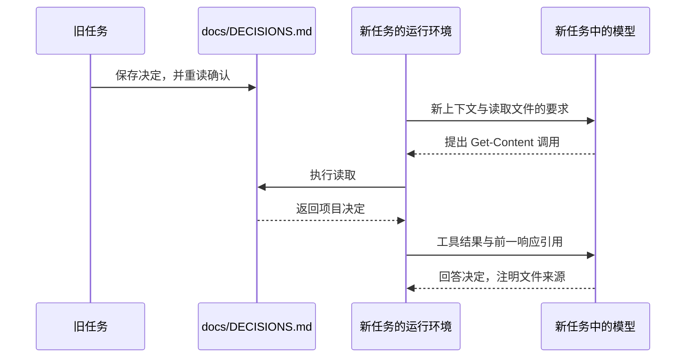
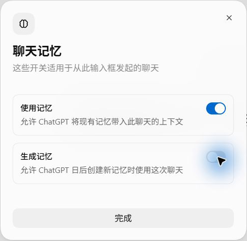
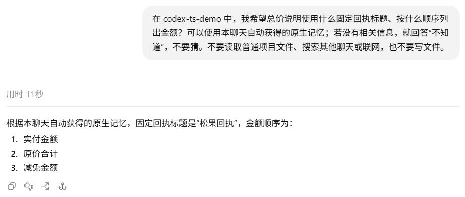

# 记忆与持久信息：新任务怎样得知旧决定？

第四章只把临时代号留在原任务里，新任务没有得到它。如果希望下次工作还能用到一条信息，可以把它写进项目文件，也可以让 Codex 的原生 Memories 在后台提取。

先看一条文件笔记怎样被新任务读到，再看原生记忆从提取、整合到进入新请求的过程。两种实验都要回答同一个问题：答案中的信息从哪里来？

## 先把决定写到磁盘

在原任务中发送：

```text
把这条项目约定写入 docs/DECISIONS.md：当前商品总价使用元，暂不支持折扣。只记录这一条，不修改业务代码。
```

Codex 检查项目规则与目标文件是否存在，用 `apply_patch` 创建文档，再重新读取确认。文件只有一条：

```markdown
- 当前商品总价使用元，暂不支持折扣。
```

这条决定记录的是当时的项目状态。后面提出折扣需求时，记录也随实现更新。

[修改输出](../evidence/desktop-lab/12-memory-write/02-request.output-items.json)记录了补丁，[最后请求](../evidence/desktop-lab/12-memory-write/04-request.request.json)带回实际重读的正文和退出码 0。决定已经保存在项目文件中，即使新任务不接续原对话，也可以通过读取取得它。

<details>
<summary>深入核对：一行笔记的五次请求</summary>

这轮共 5 次正式请求、4 次外层工具调用，输入每次新增 1 项，并通过 `previous_response_id` 接续历史：

| 阶段 | 新获得的信息 | 模型提出的动作 |
| --- | --- | --- |
| [00](../evidence/desktop-lab/12-memory-write/00-request.request.json) | 写入决定的用户要求 | 搜索规则与已有 `DECISIONS.md` |
| [01](../evidence/desktop-lab/12-memory-write/01-request.request.json) | 搜索得到项目 `AGENTS.md` 等信息 | 读取规则，检查 `docs` 和目标文件是否存在 |
| [02](../evidence/desktop-lab/12-memory-write/02-request.request.json) | 规则与存在性检查结果 | 用 `apply_patch` 创建文件 |
| [03](../evidence/desktop-lab/12-memory-write/03-request.request.json) | 修改工具返回 `{}` | 重新读取文件 |
| [04](../evidence/desktop-lab/12-memory-write/04-request.request.json) | 文件正文与退出码 0 | 汇报已记录 |

阶段 02 的调用编号 `call_DSJ0OJJ2QNh19LfsKRsx1o5A` 在下一请求的返回中出现。简短的 `{}` 不包含完整落盘正文，所以随后又读取确认。至此，旧任务历史记录了写入过程，磁盘文件也保存了决定。

</details>

## 新任务从文件取得内容

随后在同一项目下新建任务，发送：

```text
读取 docs/DECISIONS.md，告诉我当前项目决定，并明确说明信息来自哪个文件。不要修改任何内容。
```

模型提出 `Get-Content` 读取。工具结果进入第二次请求后，它回答总价使用“元”为单位，暂不支持折扣，并指出来源为 `docs/DECISIONS.md`。


回答注明来源是 `docs/DECISIONS.md`，对应[文件笔记读取](../evidence/desktop-lab/12-memory-read/manifest.json)，不能计作原生 Memories 召回。

两个实验的任务 ID 不同。[新任务首请求](../evidence/desktop-lab/12-memory-read/00-request.request.json)没有引用旧任务的响应；决定内容出现在[下一请求的工具结果](../evidence/desktop-lab/12-memory-read/01-request.request.json)中。解析 `input[0].output[1].text` 后，相关字段如下：

```json
{
  "exit_code": 0,
  "output": "- 当前商品总价使用元，暂不支持折扣。\n\r\n"
}
```

用户明确指定了文件，工具结果提供正文，回答才使用其中的决定。本轮没有自动扫描项目里所有 Markdown。



新任务内部仍通过工具回传和响应引用接续；跨任务传递则经过磁盘文件。

<details>
<summary>深入核对：新任务的读取链</summary>

首请求有 7 项输入，没有 `previous_response_id`。[第一次输出](../evidence/desktop-lab/12-memory-read/00-request.output-items.json)提出读取，调用编号是 `call_Lrw0R8e67zTmGTkq5mPT5GAj`。

第二请求中的 `custom_tool_call_output` 使用同一编号，并通过 `previous_response_id` 引用这个新任务的第一次响应。最终[输出项](../evidence/desktop-lab/12-memory-read/01-request.output-items.json)引用文件来源回答。

读取共 2 次正式请求、1 次外层工具调用。写入与读取的统计都排除预热，它们是普通文件操作，没有被计为原生记忆后台任务。

</details>

## 让原生记忆保存一条展示偏好

原生 Memories 从符合条件的旧聊天中提取信息，在后台更新本地记忆。在 `Settings > Personalization` 开启“Codex 记忆”后，新聊天还可以通过 `/memories` 分别设置是否使用已有记忆、是否允许这个聊天贡献记忆。前者影响当前回答能得到什么，后者影响这段聊天以后能否成为记忆来源。



本次来源聊天关闭“使用记忆”、开启“生成记忆”；所有测试聊天都关闭生成，避免把测试回答再次当作来源。测试时使用全新聊天，使用开关在第一条消息前设定。

在提供偏好之前，先用[独立聊天](../evidence/desktop-lab/native-memory-baseline/manifest.json)提问，得到“不知道”。随后在来源聊天发送：

```text
在 codex-ts-demo 项目里，我有一条长期展示偏好：总价说明的固定标题用“松果回执”，金额按“实付金额 → 原价合计 → 减免金额”的顺序列出。这条偏好以后继续这个项目时也适用，允许原生记忆在后台提取。现在请只在聊天里确认，并用单价 10 元、数量 3、减免 10% 给一个符合偏好的示例。不要调用工具，不要修改普通项目文件，也不要手动编辑记忆文件。
```

[来源聊天的回答](../evidence/desktop-lab/native-memory-source/00-request.output-items.json)使用了指定标题，按顺序列出 27、30、3 元。接着在同一聊天换一组金额，它仍按这个格式回答。这两轮都没有调用工具，也没有把偏好写进普通项目文件。

同一聊天中的第二次回答还不能证明跨聊天记忆。[第二轮请求](../evidence/desktop-lab/native-memory-source-context/00-request.request.json)重发了第一轮的问题和回答，模型从当前上下文就能得到偏好。

## 已经提取，为什么新聊天还不知道？

后台完成来源聊天的提取后，再开两个独立聊天，一个关闭使用记忆，一个开启。两边发送完全相同的问题，问题里不带标题或金额顺序：

```text
在 codex-ts-demo 中，我希望总价说明使用什么固定回执标题、按什么顺序列出金额？可以使用本聊天自动获得的原生记忆；若没有相关信息，就回答“不知道”，不要猜。不要读取普通项目文件、搜索其他聊天或联网，也不要写文件。
```

两个聊天都回答“不知道”。开启记忆的请求已经包含原生记忆内容，但其中没有本次偏好。


这时来源聊天的提取任务已完成，全局整合仍待处理。提取先从一段聊天整理出有用信息；整合再把这些内容纳入供后续任务使用的记忆。只看到第一步完成，还不能判断新请求会带上哪条信息。

<details>
<summary>深入核对：提取、整合与等待条件</summary>

[核对记录](../evidence/desktop-lab/native-memory-recall-consolidated/audit.json)保留了这条来源的状态变化。以下时间均为 2026-10-03 北京时间：

| 时间 | 观察 |
| --- | --- |
| 13:25:32 | 来源聊天的第二轮完成，成为本次提取的来源版本 |
| 18:53:34 | `memory_stage1` 完成，但来源尚未被选入整合 |
| 19:02、19:04 | 关闭和开启记忆的两个新聊天都回答“不知道” |
| 19:15 | 运行日志报告剩余额度低于门槛，跳过后台启动 |
| 19:19:24 | 重启后的全局整合开始 |
| 19:24:24 | `MEMORY.md` 和 `memory_summary.md` 更新，包含目标偏好 |
| 19:24:40 | 全局整合完成，来源被选入，版本对应 13:25:32 的来源内容 |

这里的 `memory_stage1`、`selected_for_phase2` 等字段来自本次版本的本地状态。整合完成后，`selected_for_phase2=1`，`selected_for_phase2_source_updated_at` 与来源版本一致；生成的 `MEMORY.md` 还保留来源聊天 `01a10034-1814-77d3-9563-3ca5e239f795` 的引用。这些信息把记忆产物与最初的两轮聊天连起来。

[官方 Memories 文档](https://learn.chatgpt.com/docs/customization/memories)和[配置参考](https://learn.chatgpt.com/docs/config-file/config-reference)说明了闲置时间、会话条件和剩余额度等限制。核对时，`memories.min_rollout_idle_hours` 默认 6 小时，本机已改为 1 小时；`memories.min_rate_limit_remaining_percent` 默认 25%。19:15 的运行日志确认账户剩余 20%，低于当时的 25% 门槛。用户将门槛改为 10% 并重启后，才观察到本轮整合启动。

达到闲置时长只表示满足其中一个条件，不能据此承诺何时生成。这次也没有测量不同设置下的生成速度或召回成功率。

</details>

## 整合之后，偏好进入了新请求

整合完成后，再用两个独立新聊天重复同一个问题，使用记忆分别开启和关闭。它们都不继承来源聊天，也不读取普通项目文件。结果变成了：

| 新聊天 | 请求中的目标偏好 | 回答 |
| --- | --- | --- |
| [开启使用记忆](../evidence/desktop-lab/native-memory-recall-consolidated/manifest.json) | 原生 `## Memory` 块包含标题和金额顺序 | “松果回执”，按实付金额、原价合计、减免金额排列 |
| [关闭使用记忆](../evidence/desktop-lab/native-memory-recall-consolidated-off/manifest.json) | 没有目标偏好 | “不知道。” |



两轮都是 1 次请求、0 次工具调用。开启记忆那轮的[首请求](../evidence/desktop-lab/native-memory-recall-consolidated/00-request.request.json)中，`input[2].content[1].text` 的 `## Memory` 块包含下面这一行，与生成的 `memory_summary.md` 第 13 行逐字一致：

```text
- codex-ts-demo price explanations use 松果回执: 实付金额 → 原价合计 → 减免金额.
```

这行内容在回答生成前就已进入请求。结合来源聊天、提取记录和整合产物，可以追到本次答案的信息路径：来源聊天中的偏好经过后台处理，进入原生记忆摘要，再由运行环境附加到新聊天的上下文中。

这次验证了自动注入记忆后回答的路径。模型没有主动调用工具搜索记忆目录，因此未测试那种检索方式，也不能由这一个案例推断所有信息都会被保存、每次都会召回。原生记忆也可能涉及文件读取；判断来源时要看读取的是哪种文件，以及它由谁生成。

<details>
<summary>深入核对：从来源聊天到回答</summary>

[核对记录](../evidence/desktop-lab/native-memory-recall-consolidated/audit.json)关联了来源版本、生成文件的目标片段、请求和回答。成功聊天为 `01a10183-f694-76e2-b438-211a32bd1b05`，19:26:32 发出首请求，没有 `previous_response_id`，也没有重发来源聊天的历史。

没有响应引用本身不足以排除历史重发。这里还需检查实际输入：当前用户问题没有答案，原生记忆块包含答案，回答前没有文件读取或其他工具调用。关闭使用记忆的对照使用同一问题，未获得目标内容，最终回答“不知道。”。

第一次未成功召回的[关闭对照](../evidence/desktop-lab/native-memory-recall-off/manifest.json)与[开启对照](../evidence/desktop-lab/native-memory-recall-on/manifest.json)也各有 1 次请求、0 次工具调用。开启记忆时能看到额外内容，只能说明记忆入口在工作；是否包含所问的偏好，还要核对该内容本身。

后台提取与整合由本地状态和生成产物核验，本次没有导出它们的 CPA 后台请求。来源聊天和召回聊天的 CPA 请求分别保存在对应实验中。

公开请求保留了目标行，无关私人记忆以明确的脱敏标记替换。它们可用于核对本实验的来源，不能用于推断当时全部记忆的内容。

</details>

## 哪些信息适合放在哪里？

| 来源 | 信息怎样保留 | 本次怎样进入新任务 |
| --- | --- | --- |
| 对话历史 | 保留此前用户消息与响应 | 第四章观察到重发与响应引用；本章来源聊天的第二轮也重发了历史 |
| 项目文件笔记 | 明确写入 `docs/DECISIONS.md` | 用户指定文件，工具读取后回传 |
| 原生 Memories | 后台提取并整合符合条件的聊天 | 本次将生成摘要中的偏好自动注入新请求 |

项目决定需要审阅、修改和版本管理时，可以保存在文件笔记中。必须持续适用的团队规则适合放在 `AGENTS.md` 或项目文档里。原生 Memories 可以带入过去工作中的有用信息，但后台是否保存、何时更新，以及当前请求是否包含它，都有各自的条件。

## 为答案确定来源

分别找出“暂不支持折扣”和“松果回执”进入新任务的位置：前者在哪次工具返回中出现，后者在哪个请求内容块中出现？再解释为什么来源聊天完成提取后，第一次开启记忆的新聊天仍回答“不知道”。

<details>
<summary>核对答案</summary>

文件笔记由用户指定，第二请求的工具结果带回 `docs/DECISIONS.md` 的正文。原生记忆实验中，整合后的新聊天在首请求的 `input[2].content[1].text` 里得到目标偏好，随后直接回答，没有工具调用。

第一次开启记忆的新聊天虽然已经收到原生记忆块，但其中还没有这条偏好；当时来源提取完成，全局整合尚未完成。检查后台状态、请求内容和回答，才能分别判断保存到了哪一步、模型实际得到了什么。

</details>

[上一章：Skills](07-skills.md) · [下一章：MCP](09-mcp.md)
