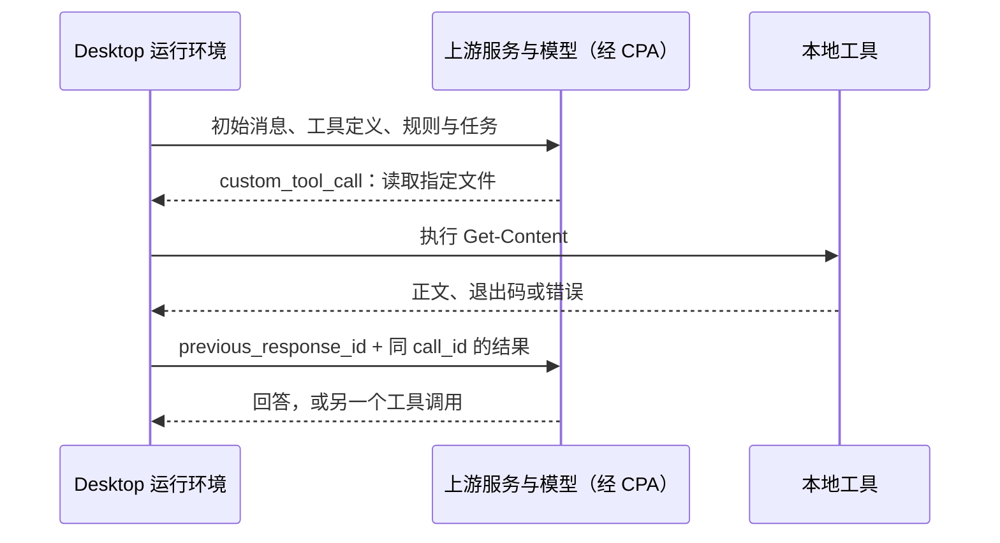

# 模型眼前的上下文，都从哪里来？

同一个回答可能同时受到用户要求、项目规则、技能正文和文件内容影响。理解上下文的关键，是追查每条信息通过什么路径进入请求，而不是把一大段输入统称为“提示词”。

本章复用前面的真实实验，不需要再制造一次长对话。分别打开第 3、4、5 章的请求，沿信息来源做一次对照。

## 从三个真实任务开始

我们先后发送过：

```text
请只阅读项目的 README.md，用三句话说明项目做什么、如何运行、当前已知问题。不要修改任何文件，也不要修复问题。
```

以及显式技能调用：

```text
$price-project-check 请对当前项目做一次只读概览检查。
```

输入框文字很短，实际请求却还包含应用指令、工具定义、环境与项目约定。部分信息在模型第一次生成前就存在，部分要等文件读取之后才加入。

## 给信息贴上来源，而不只看角色

| 信息 | 本次真实入口 | 可以核对的位置 |
| --- | --- | --- |
| 当前任务要求 | 普通用户消息 | 第 4 章首请求 `input[6]` |
| 项目规则 | Desktop 附加的规则块 | 同请求 `input[5].content[1].text` |
| 可用技能描述 | 技能目录 | 第 5 章首请求 `input[2].content[1].text` |
| 显式使用的技能正文 | 附加的 `<skill>` 块 | 同请求 `input[7]` |
| README 与源码内容 | 工具执行结果 | 第 5 章第二请求 `input[0].output` |

可分别打开[第 4 章请求](../evidence/desktop-lab/04-agents/00-request.request.json)、[第 5 章首请求](../evidence/desktop-lab/05-skills/00-request.request.json)和[文件结果请求](../evidence/desktop-lab/05-skills/01-request.request.json)核对。

这些来源有时共享 `role: "user"`，但不是同一来源。客户端附加的规则和技能正文，不等于人在聊天框里逐字输入了那些内容。

## 把三个实验的六次请求展开

第 3、4、5 章各有两次正式请求。按“当前输入 → 模型输出 → 本地执行 → 下一输入”排列，区别就很具体：

| 实验与阶段 | 本次请求装入什么 | 模型接下来输出什么 | 结果何时进入模型 |
| --- | --- | --- | --- |
| 读 README `00` | 13 项：已有对话、当前任务等 | `exec` 内调用 `Get-Content README.md` | [读 README `01`](../evidence/desktop-lab/03-readme/01-request.request.json) 的工具结果 |
| 读 README `01` | 1 项结果，并引用上一响应 | 三句项目介绍 | 此轮结束，无新工具结果 |
| 加规则 `00` | 7 项：其中规则块已出现“项目观察：”要求 | 再读 README | [加规则 `01`](../evidence/desktop-lab/04-agents/01-request.request.json) 的工具结果 |
| 加规则 `01` | 1 项结果，并引用上一响应 | 遵循项目规则的介绍 | 此轮结束 |
| 显式 Skill `00` | 8 项：技能目录、用户点名和附加正文 | 一次 `exec` 内安排技能及三个项目文件的读取 | [Skill `01`](../evidence/desktop-lab/05-skills/01-request.request.json) 的结果数组 |
| 显式 Skill `01` | 1 项结果，内含多个文件内容块 | 用途、命令、实现与需求的差异 | 此轮结束 |

对应模型提出的动作保存在[第 3 章 `00` 输出](../evidence/desktop-lab/03-readme/00-request.output-items.json)、[第 4 章 `00` 输出](../evidence/desktop-lab/04-agents/00-request.output-items.json)、[第 5 章 `00` 输出](../evidence/desktop-lab/05-skills/00-request.output-items.json)。请求里列了可用工具，和响应里真的提出读取，是两个时刻；读取结果又要到下一次请求才进入模型。

例如第 3 章调用的 `call_id` 是 `call_a288dLl8tyNv8JFlTJgNdtfK`。下一请求中的 `custom_tool_call_output.call_id` 与它相同，结果里才有 README 正文。客户端还将 `previous_response_id` 指向产生调用的那次响应，使模型同时知道“我刚才为什么读它”和“实际读到了什么”。

本次六份客户端请求与对应上游请求的 `input`、`previous_response_id` 一致。比较入口如 [Skill 首次上游请求](../evidence/desktop-lab/05-skills/00-request.upstream.json)与[后续上游请求](../evidence/desktop-lab/05-skills/01-request.upstream.json)。因此，在 CPA 这段链路上没有证据表明代理额外替模型读取了 README。它转发包含文件结果的模型请求，文件读取本身由本地工具完成。

## 文件存在，不代表正文已经送入模型

第 5 章首请求已经提到 `src/price.ts`，因为技能要求检查它；其中还没有计算函数的 `unitPrice + quantity` 实现。路径告诉模型可以去哪里查看，工具返回才提供这次读取的正文。

第二请求中的工具结果，按文件标记了 `SKILL.md`、`README.md`、`package.json` 和 `src/price.ts`。把 `src/price.ts` 对应内容块内的 JSON 字符串解析后，可得到以下字段节选：

```json
{
  "file": "src/price.ts",
  "status": "fulfilled",
  "value": {
    "exit_code": 0,
    "output": "export function calculateTotal(unitPrice: number, quantity: number): number {\n  return unitPrice + quantity;\n}\n\r\n"
  }
}
```

这个结果为“实现使用加法”提供直接依据。原始工具结果里正文包含末尾换行，这里保持原样；工具执行耗时等字段没有展示。

## 当前请求不一定重写全部上下文

第 3 章第一次请求有历史、任务和进度文字；读完 README 后，第二次请求只带一个工具结果，通过 `previous_response_id` 接续前一响应。追查来源时，需要沿这条引用往前找，而不能只搜索当前这一份 JSON。

另一方面，第 2 章是把历史重新放进 `input`。因此“本次文件里没有某句话”至少存在两种解释：它确实没有进入可用上下文，或者它位于所引用的历史中。先检查链路，再下结论。

这个过程就是本教程所说的 Agent Loop：不是模型生成一段很长的文字就算完成，而是运行环境重复组织请求，把上一步动作的结果交给下一步生成。本例循环一次读取就结束；修复任务可以经历读取、搜索、修改、测试等多次循环。循环次数由实际输出决定，不能预先用“用户发了一句话”固定为一次请求。



图是依据本组记录整理的职责示意，不是内部源码。它还解释了为什么文件读取失败也有学习价值：错误同样可以进入下一次请求，模型才能根据失败调整动作。缓存、压缩和持久记忆分别改变计算复用、当前历史表示、跨任务信息来源，不改变“要找到信息实际进入模型的位置”这个阅读方法。

## 哪些判断有证据，哪些还没有？

工具结果证明这次读取返回了某个版本的文件内容。它不能保证文件此后没有被其他任务修改；需要判断当前状态时，应重新读取。类似地，目录中列出一个 Skill 证明它可被发现，不证明所有正文已经加载或执行过。

本章只重读已有证据，不新增模型请求。跨章节比较用量时应使用各自正式响应的统计，排除预热；不能把文件大小当作 token，也不能把 token 直接当成费用。

## 练习：为一个结论找来源

对于“项目要求总价相乘，但实现使用加法”，分别找出需求依据和实现依据。只看到 `src/price.ts` 的路径，为什么还不足以支持后半句？

<details>
<summary>参考解释</summary>

需求来自读取结果中的 README，实现来自读取结果中的 `src/price.ts` 正文。路径只标识文件位置，并没有说明内部运算符。最终回答应建立在实际读到的内容上，而不是把路径、文件名或技能描述当成源码。

</details>

[上一章：继续旧任务和新建任务，有什么不同？](08-session.md) · [下一章：对话变长，历史怎样被压缩？](10-compaction.md)
