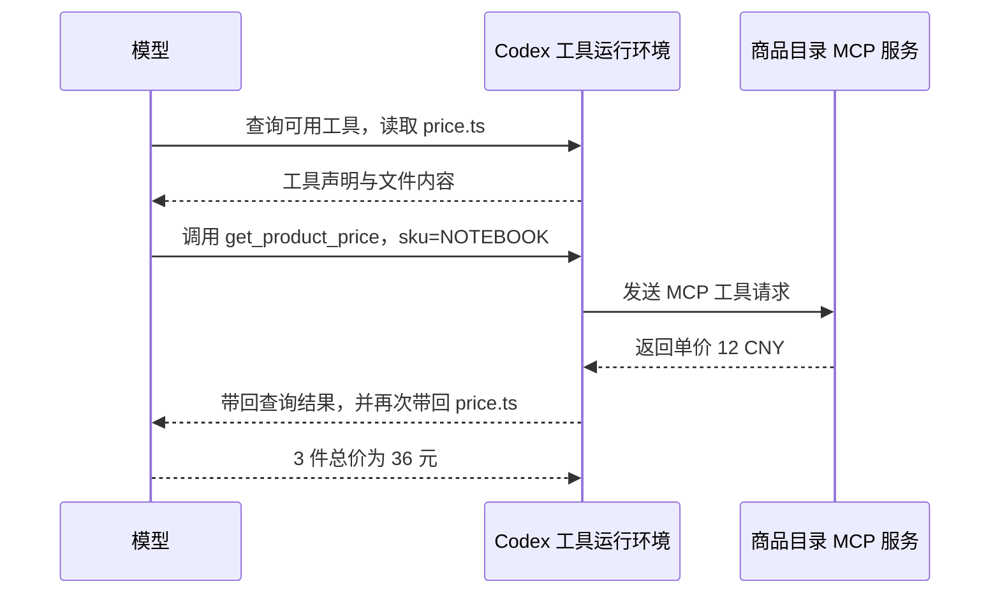

# MCP：单价 12 元是从哪里来的？

前面的计算都由用户给出单价。这次只告诉 Codex 商品编号 `NOTEBOOK`，要求它查价，再计算 3 件的总价。最后它回答 36 元。要相信这个结果，先得找到 12 元第一次进入这轮上下文的位置。

项目接入了一个本地商品目录，提供 `get_product_price` 工具。MCP 约定客户端怎样发现和调用这类服务；商品查询由服务中的 TypeScript 代码完成。本章沿一次真实查询看这层连接怎样参与 Agent Loop。

## 先找到价格返回

Desktop 中发送的要求如下。原始输入保存在[实验清单](../evidence/desktop-lab/13-mcp/manifest.json)，下面按普通文本展示：

```text
请使用 product_catalog MCP 的 get_product_price 工具查询 SKU NOTEBOOK 的单价，再读取 src/price.ts，计算 3 件的总价。必须以实际工具结果为依据；若该 MCP 工具不可用就如实说明，不要用读取商品目录源码代替调用。不要修改文件。
```

这段输入没有提供单价。在[最后一次请求](../evidence/desktop-lab/13-mcp/02-request.request.json)中，前一次工具执行返回了下面的内容。它来自 `input[0].output[1].text`，解析该 JSON 字符串后为：

```json
{
  "content": [
    {
      "type": "text",
      "text": "{\"sku\":\"NOTEBOOK\",\"unitPrice\":12,\"currency\":\"CNY\"}"
    }
  ],
  "structuredContent": {
    "sku": "NOTEBOOK",
    "unitPrice": 12,
    "currency": "CNY"
  }
}
```

`unitPrice: 12` 在工具结果里已经出现。`content` 提供文字形式，`structuredContent` 提供结构化形式，两者都由服务返回。下一内容块带回 `src/price.ts`，其中计算函数使用 `unitPrice * quantity`。模型收到价格和实现后，才给出 `12 × 3 = 36 元`。

这一轮读取了函数并计算答案，没有实际执行 `calculateTotal(12, 3)`。如果要证明程序对这个输入返回 36，还需要运行函数或增加对应测试。

## 调用之前，模型先找到了接口

查价并非第一步。第一次模型响应生成一段 `exec` 代码，查询运行环境的工具目录，同时读取 `src/price.ts`。返回目录中出现了以下声明：

```ts
declare const tools: {
  mcp__product_catalog__get_product_price(args: {
    // 商品编号：NOTEBOOK 或 PENCIL
    sku: string;
  }): Promise<CallToolResult>;
};
```

这段声明告诉模型调用名称和参数格式，尚未提供查询结果。收到它以后，[第二次模型响应](../evidence/desktop-lab/13-mcp/01-request.output-items.json)才生成实际查询，代码节选为：

```js
text(await tools.mcp__product_catalog__get_product_price({sku:"NOTEBOOK"}));
```

运行环境执行这段代码，把参数交给已连接的商品服务。服务取出价格，结果再随下一次请求回到模型。这里仍是第二、三章见过的工具往返，只是工具背后多了一个独立服务。



图按实际记录整理。第一次目录查询已读过源码，第二次调用又读了一遍，因此实际动作没有完全遵循提示里“先查价，再读文件”的顺序。整轮有 3 次正式模型请求、2 次外层 `exec`，只有 1 次商品 MCP 查询。

<details>
<summary>深入核对：三个阶段怎样对应</summary>

| 阶段 | 模型新获得什么 | 随后输出 |
| --- | --- | --- |
| [00 请求](../evidence/desktop-lab/13-mcp/00-request.request.json) | 12 项输入，包含基础上下文、重发的项目笔记历史和查价要求 | [查询工具目录并读文件](../evidence/desktop-lab/13-mcp/00-request.output-items.json) |
| [01 请求](../evidence/desktop-lab/13-mcp/01-request.request.json) | 工具声明与首次文件读取结果 | [调用 MCP 并再次读文件](../evidence/desktop-lab/13-mcp/01-request.output-items.json) |
| [02 请求](../evidence/desktop-lab/13-mcp/02-request.request.json) | 单价与重读的计算函数 | [最终答案](../evidence/desktop-lab/13-mcp/02-request.output-items.json) |

首请求没有 `previous_response_id`；`input[0..5]` 是工具和基础上下文，`input[6..10]` 重发此前读取项目笔记的过程，`input[11]` 是本次要求。后两次请求分别引用前一响应。

第一次外层调用编号为 `call_75g7fEltP0HEVgJJJOpXMJns`，第二次为 `call_p7bdY59aNNKkV0ISyHbxziJ8`，各自结果通过同一 `call_id` 返回。外层结果类型是 `custom_tool_call_output`；MCP 结果在其中一个内容块里，不能再算成一次额外的模型生成。

首请求顶层工具目录没有直接列出商品接口。模型从 `ALL_TOOLS` 取得声明，因此“顶层没看到名称”不足以判断工具不可用。那次广泛检索产生了截断，商品声明仍保留在结果开头；复现查询无需照搬这次额外检索。

配置中的 `product_catalog` 与服务注册的 `get_product_price`，在本次 Code Mode 中组合成 `mcp__product_catalog__get_product_price`。上面的 TypeScript 声明是提供给模型的调用形式，服务的 Zod schema 则负责参数校验。声明不是原始 MCP `tools/list` JSON。

</details>

## 服务里的 TypeScript 做了什么？

[mcp/catalog.ts](../examples/13-mcp/mcp/catalog.ts)只保存两条商品数据：`NOTEBOOK` 为 12 元，`PENCIL` 为 3 元。注册工具时提供名称、用途和输入 schema，处理函数收到 `sku` 后查询 `Map`。查不到时返回 `isError: true`，因此不存在的商品不会被当作 0 元。

这一分工与 Skill 有明显不同：Skill 正文为模型提供工作方法；这里的服务执行代码并返回业务数据。模型可以选择查哪件商品，具体价格取决于服务中的目录。

<details>
<summary>深入核对：工具定义与处理函数</summary>

以下节选来自同一服务源码，注册部分省略处理函数：

```ts
server.registerTool(
  'get_product_price',
  {
    title: '查询商品单价',
    description: '只读查询本地商品目录，返回人民币单价（元）。SKU 区分大小写。',
    inputSchema: { sku: z.string().min(1).describe('商品编号：NOTEBOOK 或 PENCIL') },
    annotations: { readOnlyHint: true, destructiveHint: false, idempotentHint: true, openWorldHint: false },
  },
  // 此处省略处理函数，完整实现见上面的源码链接。
);
```

对应的处理函数为：

```ts
async ({ sku }) => {
  const unitPrice = prices.get(sku);
  if (unitPrice === undefined) {
    return {
      isError: true,
      content: [{ type: 'text', text: `Unknown SKU: ${sku}. Supported SKUs: NOTEBOOK, PENCIL.` }],
    };
  }
  const product = { sku, unitPrice, currency: 'CNY' };
  return { content: [{ type: 'text', text: JSON.stringify(product) }], structuredContent: product };
}
```

SDK 将经过校验的参数交给处理函数。`readOnlyHint` 是提示性注解；实际只读行为来自实现只查 `Map`，没有写文件或访问网络。运行时的权限边界需要另外核对，下一章会做一次写入实验。

服务使用 `StdioServerTransport`。Desktop 启动本地 Node 进程，通过标准输入和标准输出与它通信，无需额外监听网络端口。stdout 用于 MCP 消息，调试日志应写入 stderr。

</details>

## 把这个服务接入自己的项目

复制[本章项目快照](../examples/13-mcp/README.md)到独立目录，使用 Node.js 24 或更新版本。快照包含锁文件和检查脚本，不包含 `node_modules`。先在复制后的项目运行：

```bash
npm ci
npm run typecheck
npm test
npm run mcp:check
```

最后一条命令通过 SDK 启动服务并调用它。本次结果为：

```text
MCP verified: tools/list; NOTEBOOK=12 CNY; PENCIL=3 CNY; unknown SKU and invalid input rejected.
```

这时已经知道服务本身可用。接下来还要让 Desktop 连接它。[配置示例](../examples/13-mcp/.codex/config.example.toml)如下，将三处路径替换为自己的绝对路径，再保存为项目的 `.codex/config.toml`：

```toml
[mcp_servers.product_catalog]
command = "C:/path/to/node.exe"
args = ["C:/path/to/codex-ts-demo/mcp/catalog.ts"]
cwd = "C:/path/to/codex-ts-demo"
```

项目配置需要受到 Codex 信任，规则见[官方配置文档](https://learn.chatgpt.com/docs/config-file/config-basic)。也可以在 Desktop 的 MCP 设置中添加 STDIO 服务，填写相同命令和参数；入口见 [MCP 文档](https://learn.chatgpt.com/docs/extend/mcp)。本次版本的位置是 `Settings > Plugins > MCP`，其他版本以实际界面为准。

设置显示启用之后，发送本章查价要求，再沿调用与返回确认当前任务确实用到了它。服务检查成功、Desktop 显示启用、任务实际调用，分别验证了连接的不同部分。

<details>
<summary>深入核对：复现环境与证据边界</summary>

本次依赖锁定为 `@modelcontextprotocol/sdk` 1.31.0 和 `zod` 4.6.5。[检查脚本](../examples/13-mcp/mcp/check-catalog.ts)使用 `Client` 与 `StdioClientTransport`，验证初始化、工具列表、两个已知商品、未知 SKU 和错误类型参数。类型检查、原有 1 个业务测试及 MCP 检查均通过。

[界面记录](../evidence/desktop-lab/ui-observations.json)中的 `mcp-project-config-visible` 显示服务已列出并启用。更早的状态面板和请求未看到它；进入设置确认后，再次发送任务才实际调用成功。实验没有重启，也没有确定此前缺席的内部原因。demo 未初始化 Git，但当时的 core 已读取受信任项目配置。

CPA 位于 Codex 与模型服务之间。这里的 stdio MCP 通信在本地发生，不经过 CPA。CPA 可以证明模型发出了查价调用，下一次请求带回 12 元；本地配置、服务源码和独立 SDK 检查补充了服务一侧的证据。本实验未采集 MCP 底层 JSON-RPC 握手帧。

</details>

## 换一个商品，先预测再核对

在自己的 Desktop 中改查 `PENCIL`，计算 3 件总价。发送前先写下预期结果；收到回答后，从 MCP 返回和下一次模型请求中找出它的价格来源。如果只有最终答案正确，能否确认工具实际被调用了？

<details>
<summary>参考解释</summary>

服务目录中 `PENCIL` 单价为 3，预期总价为 9。还需要找到本次实际调用、对应结果中的单价，以及结果进入模型的请求。正确答案本身不能证明调用发生。公开 Desktop 样本只查询了 `NOTEBOOK`；`PENCIL`、未知 SKU 和非法参数已有独立 SDK 检查，新的 Desktop 查询要用自己的日志核对。

</details>

[上一章：记忆与持久信息](08-memory.md) · [下一章：权限与安全](10-permissions.md)
