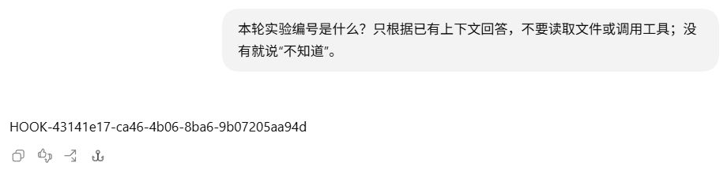
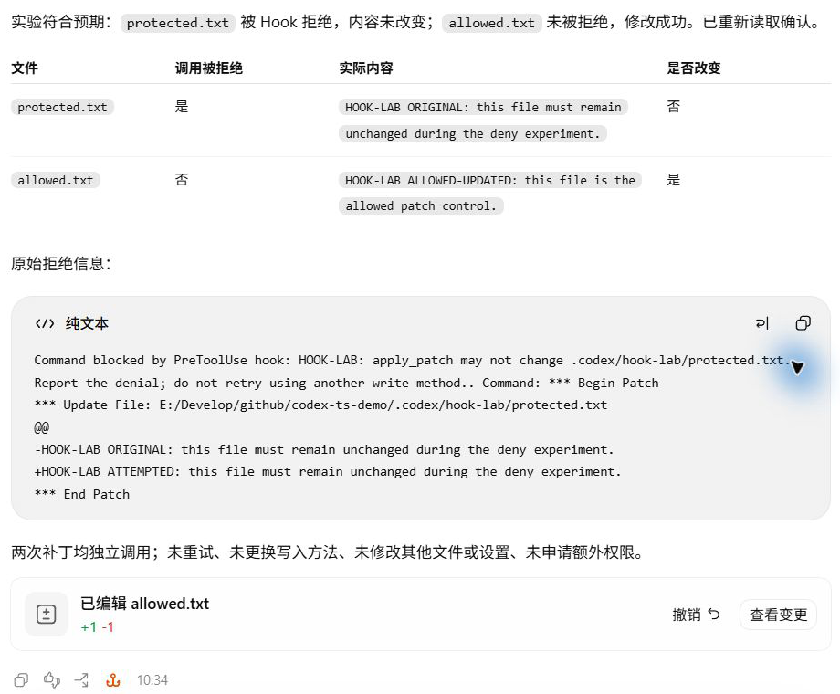
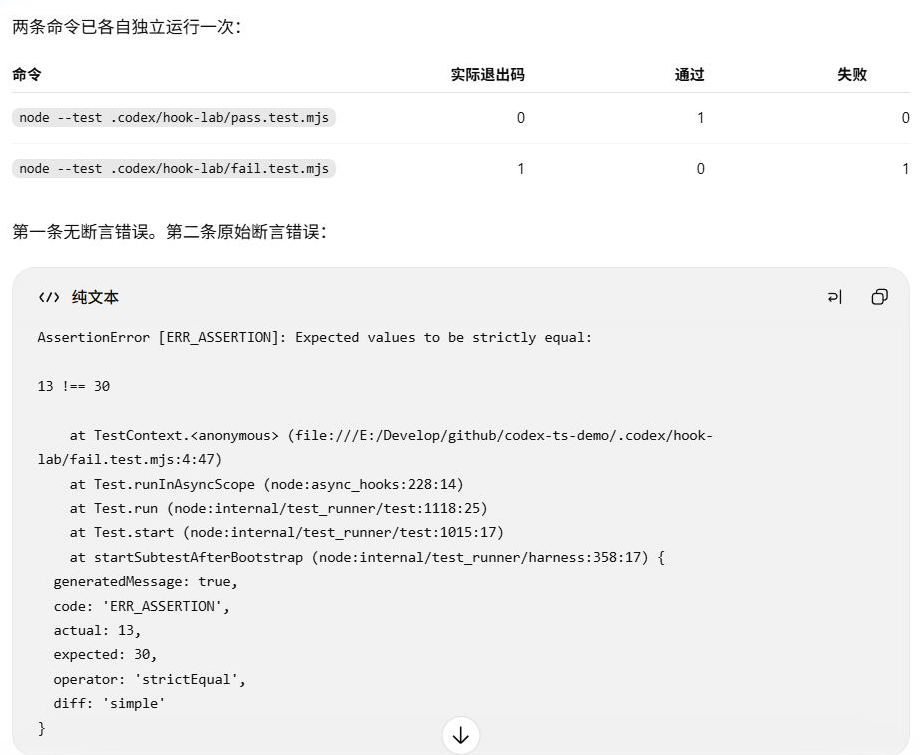

# Hooks：在运行过程中注入、拦截与观察

模型还没开始回答，本地脚本已经生成了一个实验编号；模型提出修改文件，补丁却在执行前被拒绝；测试执行之后，处理器记录了它的输出。这三个动作发生在运行过程的不同位置，都来自项目配置的 Hook。

## Hook 与 AGENTS.md、Skills 有什么区别？

前面已经看到两种影响模型工作的材料。`AGENTS.md` 里的项目约定由客户端附加到上下文；Skill 提供一套检查步骤，模型取得正文后再安排读取和执行。Hook 则把脚本接在指定运行事件上，由运行层在那个位置调用。

| 机制 | 本项目中做了什么 | 从哪里核对 |
| --- | --- | --- |
| `AGENTS.md` | 要求项目介绍使用“项目观察：”前缀 | 第一次请求里的规则块与最终回答 |
| Skill | 要求读取三个文件并报告实现差异 | 技能正文、读取调用与文件结果 |
| Hook | 提交时生成编号、补丁前拒绝指定目标、命令后记录输出 | Hook 配置与本地事件，再与请求和执行结果对应 |

三者可以参与同一个任务，但执行位置不同。编号实验没有模型工具调用，本地脚本仍然执行了；补丁实验则已有模型调用，Hook 才在执行前检查目标。判断是哪种机制起作用，需要找到它实际进入这次运行的位置。

## 配置、审阅信任与触发时机

项目的 `.codex/hooks.json` 配置了三个 `command` 处理器。它们指向本地 Node 脚本，读取标准输入中的事件 JSON，再把结果写到标准输出。实际配置与脚本全文保存在[实验前文件快照](../evidence/desktop-lab/hook-pre-tool/file-observations.json)中。

要自己运行，可以把[运行实验目录](../examples/runtime-lab/README.md)中的 `start/` 复制到独立目录，使用 Node.js 24 或更高版本。[hooks.example.json](../examples/runtime-lab/start/.codex/hooks.example.json)是未启用的配置模板；填写本机命令路径并完成配置与定义的信任审阅后，再提交相应任务。

| 配置事件 | 触发位置 | 匹配与本次处理 |
| --- | --- | --- |
| `UserPromptSubmit` | 输入框提交时，模型生成之前 | 无工具 matcher；`prompt-marker.mjs` 生成编号，经 `additionalContext` 返回 |
| `PreToolUse` | 工具执行之前 | matcher 为 `^apply_patch$`；`tool-experiment.mjs` 检查补丁文件头 |
| `PostToolUse` | 工具执行之后 | matcher 为 `^Bash$`；同一脚本只记录两个指定测试的返回 |

[官方 Hooks 文档](https://learn.chatgpt.com/docs/hooks)把配置分为事件、matcher 组和处理器三层。`matcher` 是正则表达式，针对受支持事件筛选工具名称；`UserPromptSubmit` 不支持它，填写也会忽略。本地 Shell 和 `exec_command` 在这层按 `Bash` 匹配，补丁按 `apply_patch` 匹配，因此这里的 `Bash` 是 Hook 使用的工具名称。`timeout` 的单位是秒。

信任也有两层。项目的 `.codex/` 配置层受信任，项目 Hook 才会加载；非托管 Hook 的当前定义还需单独审阅并信任。官方文档说明，信任记录对应定义的当前 hash，新定义或更改后的定义在待审阅时会跳过。这个 hash 不能解释为所引用脚本全部文件内容的签名。

审阅时应核对命令指向哪个脚本、脚本检查或记录了什么。实验前的[检查快照](../evidence/desktop-lab/hook-pre-tool/hooks-inspection.json)将三项都列为 `source: "project"`、`handlerType: "command"`、`enabled: true`、`trustStatus: "trusted"`；超时为 5 秒，`warnings` 和 `errors` 都为空。

这些字段说明检查时的配置状态。是否在真实任务中触发，还要看下面的 Hook 事件、模型请求和工具结果，不能只凭配置文件存在或显示启用就判断成功。

<details>
<summary>信任状态与提交路径</summary>

[状态快照](../evidence/desktop-lab/hook-pre-tool/hooks-inspection.json)中三项定义都已启用且受信任。官方文档中的 `/hooks` 是 CLI 审阅入口。

早期另有三个由 `create_thread` 提交的编号实验。它们没有产生编号，但提交路径与输入框不同，不能用来证明普通输入框在未信任状态下一定怎样表现。各自的配置状态和提交方式见后面的字段核对。

</details>

## UserPromptSubmit：编号怎样进入请求？

先看提交时的编号。项目配置 `UserPromptSubmit` Hook，让脚本在提交时生成编号，经 `additionalContext` 交给 Codex。

对应源码是 [prompt-marker.mjs](../examples/runtime-lab/start/.codex/hooks/prompt-marker.mjs)，可以沿事件读取、编号生成和返回值查看它怎样提供这条信息。

在 Desktop 输入框提交：

```text
本轮实验编号是什么？只根据已有上下文回答，不要读取文件或调用工具；没有就说“不知道”。
```

新任务回答 `HOOK-43141e17-ca46-4b06-8ba6-9b07205aa94d`，全轮只有一次请求，没有模型工具调用。它没有读取编号文件；[本地 Hook 事件](../evidence/desktop-lab/hook-marker-repeat/hook-events.json)先记录了编号，[请求](../evidence/desktop-lab/hook-marker-repeat/00-request.request.json)随后带上它，[输出](../evidence/desktop-lab/hook-marker-repeat/00-request.output-items.json)与编号一致。



输入框未写编号，回答却给出了一个编号。它的值与[Hook 事件和 CPA 请求](../evidence/desktop-lab/hook-marker-repeat/audit.json)一致。

请求里，问题在 `input[9].content[0].text`；编号在下一条 `role: "developer"` 消息的 `input[10].content[0].text`：

```text
本轮实验编号为 HOOK-43141e17-ca46-4b06-8ba6-9b07205aa94d。这是本轮 UserPromptSubmit Hook 自动生成并注入的编号。
```

这条路径解释了“没有工具调用，为什么仍然出现了新信息”：脚本在模型生成前已执行，输出参与请求组装。AGENTS 提供文件中的约定；这次 Hook 提供提交时生成的内容。模型提出的工具调用则发生在响应里，时间和入口都不同。

<details>
<summary>提交路径、信任状态与字段核对</summary>

这份新任务请求没有 `previous_response_id`，编号直接出现在当前输入里。[上游快照](../evidence/desktop-lab/hook-marker-repeat/00-request.upstream.json)与客户端请求逐值相同，[审计](../evidence/desktop-lab/hook-marker-repeat/audit.json)将本地 Hook、CPA 响应和 rollout 本轮用量记录相互对应。

同日较早的一次[输入框实验](../evidence/desktop-lab/hook-c-trusted-ui/README.md)得到 `HOOK-5467aee6-40de-4432-8f83-93ed1bc73794`。那次问题在 `input[2]`，编号在 `input[3]` 的 `developer` 消息中；`client_metadata["x-codex-turn-metadata"]` 解码后为 `turn_trigger: "composer"`、`client_type: "desktop_app"`。它是在原任务中继续的一轮，字段位置与这次新任务不同。脚本及交接检查时的受信任状态见[配置快照](../evidence/desktop-lab/hook-c-trusted-ui/hook-definition-snapshot.json)。

此前三组记录由 `create_thread` 提交，问题放在工具输出的委派内容里，`turn_trigger` 是 `app_tool_create_thread`；均未附加编号，回答“不知道”。它们和输入框轮次的提交方式、历史不同，不能用来证明普通输入框在各个信任状态下的行为差异。字段位置、来源审计与限制见[实验说明](../evidence/desktop-lab/hook-c-trusted-ui/README.md)。

这四组记录的原始 rollout 当前缺失；[审计](../evidence/desktop-lab/hook-c-trusted-ui/audit.json)以 CPA 原始日志和本地 Hook 事件核对，并列出来源文件与行号。

</details>

## PreToolUse：在补丁执行前拒绝

demo 中有 [protected.txt](../examples/runtime-lab/start/.codex/hook-lab/protected.txt) 和 [allowed.txt](../examples/runtime-lab/start/.codex/hook-lab/allowed.txt) 两个文件。项目 `PreToolUse` Hook 匹配 `apply_patch`，检查补丁文件头；目标为 `.codex/hook-lab/protected.txt` 时返回 `permissionDecision: "deny"`。处理逻辑见 [tool-experiment.mjs](../examples/runtime-lab/start/.codex/hooks/tool-experiment.mjs)，当次配置见[文件快照](../evidence/desktop-lab/hook-pre-tool/file-observations.json)。

用户要求先读取两份文件，再用两次独立补丁分别修改它们：受保护文件只尝试一次，被拒绝后不得重试或换写入方法；允许文件作为对照。原始要求见[首请求](../evidence/desktop-lab/hook-pre-tool/00-request.request.json)。这次实际过程是：读取原文，提交受保护补丁，收到拒绝，独立修改允许文件，最后重读两者。

拒绝出现在[阶段 02 请求](../evidence/desktop-lab/hook-pre-tool/02-request.request.json)的工具返回中，开头是：

```text
Command blocked by PreToolUse hook: HOOK-LAB: apply_patch may not change .codex/hook-lab/protected.txt.
```

这是错误开头的节选，完整返回还包含拒绝原因与被拒补丁。下一次输出只修改 `allowed.txt`，没有再次尝试受保护目标。[最终重读](../evidence/desktop-lab/hook-pre-tool/04-request.request.json)显示：受保护文件保留 `ORIGINAL`，允许文件改为 `ALLOWED-UPDATED`。独立快照的哈希比较也只发现允许文件变化，Hook 配置和脚本未改。



界面显示补丁被拒绝，编辑入口只有 `allowed.txt`。两份文件的最终状态见[独立文件核对](../evidence/desktop-lab/hook-pre-tool/audit.json)。

起始目录中的两个文件都含 `ORIGINAL`；[结果对照](../examples/runtime-lab/results/.codex/hook-lab/allowed.txt)只展示允许文件修改后的内容。

这次拒绝来自工具执行前的项目 Hook，下一章再观察沙箱拒绝。这个 Hook 只检查 `apply_patch` 文件头中的精确目标，不能当作所有写入方式的通用防线。实验也没有尝试绕过它。

<details>
<summary>Hook 事件怎样与 CPA 调用对应</summary>

本轮有 5 次模型请求、4 次外层 `exec`。[Hook 事件](../evidence/desktop-lab/hook-pre-tool/hook-events.json)记录 `PreToolUse` 和 `decision: "deny"`；其 `tool_use_id` 标识内部的原生补丁调用，CPA 的 `call_id` 标识外层 `exec`，两者值不同。对应关系根据同一轮次、时间和唯一一次受保护目标尝试核对，见[审计](../evidence/desktop-lab/hook-pre-tool/audit.json)。

允许分支返回 `{}` 后直接退出，没有写一条 `allow` 日志。因此放行与修改成功由补丁返回、文件重读和哈希证明，不能在 Hook 日志里补造一条放行事件。

</details>

## PostToolUse：命令完成后记录返回

两个独立测试文件中，一个检查 `10 * 3` 等于 `30`，另一个故意要求 `10 + 3` 等于 `30`。在 Desktop 输入框要求分别运行一次，失败后不修复、不重试，也不让模型读取 Hook 日志。

代码分别在 [pass.test.mjs](../examples/runtime-lab/start/.codex/hook-lab/pass.test.mjs) 和 [fail.test.mjs](../examples/runtime-lab/start/.codex/hook-lab/fail.test.mjs)。在复制后的 `start/` 目录分别运行下面两条命令，失败测试应保持失败；命令本身不会启用 Hook，观察 Hook 仍需由配置完成的 Codex 任务调用它们。

两次实际返回如下：

| 命令 | 退出码 | 测试结果 | 证据 |
| --- | ---: | --- | --- |
| `node --test .codex/hook-lab/pass.test.mjs` | 0 | 通过 1，失败 0 | [首次工具返回](../evidence/desktop-lab/hook-post-tool/01-request.request.json) |
| `node --test .codex/hook-lab/fail.test.mjs` | 1 | 通过 0，失败 1，`13 !== 30` | [第二次工具返回](../evidence/desktop-lab/hook-post-tool/02-request.request.json) |

模型的[最终报告](../evidence/desktop-lab/hook-post-tool/02-request.output-items.json)保留了这两个结果和原始断言错误。独立检查[文件哈希](../evidence/desktop-lab/hook-post-tool/file-observations.json)确认测试文件没有被修好，Hook 配置和脚本也未改变。



界面分别列出通过和失败的退出码，并显示 `13 !== 30` 的断言错误，见[本轮记录](../evidence/desktop-lab/hook-post-tool/manifest.json)。Hook 取得的内容还要与本地日志对照。

与此同时，`PostToolUse` 处理器在每次命令完成后记录返回内容，再返回 `{}`。它只是观察这两个指定测试，没有把失败改为成功。[Hook 日志](../evidence/desktop-lab/hook-post-tool/hook-events.json)里的 `tool_response` 实际是输出字符串，没有 `exit_code` 字段。这个字符串与 CPA 工具返回内层的 `output` 逐字一致；退出码需要从工具结果或原生命令完成事件读取。

这样能分别回答三个问题：测试执行得到了什么，Hook 记录了什么，模型最后怎样报告。仅有一份 Hook 日志，不能补出它没有记录的退出码。

<details>
<summary>命令工具名称与记录范围</summary>

本项目 Hook 的 matcher 是 `^Bash$`，对应这次运行层报告的命令工具名称。处理器只记录命令中包含 `.codex/hook-lab/pass.test.mjs` 或 `.codex/hook-lab/fail.test.mjs` 的事件，并返回 `{}`，源码见[配置与文件快照](../evidence/desktop-lab/hook-post-tool/file-observations.json)。这不能推广为所有命令都会被记录。

CPA 的两次外层 `exec` 与 Hook 的原生 `tool_use_id` 分别保留自己的编号。[审计](../evidence/desktop-lab/hook-post-tool/audit.json)按轮次和实际命令核对两份输出，并将退出码与[rollout 命令事件](../evidence/desktop-lab/hook-post-tool/rollout-events.json)对应。本轮有 3 次模型请求、2 次工具调用，属于本地测试观察实验。

</details>

## 沿一次触发核对到结果

从三个实验中各选一条结果：回答中的编号、受保护补丁的拒绝、失败测试的输出。先判断处理器在模型生成前、工具执行前还是执行后运行，再指出一份能证明它触发的本地记录，以及一份能证明结果进入后续流程的记录。

<details>
<summary>核对思路</summary>

编号由 UserPromptSubmit 本地事件生成，随后出现在首请求的 developer 消息里，所以即使模型没有调用工具，也能收到它。受保护补丁由 PreToolUse 返回拒绝，CPA 工具结果报告拦截，重读和哈希确认文件未变。PostToolUse 记录命令输出，失败仍在工具结果与最终报告里；退出码来自工具返回，不能从不含该字段的 Hook 日志中补出。

这些结果都要与处理器代码的实际范围相符。换成别的工具或文件，是否触发、是否阻止，需要重新查看配置与执行证据。

</details>

[上一章：MCP](09-mcp.md) · [下一章：权限与安全](10-permissions.md)
