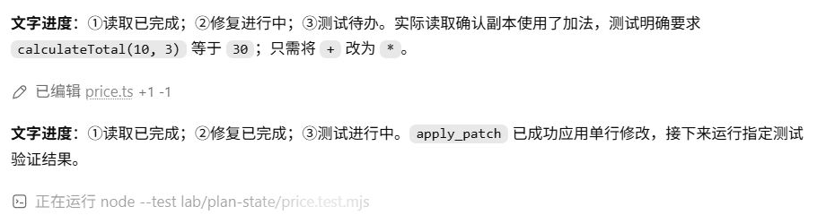
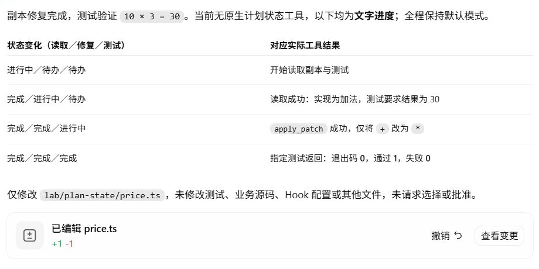

# Plan Mode：金额精度还没决定，怎样开始实施？

乘法错误修好后，项目要增加折扣。需求已经给出 10% 和 100% 的例子，却没说遇到小数金额时要不要四舍五入。这会影响实现、测试和文档，适合先查清现状，再确定方案。

Codex 先读取项目，询问精度策略，生成计划；确认实施后才修改代码。计划阶段的基线检查和实施后的折扣测试，验证的是不同状态。

## 从一个未完全确定的需求开始

通过输入框的 `/` 菜单选择“计划模式”，然后发送：

```text
先调查并制定方案：为 calculateTotal 增加可选参数 discountPercent，默认 0，只允许 0 到 100 的整数；单价 10 元、数量 3、折扣 10% 应返回 27 元，折扣 100% 应返回 0。保留旧调用兼容，并考虑测试、README 和项目决定的更新。现在只给计划，不修改文件、不实施。
```

[首请求](../evidence/desktop-lab/14-plan/00-request.request.json)在折扣要求前增加一项 developer 消息，以 `<collaboration_mode># Plan Mode (Conversational)` 开头。本地 `turn_context` 也记录 `collaboration_mode.mode` 为 `plan`，见[计划证据](../evidence/desktop-lab/14-plan/plan.json)。产品模式通过运行指令进入上下文。

模型随后读了源码、调用位置、测试和文档。旧函数只有两个参数，项目决定仍写着暂不支持折扣。已有文件能回答这些问题，因此调查先于向用户提问。

## 一次用户选择怎样回到模型？

读取后，Codex 用 `request_user_input` 询问折扣产生小数时的处理方式。界面选择了“保持现有数值精度 (Recommended)”。这个选择成为[下一次请求](../evidence/desktop-lab/14-plan/04-request.request.json)中的工具结果；解析 `function_call_output.output` 后得到：

```json
{
  "answers": {
    "rounding_policy": {
      "answers": ["保持现有数值精度 (Recommended)"]
    }
  }
}
```

这里的工具结果来自人的选择。前几章的工具返回文件和退出码，这次返回一个会影响代码行为的决定。运行层仍通过 `call_id` 将它与之前的提问配对，模型收到结果后才能据此完善方案。

最终计划采用 JavaScript `number` 的现有精度，不额外舍入；第三个参数默认 0，只接受 0 到 100 的整数，非法值抛出 `RangeError`，旧两参数调用保持兼容。测试包含 10% 返回 27、100% 返回 0、25% 返回 22.5，以及越界、小数、`NaN` 和无限值等输入。

精度、默认值和非法参数的处理都有了明确结果，实施后可以逐项验收。

## 计划阶段已经用了工具，也运行了测试

在提交方案之前，Codex 运行了 `npm test`、`npm run typecheck` 和 `npm start`。它们确认旧功能的基线通过、示例输出仍为 30。此时新增折扣尚未实现。

[计划前](../evidence/desktop-lab/14-plan/files-before.json)和[计划后](../evidence/desktop-lab/14-plan/files-after-plan.json)的 14 个受监测文件哈希相同。结合操作记录，可以确认这阶段做了调查和基线检查，没有实施折扣。哈希比较的范围限于这些文件，不代表整个操作系统没有发生任何写入。

调查也曾失败：demo 没有初始化 Git，`git status` 返回错误；一条 PowerShell 读取命令发生解析错误。模型读取错误后调整命令，再次取得文件内容。这些失败仍留在原始日志里。

<details>
<summary>深入核对：六次计划请求与澄清调用</summary>

| 阶段 | 收到的信息 | 模型接下来做什么 |
| --- | --- | --- |
| [00](../evidence/desktop-lab/14-plan/00-request.output-items.json) | 计划模式与用户要求 | 读取本机 Skill，列文件，尝试 Git 状态 |
| [01](../evidence/desktop-lab/14-plan/01-request.output-items.json) | 文件清单与 Git 错误 | 读取项目并搜索折扣实现 |
| [02](../evidence/desktop-lab/14-plan/02-request.output-items.json) | `ParserError` 与搜索结果 | 修正命令，重新读取并查 Node 环境 |
| [03](../evidence/desktop-lab/14-plan/03-request.output-items.json) | 文件内容与环境 | 询问精度策略 |
| [04](../evidence/desktop-lab/14-plan/04-request.output-items.json) | 用户选择 | 运行三条基线检查 |
| [05](../evidence/desktop-lab/14-plan/05-request.output-items.json) | 检查结果 | 生成 `<proposed_plan>` |

表中链接为输出，同目录同编号 `request.json` 是输入。首请求新增两项内容，后续请求各新增一项工具结果，均通过 `previous_response_id` 接续。

澄清调用编号是 `call_9f8LTJWOrmPRVjiloSJ9B6EL`，阶段 04 的返回使用相同编号。它是 `function_call_output`，不同于 Shell 经过 `exec` 返回的 `custom_tool_call_output`。计划最终在 rollout 中保存为原生 `Plan` 项。

计划阶段共 5 次工具调用，其中 1 次为澄清。调查中读取本机 Skill 的动作属于这个运行环境，复现实验无需安装同一套个人技能。

</details>

## 确认实施，才开始改变项目

Desktop 显示“实施此计划？”，选择“是，实施此计划”后，[实施首请求](../evidence/desktop-lab/14-plan-implement/00-request.request.json)包含两项新内容：developer 消息将模式切回 `Default`；user 消息以 `PLEASE IMPLEMENT THIS PLAN:` 开头，携带完整计划。它继续引用计划阶段的最终响应。

模型重读当前文件，用 `apply_patch` 修改函数、测试、README 和 `docs/DECISIONS.md`，再运行三条检查。重新读取可以核对调查之后文件是否发生变化。

[实施后快照](../examples/14-discount/README.md)中的计算表达式为：

```typescript
return (unitPrice * quantity) * ((100 - discountPercent) / 100);
```

[实际验证结果](../evidence/desktop-lab/14-plan-implement/03-request.request.json)显示 11 项测试通过，类型检查通过，旧示例仍输出 30 元，三条命令退出码均为 0。计划里的兼容性、边界和文档要求，也能在快照中继续核对。

<details>
<summary>查看历史计划、确认实施与完成结果</summary>


上方是[计划阶段](../evidence/desktop-lab/14-plan/manifest.json)的调查和计划产物，下方是确认之后的[实施结果](../evidence/desktop-lab/14-plan-implement/manifest.json)。截图重开于 2026-10-03，实验时间以两份记录为准。

</details>

<details>
<summary>深入核对：四次实施请求与阶段边界</summary>

| 阶段 | 新输入 | 随后的输出 |
| --- | --- | --- |
| [00](../evidence/desktop-lab/14-plan-implement/00-request.output-items.json) | 模式变化与完整计划 | 重读源码、测试、文档和规则 |
| [01](../evidence/desktop-lab/14-plan-implement/01-request.output-items.json) | 当前文件 | 修改四个文件 |
| [02](../evidence/desktop-lab/14-plan-implement/02-request.output-items.json) | 修改工具返回 | 运行 test、typecheck、start |
| [03](../evidence/desktop-lab/14-plan-implement/03-request.output-items.json) | 执行结果 | 汇报实现与验证 |

实施共 4 次正式请求、3 次外层调用。[界面观察](../evidence/desktop-lab/ui-observations.json)保留进入计划模式与选择实施的记录。

计划和实施的沙箱均为 `danger-full-access`，审批策略均为 `never`；变化的是协作模式和本轮要求。字段见[运行时节选](../evidence/desktop-lab/15-permissions/runtime-context.json)。因此计划阶段文件未变可以证明遵守了工作阶段要求，不能据此推断系统级只读隔离。本章使用历史实验记录，实际时间上早于上一章的受限写入。

</details>

## 判断一个计划能不能验收

找到精度选择进入模型的请求，再查看最终计划怎样使用了这个决定。随后判断：只有基线测试通过，能否证明新折扣功能已经完成？请补出还需要的实施与验证记录。

<details>
<summary>参考解释</summary>

阶段 04 的澄清返回选择保留现有数值精度，计划据此不增加舍入。基线测试发生在实施前，只证明原有行为；新增功能需要实际补丁、最终文件和实施后的测试结果。实施后的 11 项测试支持约定场景，但是否足以防止意外舍入，还可以继续审查，下一章会检查这个覆盖问题。

</details>

## 补充实验：普通任务中的文字进度

2026-10-03，我们在 Default 模式要求 Codex 修复 `lab/plan-state/price.ts` 副本，并跟踪“读取、修复、测试”三步。提示要求优先使用可用的计划状态工具；如果没有，则明确标为文字进度。没有进入需要选择或确认的 Plan Mode。

模型先搜索本轮暴露的 `ALL_TOOLS` 目录，[返回结果](../evidence/desktop-lab/plan-status/01-request.request.json)为 `[]`。它随后说明没有找到相应工具，以进度文字继续：读取副本和测试之后，将读取标为完成；补丁返回之后，将修复标为完成；测试结果返回前，仍将测试标为进行中。



这张保留的执行中画面显示“测试进行中”，对应[本轮实际调用](../evidence/desktop-lab/plan-status/03-request.output-items.json)。其中的状态由助手文字表达，不是原生计划状态控件。

[最后一份请求](../evidence/desktop-lab/plan-status/04-request.request.json)带回 `node --test lab/plan-state/price.test.mjs` 的结果：退出码 0，通过 1，失败 0。模型收到结果后，才在[最终报告](../evidence/desktop-lab/plan-status/04-request.output-items.json)里把三步全部标为完成。独立[文件比较](../evidence/desktop-lab/plan-status/file-observations.json)确认副本仅从加法改为乘法，测试未改。

这里验证了进度文字与执行记录一致。文字表格、原生计划状态、Plan Mode 是三件事：本轮没有原生计划工具调用或状态事件；前面折扣实验才进入了原生 Plan Mode，并保存了计划与实施记录。

<details>
<summary>查看文字进度的完成报告</summary>



完成报告仍明确标为“文字进度”。退出码 0 和三步的依据见[逐阶段核对](../evidence/desktop-lab/plan-status/audit.json)。

</details>

<details>
<summary>这次没有验证到的原生状态</summary>

本地 `turn_context` 记录模式为 `default`，全轮有 5 次请求、4 次工具调用。工具目录查询使用 `update_plan|plan state|plan status|planning tool`；空结果只说明这次查询没有找到匹配条目，不能推广到所有 Codex 版本或模式。[审计](../evidence/desktop-lab/plan-status/audit.json)列出了各阶段进度与实际调用，[rollout 节选](../evidence/desktop-lab/plan-status/rollout-events.json)保留运行模式和执行事件。

</details>

[上一章：权限与安全](10-permissions.md) · [下一章：多 Agent](12-multi-agent.md)
