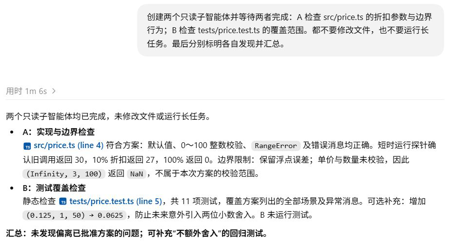

# 多 Agent：两份检查结论怎样回到同一个任务？

折扣功能实现后，父任务把函数边界检查交给 A，把测试覆盖检查交给 B，再等待并汇总。两个子任务各有自己的请求链，运行时间有重叠，却使用同一个项目目录。本章追踪它们继承了什么、结果怎样返回。

## 创建任务返回了什么？

在[折扣项目](../examples/14-discount/README.md)中发送：

```text
创建两个只读子智能体并等待两者完成：A 检查 src/price.ts 的折扣参数与边界行为；B 检查 tests/price.test.ts 的覆盖范围。都不要修改文件，也不要运行长任务。最后分别标明各自发现并汇总。
```



父任务的历史回答分别列出 A 和 B 的发现。接下来沿[协作记录](../evidence/desktop-lab/16-multi-agent/manifest.json)追查这些结论怎样回来。

父任务先调用 `spawn_agent` 创建 A。下一次请求收到的返回为：

```json
{"task_name":"/root/a_price_boundaries"}
```

这个地址说明子任务已经建立。检查发现尚未出现在返回里。父模型收到地址后才创建 B，随后读项目决定和 README，再调用 `wait_agent`。A 在此期间已经可以继续自己的工作，所以两次委派先后发出，并不妨碍后续执行重叠。

## 子任务从什么上下文开始？

本次委派使用 `fork_turns: "all"`。两个子任务的首个正式请求里，都能找到此前的项目决定、折扣计划、实施结果和当前检查要求。它们继承这些材料，再在各自任务里继续生成，并非只有一句“检查文件”的空白开场。

[协作记录](../evidence/desktop-lab/16-multi-agent/collaboration.json)中，A、B 各有独立的 `threadId`、当前 `turnId` 和响应链。A 读取函数、规则和配置，随后运行短 Node 探针；B 读取测试及相关文件，提交静态覆盖分析。各自的工具结果进入各自下一次模型请求。

父任务需要等到这两条调查链的结论到达，才能汇总；创建返回里还没有这些发现。

<details>
<summary>深入核对：子任务的预热、继承上下文和工具循环</summary>

第一次委派参数来自[父任务阶段 00 输出](../evidence/desktop-lab/16-multi-agent/00-request.output-items.json)。解析 `function_call.arguments` 可见以下字段；委派消息密文已脱敏：

```json
{
  "task_name": "a_price_boundaries",
  "fork_turns": "all"
}
```

A、B 首个正式请求各有 22 项新增输入，并通过 `previous_response_id` 引用自己的预热响应。预热各有 2 项输入、`generate: false`，没有生成输出。可核对 [A 预热请求](../evidence/desktop-lab/16-agent-a/00-prewarm.request.json)、[A 完成事件](../evidence/desktop-lab/16-agent-a/00-prewarm.response.json)、[B 预热请求](../evidence/desktop-lab/16-agent-b/00-prewarm.request.json)和 [B 完成事件](../evidence/desktop-lab/16-agent-b/00-prewarm.response.json)。22 只是这次新增项数，不能当作完整有效上下文的总量。

| 子任务阶段 | 模型输出 |
| --- | --- |
| [A 00](../evidence/desktop-lab/16-agent-a/00-request.output-items.json) | 读取带行号的计算函数 |
| [A 01](../evidence/desktop-lab/16-agent-a/01-request.output-items.json) | 读取规则、package 和本机 Skill |
| [A 02](../evidence/desktop-lab/16-agent-a/02-request.output-items.json) | 运行短 Node 探针 |
| [A 03](../evidence/desktop-lab/16-agent-a/03-request.output-items.json) | 提交实现边界结论 |
| [B 00](../evidence/desktop-lab/16-agent-b/00-request.output-items.json) | 读取规则、测试、源码和 package |
| [B 01](../evidence/desktop-lab/16-agent-b/01-request.output-items.json) | 读取本机 Skill |
| [B 02](../evidence/desktop-lab/16-agent-b/02-request.output-items.json) | 提交静态分析 |

两个子任务读取了本机 `ponytail` Skill，这是当前环境对动作选择的影响。多 Agent 本身不要求每个子任务都读取这份技能。

子 rollout 还复制了父任务的历史轮次。上述统计只取子任务自身的当前轮次，避免把继承记录重新计作子任务工作。

</details>

## 等待结束，结论从哪里进来？

父任务最后一次生成前，收到 `wait_agent` 的返回：

```json
{"message":"Wait completed.","timed_out":false}
```

这个结果只说明等待结束。具体发现由另外的 `agent_message` 项送入，[该请求](../evidence/desktop-lab/16-multi-agent/04-request.request.json)中可以找到发送方 `/root/b_test_coverage` 和 `/root/a_price_boundaries`，以及各自 `Payload` 里的完整结论。

这一请求重发了 75 项输入，没有 `previous_response_id`。因此本阶段的上下文接续也发生了变化：历史和新增子任务消息一起发送给模型。证据没有说明内部为何选择在此处重发，但实际请求不能画成只回传一个等待结果。

父模型获得结果后，分别说明 A、B 的发现，再做汇总。传递给父模型的是这些显式消息，不能由此认为父模型自动获得了每个子任务全部内部推理。

<details>
<summary>深入核对：父任务五次请求与结果位置</summary>

| 阶段 | 输出动作 |
| --- | --- |
| [00](../evidence/desktop-lab/16-multi-agent/00-request.output-items.json) | 创建 A |
| [01](../evidence/desktop-lab/16-multi-agent/01-request.output-items.json) | 收到 A 地址后创建 B |
| [02](../evidence/desktop-lab/16-multi-agent/02-request.output-items.json) | 收到 B 地址后读项目文档 |
| [03](../evidence/desktop-lab/16-multi-agent/03-request.output-items.json) | 等待子任务 |
| [04](../evidence/desktop-lab/16-multi-agent/04-request.output-items.json) | 汇总结果 |

首次创建调用编号为 `call_LleINkkheKDASZQRQPmQ4KgN`，与带回 A 地址的工具结果配对。父任务第 04 请求末尾的主要位置为：

| 位置 | 内容 |
| --- | --- |
| `input[70]` | 此前的 `wait_agent` 调用 |
| `input[71]` | 等待结束的 `function_call_output` |
| `input[72]` | B 的 `agent_message` |
| `input[74]` | A 的 `agent_message` |

结果消息含 `Message Type: FINAL_ANSWER`、`Sender` 和 `Payload`。通过 `call_id` 可以追查创建与等待的返回；通过任务路径、`threadId` 和发送方，可以追查具体结论。

父任务有 5 次正式请求、4 次工具调用；A 有 4 次请求、3 次调用；B 有 3 次请求、2 次调用。共 12 次正式请求，另有两个子任务预热，不把复制的父历史再次计数。

</details>

## 两份结论的依据并不相同

A 读取实现并运行探针，确认默认参数、整数范围和 `RangeError` 符合计划，也实际得到 10% 返回 27、100% 返回 0。探针另外观察到浮点误差，以及未校验单价时 `(Infinity, 3, 100)` 返回 `NaN`。这些发现没有被擅自扩展成修复任务。

B 静态阅读测试，确认现有 11 项覆盖已批准方案的必需场景。它建议补充 `(0.125, 1, 50) → 0.0625`，更明确地防止后来误加两位小数舍入。本次 B 没有运行测试，也没有添加用例。

A 的探针提供运行证据，B 的覆盖结论来自源码分析，汇总时要保留这个区别。

## 共享项目时，怎样判断实际并行与文件变化？

父子任务使用同一个 demo 目录。这次要求只读，完成后的[文件核对](../evidence/desktop-lab/16-multi-agent/file-state.json)显示 13 个项目文件与实施后快照的哈希一致。如果以后让两个 Agent 修改同一文件，就需要明确修改范围并处理冲突；独立任务 ID 不提供文件隔离。

并行也可以从记录核对：A、B 的实际运行区间重叠 30.815 秒。它支持这次有并发工作，尚不足以计算比串行快了多少，后者需要同条件对照。

<details>
<summary>深入核对：子任务的实际起止时间</summary>

时间取自[协作记录](../evidence/desktop-lab/16-multi-agent/collaboration.json)中子任务自身的开始、完成事件，以下为北京时间：

| 子任务 | 开始 | 完成 |
| --- | --- | --- |
| A | 00:48:30.289 | 00:49:10.648 |
| B | 00:48:35.700 | 00:49:06.515 |

时间取自子任务本轮，未计入继承的父历史；区间重叠说明两项工作在同一段时间内运行，不用于推断逐条 CPU 指令的执行情况。

</details>

## 从汇总倒查一条发现

选择“不舍入测试还可以更明确”这条发现，从父任务最终回答往回追到发送方和子任务记录。它来自静态阅读还是一次测试执行？再说明仅看到两个 `spawn_agent`，还缺什么才能确认两项检查已经完成。

<details>
<summary>参考解释</summary>

这条建议来自 B 的静态覆盖分析，经过 `agent_message` 进入父任务。创建调用只能证明提出了委派，创建返回说明任务建立；还需子任务实际完成事件和结果消息，才能支持完成及汇总。并行和未改文件则分别需要时间与文件状态证据。

</details>

[上一章：Plan Mode](11-plan.md) · [下一章：目标、停止条件与续跑](13-autonomy.md)
