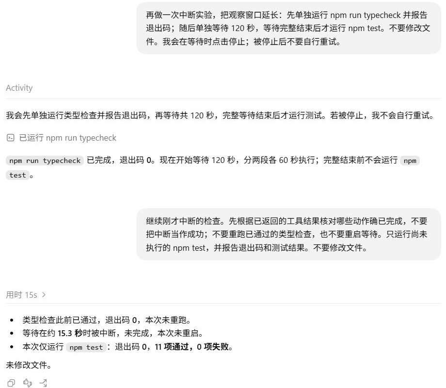
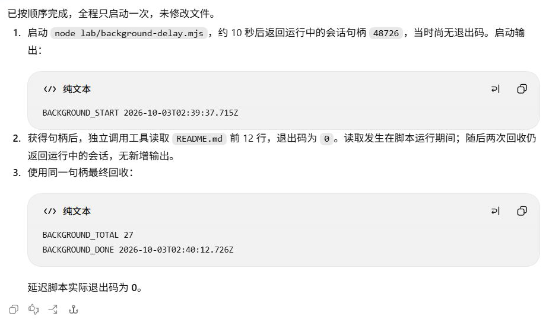
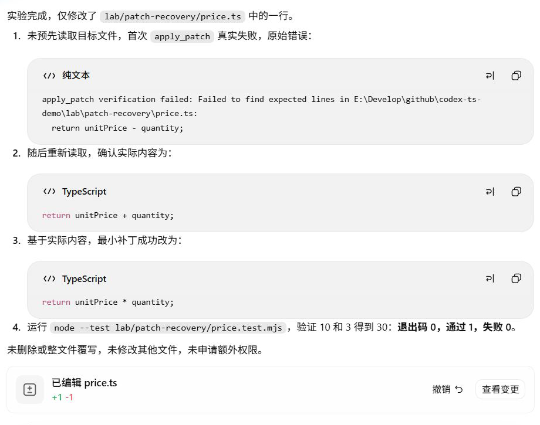

# 目标、停止条件与续跑：下一步还需要做什么？

工具返回后，模型要根据结果和用户要求决定下一步：检查通过可以完成目标，命令失败可能需要读取配置，用户中断后则要核对哪些工作已经完成。仍在运行的命令需要继续取得结果，补丁失败也要先查明原因。

下面的实验各有独立的要求、项目状态和请求链，不属于同一个 Goal。

## 先给目标一个可检查的终点

通过 Desktop `/` 菜单的 Goal 入口填写：

```text
检查当前总价实现是否满足 README 的折扣约定，运行 npm run typecheck 和 npm test，每项至多一次。两项通过且给出退出码与结论后完成目标；不修改文件，不创建子智能体，不扩展任务。若失败就报告具体失败。
```

这个目标约定了完成条件，也限定了检查次数和工作范围，没有设置 token 预算。

[首请求](../evidence/desktop-lab/17-goal/00-request.request.json)中的 user 消息以 `<codex_internal_context source="goal">` 开头。除了 `<objective>` 中的要求，应用还加入了继续工作和核查完成条件的说明，一同发给模型。

Codex 读取 README、实现、测试和配置，核对折扣的默认值、整数范围、异常和精度行为。随后各运行一次类型检查和测试，两项退出码均为 0，11 项测试通过。结果到达后，模型调用：

```javascript
text(await tools.update_goal({status:"complete"}));
```

[工具返回](../evidence/desktop-lab/17-goal/goal-state.json)记录状态为 `complete`。这次状态更新发生在验证之后，是否达到目标仍要根据前面的文件和命令结果判断。

<details>
<summary>深入核对：Goal 的五次请求与状态返回</summary>

| 阶段 | 模型新得到什么 | 输出动作 |
| --- | --- | --- |
| [00](../evidence/desktop-lab/17-goal/00-request.output-items.json) | Goal 包装与前轮引用 | 读取 README、实现、测试和 package |
| [01](../evidence/desktop-lab/17-goal/01-request.output-items.json) | 文件内容 | 读取 `tsconfig.json` |
| [02](../evidence/desktop-lab/17-goal/02-request.output-items.json) | 类型检查配置 | 各运行一次 typecheck 与 test |
| [03](../evidence/desktop-lab/17-goal/03-request.output-items.json) | 两项实际结果 | 说明结论，调用 `update_goal` |
| [04](../evidence/desktop-lab/17-goal/04-request.output-items.json) | 状态更新结果 | 最终汇报 |

[阶段 03 请求](../evidence/desktop-lab/17-goal/03-request.request.json)包含两项命令结果；[阶段 04 请求](../evidence/desktop-lab/17-goal/04-request.request.json)包含目标工具返回。本次没有 `get_goal` 调用，`complete` 状态来自 `update_goal` 的结果。

整轮 5 次正式请求、4 次外层调用，后续各通过一个 `custom_tool_call_output` 与前一响应引用接续。目标工具返回的用量与耗时是独立统计，不与 CPA 的多次请求 token 求和混算。

本目标在一轮工作内完成。它没有触发后台多轮自动续跑、暂停恢复、预算耗尽或定时调度。目标要求的“每项至多一次”是工作范围约束，不是硬性的 token 或费用限制。

</details>

## 文字进度何时算完成？

在 Default 模式要求 Codex 修复 `lab/plan-state/price.ts` 副本，并跟踪“读取、修复、测试”三步。提示要求优先使用可用的计划状态工具；如果没有，则明确标为文字进度。这轮没有进入 Plan Mode。

可运行副本见[起始代码](../examples/runtime-lab/start/lab/plan-state/price.ts)与[对应测试](../examples/runtime-lab/start/lab/plan-state/price.test.mjs)。复制[运行实验目录](../examples/runtime-lab/README.md)的 `start/` 后，在目录根使用 Node.js 24 或更高版本执行 `node --test lab/plan-state/price.test.mjs`：起始加法应失败，改成乘法后通过；[修复结果](../examples/runtime-lab/results/lab/plan-state/price.ts)单独供对照，测试无需修改。

模型先搜索本轮暴露的 `ALL_TOOLS` 目录，[返回结果](../evidence/desktop-lab/plan-status/01-request.request.json)为 `[]`。它随后说明没有找到相应工具，以进度文字继续：读取副本和测试之后，将读取标为完成；补丁返回之后，将修复标为完成；测试结果返回前，仍将测试标为进行中。


界面显示“测试进行中”，下面是[正在执行的调用](../evidence/desktop-lab/plan-status/03-request.output-items.json)。进度由助手文字表达，不是原生计划状态控件。

[最后一份请求](../evidence/desktop-lab/plan-status/04-request.request.json)带回 `node --test lab/plan-state/price.test.mjs` 的结果：退出码 0，通过 1，失败 0。模型收到结果后，才在[最终报告](../evidence/desktop-lab/plan-status/04-request.output-items.json)里把三步全部标为完成。独立[文件比较](../evidence/desktop-lab/plan-status/file-observations.json)确认副本仅从加法改为乘法，测试未改。

本轮的文字进度与执行记录一致，但没有原生计划工具调用或状态事件。[折扣实验](11-plan.md)进入了原生 Plan Mode，并保存了计划与实施记录；进度文字不能作为进入该模式或更新原生计划状态的证据。

<details>
<summary>查看文字进度的完成报告</summary>


完成报告仍明确标为“文字进度”。退出码 0 和三步的依据见[逐阶段核对](../evidence/desktop-lab/plan-status/audit.json)。

</details>

<details>
<summary>这次没有验证到的原生状态</summary>

本地 `turn_context` 记录模式为 `default`，全轮有 5 次请求、4 次工具调用。工具目录查询使用 `update_plan|plan state|plan status|planning tool`；空结果只说明这次查询没有找到匹配条目，不能推广到所有 Codex 版本或模式。[审计](../evidence/desktop-lab/plan-status/audit.json)列出了各阶段进度与实际调用，[rollout 节选](../evidence/desktop-lab/plan-status/rollout-events.json)保留运行模式和执行事件。

</details>

## 命令失败后，哪些继续动作仍然有意义？

另一轮实验故意要求先运行 `npm run lint`。项目没有该脚本，执行返回退出码 1：

```text
npm error Missing script: "lint"
```

错误进入[下一次请求](../evidence/desktop-lab/19-recovery/01-request.request.json)后，Codex 读取 `package.json` 和 `tsconfig.json`，找到了现有的 typecheck 与 test 脚本。用户已经允许在这种情况下改用现有检查，并明确不安装依赖、不新增脚本，因此模型接着运行这两项。

类型检查成功，11 项测试通过。最终报告保留了 lint 失败和替代检查通过的结果。后续动作由模型读到错误和配置后提出，这期间没有 CPA 自动重发，也没有反复运行缺失的脚本。

<details>
<summary>深入核对：失败怎样影响后续动作</summary>

原始要求为：

```text
先实际运行一次 npm run lint，作为错误反馈实验。如果提示脚本不存在，不要安装依赖或新增脚本；读取 package.json 找出现有的类型检查和测试命令，改用它们检查，并报告最初失败以及后续结果。不要修改文件。
```

| 阶段 | 新信息 | 下一动作 |
| --- | --- | --- |
| [00](../evidence/desktop-lab/19-recovery/00-request.output-items.json) | 用户要求 | 运行 lint |
| [01](../evidence/desktop-lab/19-recovery/01-request.output-items.json) | 缺少脚本，退出码 1 | 读取配置 |
| [02](../evidence/desktop-lab/19-recovery/02-request.output-items.json) | 真实脚本定义 | 运行已有 typecheck 与 test |
| [03](../evidence/desktop-lab/19-recovery/03-request.output-items.json) | 两项退出码 0，11 项测试通过 | 分别报告失败与成功 |

两条替代检查的结果带有 `command` 标签，可以在[最后请求](../evidence/desktop-lab/19-recovery/03-request.request.json)中分别核对退出码和输出。npm 错误附带的一般提示不会改变用户限定的工作范围。

[完整记录](../evidence/desktop-lab/19-recovery/manifest.json)保留了四次请求中的失败与后续动作。本实验没有模拟网络超时、服务端重试或响应丢失。

</details>

## 用户停止时，已经做完的工作会丢吗？

中断实验要求先运行类型检查，等待 120 秒，等待结束后再运行测试。Codex 完成类型检查后发起第一段 60 秒的 `clock.sleep`，操作方在等待时点击停止。工具返回：

```text
aborted by user after 15.3s
```

[本地中断记录](../evidence/desktop-lab/20-interrupted/interruption.json)随后出现 `turn_aborted`，原因为 `interrupted`。这轮没有继续调用 `npm test`，也没有最终回答。中断时各项工作停在了不同位置：

| 动作 | 中断时的状态 | 依据 |
| --- | --- | --- |
| 类型检查 | 已完成 | 返回退出码 0 |
| 等待 | 被取消 | 等待工具返回中断信息 |
| 测试 | 尚未执行 | 该轮没有测试调用 |

用户随后要求继续，只运行尚未执行的测试。恢复请求带回等待取消结果、运行环境的中断说明和新的继续要求，并引用此前发出等待调用的响应。模型因此能看到类型检查已成功，而等待被取消。

[恢复阶段输出](../evidence/desktop-lab/20-resume/00-request.output-items.json)只提出 `npm test`，没有重跑类型检查或重启等待。工具返回退出码 0、11 项通过后，模型报告结果。恢复发生在新一轮的两次模型请求中，原来的中断记录仍保留。

<details>
<summary>查看中断后只补测试的历史画面</summary>



上方保留类型检查已通过的消息，下方继续要求与报告明确只补测试。对应[中断](../evidence/desktop-lab/20-interrupted/manifest.json)和[恢复](../evidence/desktop-lab/20-resume/manifest.json)两个轮次。

</details>

<details>
<summary>深入核对：中断前、取消结果与恢复输入</summary>

实际中断要求为：

```text
再做一次中断实验，把观察窗口延长：先单独运行 npm run typecheck 并报告退出码；随后单独等待 120 秒，等待完整结束后才运行 npm test。不要修改文件。我会在等待时点击停止；被停止后不要自行重试。
```

[阶段 00](../evidence/desktop-lab/20-interrupted/00-request.output-items.json)提出类型检查，调用编号为 `call_6VrFE3R2Sx87HEfZFkHQ77bZ`，结果进入[阶段 01 请求](../evidence/desktop-lab/20-interrupted/01-request.request.json)。下一响应计划分两段等待，但只实际发出了第一段；等待调用字段节选为：

```json
{
  "type": "function_call",
  "name": "sleep",
  "namespace": "clock",
  "arguments": "{\"duration_ms\":60000}",
  "call_id": "call_MgxCc9ZeSdtTTeTO6HqupFTC"
}
```

15.3 秒是工具返回的已等待时长；整个中断轮次约 27.714 秒，还包含类型检查和模型处理，不能混用。索引中的 `status: "interrupted"` 对应这次中断，该轮没有最终回答。

继续要求为：

```text
继续刚才中断的检查。先根据已返回的工具结果核对哪些动作确已完成，不要把中断当作成功；不要重跑已通过的类型检查，也不要重启等待。只运行尚未执行的 npm test，并报告退出码和测试结果。不要修改文件。
```

[恢复首请求](../evidence/desktop-lab/20-resume/00-request.request.json)的三项输入分别是：

| 位置 | 内容 |
| --- | --- |
| `input[0]` | 等待的 `function_call_output`，`call_id` 与原调用相同，结果为取消 |
| `input[1]` | developer 中断说明 |
| `input[2]` | 用户继续要求 |

测试调用编号为 `call_PuqMbofyzZ4XDvPgK9HcuHGn`，结果在[恢复阶段 01 请求](../evidence/desktop-lab/20-resume/01-request.request.json)，最终说明见[对应输出](../evidence/desktop-lab/20-resume/01-request.output-items.json)。中断轮次有 2 次正式请求、2 次工具调用；恢复有 2 次请求、1 次调用。

此前还做过一次等待 30 秒的[正常完成对照](../evidence/desktop-lab/20-uninterrupted-control/manifest.json)。它有 4 次请求，等待实际完成约 30.0257 秒，随后执行测试。那次在停止操作前已结束，不能算作中断成功。

</details>

## 继续之前，依据实际状态

本例取消了等待工具，没有涉及文件修改。如果停止时正在写文件或运行后台进程，就需要先检查文件、进程或工具句柄，确认实际执行到了哪里。

中断前，两次模型生成都有 `response.completed`，但第二次生成的等待调用随后被用户取消。模型生成结束时，工具可能还未完成，任务也可能尚未达到要求。下一章会从流式事件继续解释这些状态。

## 命令还在运行时，怎样取得最终结果？

运行 `node lab/background-delay.mjs`，脚本先输出开始标记，延迟后再输出总价与结束标记。用户要求只启动一次，在它运行期间读取 README 前 12 行，再用原句柄取得最终结果。

脚本见 [background-delay.mjs](../examples/runtime-lab/start/lab/background-delay.mjs)，它调用的折扣函数见 [src/price.ts](../examples/runtime-lab/start/src/price.ts)。复制[运行实验目录](../examples/runtime-lab/README.md)的 `start/`，在目录根用 Node.js 24 或更高版本运行本节命令，会等待约 35 秒再输出总价；工具会话的取得与回收仍在 Codex 任务中观察。

[启动返回](../evidence/desktop-lab/background-return/01-request.request.json)给出了 `session_id: 48726` 和 `BACKGROUND_START`，没有 `exit_code`。这时命令仍在运行。模型接着调用另一个工具读取 README，然后用 `write_stdin` 回收同一会话的输出。前两次回收仍返回会话号，没有新增输出；第三次才带回：

```text
BACKGROUND_TOTAL 27
BACKGROUND_DONE 2026-10-03T02:40:12.726Z
```

[最终返回](../evidence/desktop-lab/background-return/05-request.request.json)还给出 `exit_code: 0`。全轮只启动了一个延迟进程，等待结果时复用了原会话。

CPA 的工具返回串起了同一个会话句柄。本地命令时间还显示，延迟脚本运行约 35 秒，README 的读取发生在它启动之后、结束之前，见[时间核对](../evidence/desktop-lab/background-return/audit.json)。模型在进程运行期间安排了一次独立读取，随后继续回收结果。

<details>
<summary>查看同一句柄的启动与回收报告</summary>



报告列出同一会话的开始、结束输出和退出码。README 的读取是否发生在运行期间，需要与[本轮执行时间](../evidence/desktop-lab/background-return/audit.json)核对。

</details>

<details>
<summary>编排返回、会话句柄与进程退出</summary>

本轮共 6 次请求、5 次外层调用：启动、读取、三次回收。首次启动调用设置较短的 `yield_time_ms: 1000`，实际约 10 秒返回；它没有在 1 秒时停止脚本。`session_id` 用于找回同一个仍在运行的命令。

外层 `Script completed` 只表明编排代码已返回。内层结果仍有会话号、没有退出码时，还不能确定进程是否成功结束，需等到最后的输出和退出码才能判断执行结果，原生命令事件见[rollout 节选](../evidence/desktop-lab/background-return/rollout-events.json)。

这次验证的是同一轮内的长进程与结果回收，没有关闭应用、跨机器恢复或定时调度。

</details>

## 补丁找不到旧代码，先重新读取

在 `lab/patch-recovery/price.ts` 副本中，提示故意指定过时的上下文 `return unitPrice - quantity;`，要求首次补丁先不读取目标。文件实际仍是加法，所以这次失败是受控实验条件，不能描述成模型偶然犯错。

这份[起始代码](../examples/runtime-lab/start/lab/patch-recovery/price.ts)与[测试](../examples/runtime-lab/start/lab/patch-recovery/price.test.mjs)可以直接运行。在复制后的 `start/` 目录用 Node.js 24 或更高版本执行 `node --test lab/patch-recovery/price.test.mjs`，加法版本应失败；[乘法结果](../examples/runtime-lab/results/lab/patch-recovery/price.ts)放在另一目录，便于修复后对照。

第一次 `apply_patch` 返回[上下文不匹配错误](../evidence/desktop-lab/patch-recovery/01-request.request.json)，包含 `Failed to find expected lines` 和那条减法表达式。模型随后读取当前文件，[读取结果](../evidence/desktop-lab/patch-recovery/02-request.request.json)显示 `return unitPrice + quantity;`，便按实际内容生成最小补丁，把加法改成乘法。

修改返回后，模型运行 `node --test lab/patch-recovery/price.test.mjs`。[测试结果](../evidence/desktop-lab/patch-recovery/04-request.request.json)为退出码 0，通过 1、失败 0，验证 `10` 和 `3` 得到 `30`。[前后文件](../evidence/desktop-lab/patch-recovery/file-observations.json)只差这一行，测试内容与哈希未变。



报告先列出上下文不匹配错误，再展示实际读到的加法实现和修改后的乘法。首次减法上下文由提示指定，完整过程见[审计](../evidence/desktop-lab/patch-recovery/audit.json)。

这次补丁失败是因为旧文本与文件不符，重新读取后便有了修改依据。第 10 章的 Hook 拒绝明确禁止修改目标，被拒之后没有换方法重试。错误原因和本轮授权范围不同，后续动作也要随之调整。

## 为下一步写出依据

只看中断与恢复的输入输出，列出“已完成、被取消、尚未执行”三类动作，并为每类标一份证据。然后判断：假如中断的是修改文件工具，还需要先检查什么，才能决定是否执行剩余测试？

<details>
<summary>参考解释</summary>

类型检查的退出码 0 在中断阶段 01 请求中；等待取消在本地事件和恢复首请求中；测试只在恢复轮次发出并返回成功。如果被中断的是修改工具，要先核对实际文件是否未改、已改或部分改动，以及工具是否仍在运行，再选择补做、继续或报告问题。原计划中的顺序不能替代这些状态。

</details>

本章用执行结果判断下一步。下一章查看同一次模型响应内部的流式事件，分清生成结束与工具执行结束。

[上一章：多 Agent](12-multi-agent.md) · [下一章：流式输出与协议细节](14-streaming.md)
