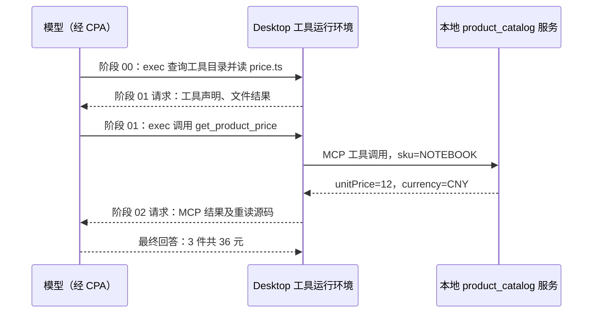

# 接入商品目录，Codex 怎样调用外部工具？

前面的单价来自用户输入。现在给项目接入一个本地商品目录：Codex 先通过 MCP 查询价格，再结合项目中的计算规则回答总价。本章要找出的关键证据是：价格确实来自一次工具执行，而不是模型读了服务源码或自行猜测。

实际查询 `NOTEBOOK` 得到单价 12 元，最终回答 3 件总价 36 元。本次有 3 次正式模型请求、2 次外层 `exec` 调用，其中只有 1 次商品目录 MCP 调用。完整记录从[实验清单](../evidence/desktop-lab/13-mcp/manifest.json)进入。

## 一个很小的 TypeScript 服务

继续使用已修好总价计算的项目，增加 [mcp/catalog.ts](../examples/13-mcp/mcp/catalog.ts)。服务中只有两条商品数据：

| SKU | 单价 | 币种 |
| --- | --- | --- |
| `NOTEBOOK` | 12 元 | `CNY` |
| `PENCIL` | 3 元 | `CNY` |

它通过官方 TypeScript SDK 注册一个工具：

```ts
server.registerTool(
  'get_product_price',
  {
    title: '查询商品单价',
    description: '只读查询本地商品目录，返回人民币单价（元）。SKU 区分大小写。',
    inputSchema: { sku: z.string().min(1).describe('商品编号：NOTEBOOK 或 PENCIL') },
    annotations: { readOnlyHint: true, destructiveHint: false, idempotentHint: true, openWorldHint: false },
  },
  // 此处省略处理函数，完整实现见上面的源码链接。
);
```

这段是源码节选，处理函数没有展开。工具名称告诉客户端可以调用什么；描述帮助模型判断用途；输入 schema 约束参数。模型拿到的是一个可调用接口，不需要把整个服务源码加载进上下文。

真正查询发生在本地处理函数中。下面是[同一源码](../examples/13-mcp/mcp/catalog.ts)的处理函数节选；`prices` 是保存两条商品的 `Map`：

```ts
async ({ sku }) => {
  const unitPrice = prices.get(sku);
  if (unitPrice === undefined) {
    return {
      isError: true,
      content: [{ type: 'text', text: `Unknown SKU: ${sku}. Supported SKUs: NOTEBOOK, PENCIL.` }],
    };
  }
  const product = { sku, unitPrice, currency: 'CNY' };
  return { content: [{ type: 'text', text: JSON.stringify(product) }], structuredContent: product };
}
```

当客户端传入 `{"sku":"NOTEBOOK"}`，SDK 将参数交给这个处理函数；函数取出 12，再把结果包装为 MCP 工具结果。未知 SKU 返回 `isError: true`，不把找不到价格变成 0 元。这段代码在服务进程执行，不是在模型里执行。

`readOnlyHint` 是工具声明。这个服务的实际只读行为来自实现：它只查询本地 `Map`，没有文件写入或网络请求。不要把一个提示性注解当成系统强制隔离。

服务使用 `StdioServerTransport`。Desktop 启动本地 Node 进程，通过标准输入和标准输出与它通信。服务不需要额外监听网络端口；也不能往 stdout 随意打印调试文字，因为那里用于传输 MCP 消息。

## 先让项目可以复现

[本章项目快照](../examples/13-mcp/README.md)包含业务代码、商品服务、锁文件与协议检查脚本，不包含 `node_modules`。复制 `examples/13-mcp` 为自己的项目目录，使用 Node.js 24 或更新版本，在该目录运行：

```bash
npm ci
npm run typecheck
npm test
npm run mcp:check
```

这些命令是 TS 项目的安装与检查，不需要使用 Codex CLI。本次本机验证中，类型检查通过，原有 1 个业务测试通过，MCP 检查也通过。依赖锁定为 `@modelcontextprotocol/sdk` 1.31.0 和 `zod` 4.6.5。

[mcp/check-catalog.ts](../examples/13-mcp/mcp/check-catalog.ts)使用正式 SDK 的 `Client` 与 `StdioClientTransport` 启动服务。它完成连接初始化，然后检查工具列表、两个已知商品、未知 SKU，以及错误类型的参数。实际检查输出为：

```text
MCP verified: tools/list; NOTEBOOK=12 CNY; PENCIL=3 CNY; unknown SKU and invalid input rejected.
```

这证明服务可以通过 MCP 协议被客户端调用，还没有证明当前 Desktop 任务已经接入它。

## 将服务接入 Desktop

项目快照仅提供 [.codex/config.example.toml](../examples/13-mcp/.codex/config.example.toml)，不会自动启用作者机器上的路径。下面是待替换的配置示例：

```toml
[mcp_servers.product_catalog]
command = "C:/path/to/node.exe"
args = ["C:/path/to/codex-ts-demo/mcp/catalog.ts"]
cwd = "C:/path/to/codex-ts-demo"
```

将三处路径替换为自己的绝对路径，再另存为项目中的 `.codex/config.toml`。`command` 指向 Node 可执行文件，`args` 指向商品服务，`cwd` 是项目目录。项目配置需要受到 Codex 信任，具体规则见[官方配置文档](https://learn.chatgpt.com/docs/config-file/config-basic)。本实验的 demo 没有初始化 Git，当前 core 仍然读到了这个受信任项目的配置。

也可以通过 Desktop 设置中的 MCP 页面添加 STDIO 服务，填写相同名称、命令和参数。官方入口说明在 [MCP 文档](https://learn.chatgpt.com/docs/extend/mcp)，按钮名称与所在位置应以自己的版本为准，界面要求保存或重启服务时按界面完成。本次版本的观察位置是 `Settings > Plugins > MCP`。

我们在[界面观察记录](../evidence/desktop-lab/ui-observations.json)的 `mcp-project-config-visible` 项看到 `product_catalog` 已列出并启用。更早的一次状态面板和请求里没有看到它；之后进入设置确认状态，再发送任务，实际调用成功。本次没有执行重启，也没有证据确定此前缺席的内部原因。

因此，配置存在、设置显示启用、当前任务能调用，是需要分别核对的三个状态。看到设置中的一行服务名称，还不能直接写“查询成功”。

## 在 Desktop 中提出可检查的任务

复现时可以发送下面的提示；原始输入文本保存在实验清单中：

```text
请使用 product_catalog MCP 的 get_product_price 工具查询 SKU NOTEBOOK 的单价，再读取 src/price.ts，计算 3 件的总价。必须以实际工具结果为依据；若该 MCP 工具不可用就如实说明，不要用读取商品目录源码代替调用。不要修改文件。
```

这段提示要求查询实际工具，同时指定了工具不可用时的行为。它不直接告诉模型单价是 12，让我们能够检查这个数字从哪里进入上下文。

## 第一次请求：还没查价，先发现工具

打开[阶段 00 请求](../evidence/desktop-lab/13-mcp/00-request.request.json)：`input` 有 12 项，没有 `previous_response_id`。`input[0..5]` 是工具与基础上下文，`input[6..10]` 重发了上一章读取项目笔记的消息、调用、结果与回答，`input[11]` 才是这次查价要求。因此“本轮第一请求”不等于“空白上下文”。

`input[0].tools` 中列的是 `functions`、`clock`、`collaboration`、`mcp__cua_repl` 等外层命名空间。这里不能仅靠顶层工具列表中没有一个直写的 `get_product_price` 项，就断言运行环境里不存在商品工具。本次模型使用 `exec` 查询运行环境的 `ALL_TOOLS`，从返回目录得到可调用名称。

实际执行也没有完全按照提示中的先后顺序进行：

| 阶段 | 实际发生的动作 | 对应证据 |
| --- | --- | --- |
| `00` | 第一次 `exec` 检索可用工具目录，并先读取一次 `src/price.ts` | [阶段 00 输出项](../evidence/desktop-lab/13-mcp/00-request.output-items.json) |
| `01` | 第二次 `exec` 调用商品 MCP，随后再次读取 `src/price.ts` | [阶段 01 输出项](../evidence/desktop-lab/13-mcp/01-request.output-items.json) |
| `02` | 模型收到真实价格与代码后，回答总价 36 元 | [阶段 02 请求](../evidence/desktop-lab/13-mcp/02-request.request.json) |

第一阶段的调用编号是 `call_75g7fEltP0HEVgJJJOpXMJns`。[阶段 01 请求](../evidence/desktop-lab/13-mcp/01-request.request.json)用同一个 `call_id` 带回结果，同时用 `previous_response_id` 引用产生目录查询的响应。模型这时新得到的目录结果中，商品工具的声明如下，摘自 `input[0].output[1].text` 中的说明：

```ts
declare const tools: {
  mcp__product_catalog__get_product_price(args: {
    // 商品编号：NOTEBOOK 或 PENCIL
    sku: string;
  }): Promise<CallToolResult>;
};
```

把它和服务源码对照：MCP 服务注册名是 `get_product_price`，配置中的服务名是 `product_catalog`，在本次 Code Mode 运行环境里组合成 `mcp__product_catalog__get_product_price`。服务里的 Zod `inputSchema` 用于参数校验，上面的声明则是本次提供给模型使用的调用形式；两者不是同一份文本。本章没有把这段 TypeScript 声明冒充原始 MCP `tools/list` JSON。

第一次目录检索还产生了大量输出，记录中出现了截断提示；商品声明仍保留在返回开头。这个广泛检索是本次执行的额外动作，不是使用 MCP 必须重复的操作。

## 第二次生成：把查询变成真正的调用

目录结果到达后，模型没有直接回答单价，而是生成下一次外层调用，编号变为 `call_p7bdY59aNNKkV0ISyHbxziJ8`。其中商品查询代码为：

```js
text(await tools.mcp__product_catalog__get_product_price({sku:"NOTEBOOK"}));
```

这是阶段 01 外层 `exec` 内容中的实际节选。其后还有一次读取项目文件的命令，完整内容保留在原记录中。因此，“2 次外层工具调用”不能解读成“查询了两次商品价格”。

运行环境执行这段 JavaScript，调用已连接的本地 MCP 服务，SDK 再调用前面的处理函数。接口名和参数由模型选择，12 元由服务执行产生。若只看到代码里写了 `get_product_price`，仍只能证明提出了调用，还要继续检查返回。

## 第三次请求：价格进入模型，循环才能结束

在阶段 02 请求中，`input[0]` 是前一次外层调用的返回，`call_id` 与阶段 01 的调用对应。解析它的 `output[1].text`，可以得到以下结构：

```json
{
  "content": [
    {
      "type": "text",
      "text": "{\"sku\":\"NOTEBOOK\",\"unitPrice\":12,\"currency\":\"CNY\"}"
    }
  ],
  "structuredContent": {
    "sku": "NOTEBOOK",
    "unitPrice": 12,
    "currency": "CNY"
  }
}
```

这里既有文本内容，也有结构化结果。两者都来自服务返回，不是模型回答里自行编出的价格。在这一层外面还有 `custom_tool_call_output`，其 `call_id` 是第二次外层调用的编号；MCP 结果作为其中一个内容块回传。不能把“外层 exec 结果”和“内部 MCP 结果”再算作两次模型生成。

紧接着的 `output[2].text` 是再次读取文件的结果，其中包含：

```ts
export function calculateTotal(unitPrice: number, quantity: number): number {
  return unitPrice * quantity;
}
```

这份请求继续引用阶段 01 的响应，模型因而同时拥有任务要求、已发现的接口、真实单价和乘法实现，最后在[阶段 02 输出](../evidence/desktop-lab/13-mcp/02-request.output-items.json)回答 `12 × 3 = 36 元`，没有再提出工具调用。Agent Loop 至此结束本轮工作。

本轮读取了函数并进行计算，没有另行运行 `calculateTotal(12, 3)`；不要把这份回答描述成程序实际执行该输入的输出。现有业务测试的运行验证属于前面的项目检查。



图中的本地服务通信由配置、服务源码、SDK 验证和实际调用结果共同支持；CPA 捕获的是模型一侧箭头，不是图中每段箭头的底层抓包。

## 不同记录各自证明什么？

| 记录 | 能支持的结论 |
| --- | --- |
| 项目配置与设置页面 | 服务已配置，界面显示启用 |
| 独立 SDK 检查 | 本地连接初始化、工具列表和调用往返成功；未知 SKU 与非法参数被拒绝 |
| Desktop 的真实工具执行 | 当前任务实际调用商品目录，而非只看到配置 |
| CPA 的调用内容与下一次请求 | 模型发出了相关调用，随后收到了单价 12 和项目代码 |
| 最终回答 | 模型使用上述证据给出总价 36 元 |

CPA 观察的是 Codex 与模型服务之间的请求和响应。本实验使用的本地 stdio MCP 通信不经过 CPA，因此这些 CPA JSON 不是 MCP 的底层 JSON-RPC 抓包。SDK 检查实际完成了该层通信，但本章没有把未采集的握手帧补成“原始日志”。

## 练习：换一个 SKU，追查答案来源

在自己的 Desktop 中改查 `PENCIL`，仍然计算 3 件。先找到真实工具结果，再检查最终答案是否使用了这份结果。随后可以查一个不存在的 SKU，观察错误怎样返回给模型。

<details>
<summary>参考解释</summary>

本地目录中 `PENCIL` 的单价是 3 元，按乘法规则应得到 9 元。需要用自己这次的 MCP 返回与后续请求证明价格来源，不能只对照这个参考数字。未知 SKU 应产生显式工具错误，不能被当成免费商品。PENCIL、未知 SKU 与非法参数已经在独立 SDK 检查中验证；本章公开的 Desktop 样本仅查询 NOTEBOOK，其他 Desktop 结果需要另行采集。

</details>

[上一章：新任务知道了旧决定，是从哪里知道的？](12-memory.md) · [下一章：先计划，再执行，会发生什么？](14-plan.md)
