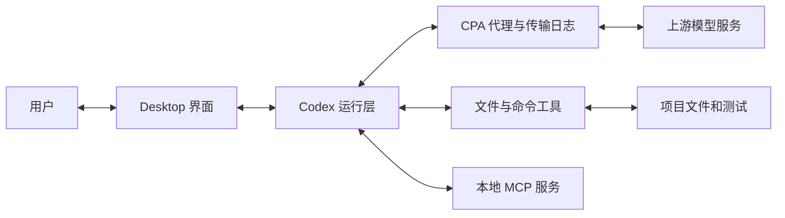

# 完整复盘：谁完成了修复，怎样验收？

总价修复改了一个运算符。判断修复是否完成，既要查到文件中的改动，也要核对测试是否运行及其结果。

## 沿一条修改追到磁盘

用户在 Desktop 提出修复要求。运行程序把要求和已有上下文组织成请求，经 CPA 发给模型服务。模型先后提出读取、搜索和修改调用；本地工具执行补丁，之后再运行检查。结果进入模型后，才产生最终完成说明。

图中按职责划分组件，每个方框不一定独占一个进程：

| 组件 | 接收什么 | 负责什么 |
| --- | --- | --- |
| Desktop 界面 | 用户输入、运行中的操作和回答 | 提供输入及模式入口，展示过程和结果 |
| Codex 运行层 | 任务上下文、模型提出的调用、工具返回 | 组织请求，调度工具，维护状态并限制执行 |
| 模型服务 | 每次请求中提供的信息 | 生成后续动作或回答 |
| 文件与命令工具 | 读取、补丁或命令的具体输入 | 访问文件、改变磁盘内容、运行测试并返回结果 |
| MCP 服务 | 客户端发来的工具参数 | 执行服务中的处理函数，例如查询商品目录 |
| CPA | Codex 与模型服务之间的请求和响应 | 转发并记录这部分传输 |

负责组织上下文、调度工具、维护状态和限制执行的程序通常称为 Harness。模型提出的补丁要经过运行层调度、本地工具执行，才能改变文件；验证结果再进入下一次模型请求，供模型判断是否完成。[第三章的验收](03-agent-loop.md#修改返回以后还需要检查什么)已经逐项核对这条链路中的文件与检查结果。那次验收限于约定的总价场景，不覆盖所有非法金额或后来的折扣需求。

这些职责划分依据可见请求和执行过程，尚未还原 Codex 的内部源码实现。MCP 查价实验调用服务并读取了函数，模型随后根据单价和代码计算出 36 元，没有实际运行总价函数；权限实验已经提出写入，运行环境却拒绝执行。沿组件间的交接记录，才能判断工作完成到了哪一步。

## 哪一种记录能回答你的问题？

核对结论时，可以按问题选择记录：

| 想确认的事实 | 优先查看 | 还要留意什么 |
| --- | --- | --- |
| 用户到底要求做什么 | 原始输入、截图、实验清单 | 请求中还可能附加应用包装 |
| AGENTS 或 Skill 是否进入上下文 | 当前请求及其引用历史 | 进入上下文不等于每条要求都已执行 |
| 模型是否要求调用工具 | 输出项或流式调用完成事件 | 工具定义只说明接口可用 |
| 命令实际返回什么 | 按 `call_id` 配对的结果 | 外层调用返回不等于内部命令退出码为 0 |
| 文件最终是什么内容 | 文件重读、快照或独立状态检查 | 只看补丁意图可能遗漏执行结果 |
| 任务是否达到要求 | 原要求逐项对应文件和检查 | 响应完成或 Goal 完成状态不替代验收 |

本地 stdio MCP 的握手不经过 CPA，模型服务内部如何保存引用历史也没有直接呈现在这些 JSON 中。核对这类问题需要相应侧的记录；没有记录时，应保留为未知。

深入核对：架构解释与旧样本的关系

[一次本机进程检查](../lessons/01-codex-cpa-trace/学习文档.md)确认 Desktop 启动 `codex.exe app-server`，后台还启动了 `codex-code-mode-host.exe`。这只能说明该次运行的进程布局，其他版本需要另查。

CPA 记录模型调用，本地工具及 MCP 服务执行具体操作，rollout 记录任务、模式、协作和中断状态。

继续查源码可从 [Codex App Server](https://github.com/openai/codex/tree/main/codex-rs/app-server) 和[官方 App Server 文档](https://developers.openai.com/codex/app-server/)入手。源码分支和本机版本需要另行对应，不能把仓库最新实现直接当作这次历史运行。

## 用自己的新日志完成一次验收

在自己的独立 demo 副本中发起一次新的总价计算检查。选择一个已有实现支持的输入，先写下预期值，要求 Codex 实际运行函数并报告结果。例如使用折扣快照时，可以检查一个 0 到 100 的整数折扣；原始故障快照则应先按第三章完成修复。

任务结束后，先收起最终回答，根据日志和文件记录整理：

| 核对项 | 需要记录的内容 |
| --- | --- |
| 当前要求 | 你输入的数字、期望行为和不应扩大的范围 |
| 数据来源 | 数字来自用户输入、文件、历史还是工具结果，具体在哪份请求进入 |
| 一次工具往返 | 发起调用的输出、`call_id`、带回结果的请求 |
| 实际执行 | 运行了哪条命令，退出码和输出是什么 |
| 完成判断 | 哪些要求已有证据，哪些仍未验证 |

再展开最终回答，核对其中的结论是否都有证据。如果模型只阅读函数后算出答案，就指出缺少实际执行，要求补齐本轮已经约定的检查。如果执行失败，就根据错误与项目状态解释原因，保留实际结果。

新日志的编号与阶段数可能和教程不同，以自己的记录为准。

核对时遇到空白或缺项

当前 `input` 找不到全部历史时，先检查 `previous_response_id`；完成事件的 `output` 为空时，继续找流式 `output_item.done`；工具结果只出现外层包装时，解析内部内容块，再查看退出码和输出。若对应原始材料没有保存，就把该项记为缺证据，不用模型最终回答补造中间过程。

复现时的工具选择或请求数可能不同，记录实际路径、数据来源和验证范围后，才能判断这些差异意味着什么。[记忆章](08-memory.md)用整合前后的请求和开关对照验证了原生记忆自动注入；主动检索记忆文件、审批完整流程、预算耗尽或定时续跑，还需各自的实验。

命令工具之外的观察记录，见 [PostToolUse 实验](10-hooks.md#PostToolUse：命令完成后记录返回)。

[上一章：流式输出与协议细节](14-streaming.md) · [回到导读](introduction.md) · [课程首页](../README.md)
