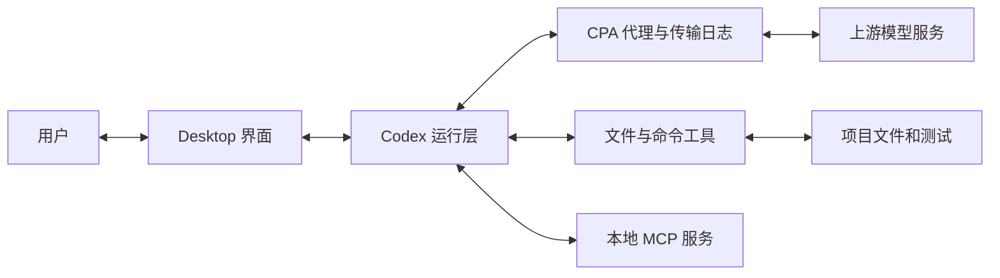

# 完整复盘：谁完成了修复，怎样验收？

总价修复只改了一个运算符，却经过上下文组装、模型生成、本地工具执行和测试。最后一章把这些职责放回同一张图，再用日志判断“已完成”是否有依据。

## 沿一条修改追到磁盘

用户在 Desktop 提出修复要求。运行程序把要求和已有上下文组织成请求，经 CPA 发给模型服务。模型先后提出读取、搜索和修改调用；本地工具执行补丁，之后再运行检查。结果进入模型后，才产生最终完成说明。

下面按职责画出本教程观察的连接，方框不代表每项都必须是独立进程：

Desktop 接收输入，展示操作、模式和回答；运行层组织上下文、接收工具调用、安排执行并回传结果。模型依据每次收到的信息生成后续动作或回答。本地文件工具实际改变磁盘，测试进程实际运行项目。CPA 记录模型请求与响应，方便我们把这些往返连起来。

组织上下文、调度工具、维护状态和限制执行的程序通常称为 Harness。这里观察的是可见请求、工具结果和本地记录，没有还原 Codex 的内部源码实现。

## 同一个“完成”，要分别回答几个问题

先看修复记录。模型生成补丁，证明它要求改变什么；补丁工具返回之后，还需要查看文件和检查结果。[修复阶段 04 请求](../evidence/desktop-lab/07-fix/04-request.request.json)正好带回这些材料：

| 要验收的要求 | 对应证据 |
| --- | --- |
| 总价函数改成乘法 | 重读的 `src/price.ts` 与[修复快照](../examples/07-fixed/README.md) |
| 原来的测试通过 | `npm test` 退出码 0，`pass 1`、`fail 0` |
| 示例实际输出 30 | `npm start` 的输出和退出码 0 |
| TypeScript 检查通过 | `npm run typecheck` 退出码 0 |
| README 更新 | 同次文件重读中的新正文 |

这些结果支持约定的总价场景，不覆盖所有非法金额或折扣行为。后来的折扣需求另有计划和 11 项测试。

MCP 章节的 36 元来自模型收到单价 12 和乘法代码后的计算，那一轮没有实际运行函数。权限章节则有写入调用，但运行环境拒绝执行，文件也未改变。核对时要分清记录停在了哪一步。

## 哪一种记录能回答你的问题？

截图、请求、工具返回和文件快照各自回答不同的问题：

| 想确认的事实 | 优先查看 | 还要留意什么 |
| --- | --- | --- |
| 用户到底要求做什么 | 原始输入、截图、实验清单 | 请求中还可能附加应用包装 |
| AGENTS 或 Skill 是否进入上下文 | 当前请求及其引用历史 | 进入上下文不等于每条要求都已执行 |
| 模型是否要求调用工具 | 输出项或流式调用完成事件 | 工具定义只说明接口可用 |
| 命令实际返回什么 | 按 `call_id` 配对的结果 | 外层调用返回不等于内部命令退出码为 0 |
| 文件最终是什么内容 | 文件重读、快照或独立状态检查 | 只看补丁意图可能遗漏执行结果 |
| 任务是否达到要求 | 原要求逐项对应文件和检查 | 响应完成或 Goal 完成状态不替代验收 |

CPA 也有观察边界。本地 stdio MCP 的握手不经过它，模型服务内部如何保存引用历史也不直接暴露在这些 JSON 中。遇到这类问题，应寻找相应侧的记录，或明确保留为未知。

深入核对：架构解释与旧样本的关系

[最初两轮对话讲义](../lessons/01-codex-cpa-trace/学习文档.md)曾用本机进程检查确认 Desktop 启动 `codex.exe app-server`，后台还启动了 `codex-code-mode-host.exe`。那是旧样本的进程证据，不能据此假定本次所有运行版本的内部布局相同。

当前这组实验支持的是本章图中的职责关系：模型调用经 CPA 留下记录，本地工具及 MCP 服务执行具体操作，rollout 补充任务、模式、协作和中断状态。这里没有完成当前版本逐行源码对应，也没有自建 Harness 与 Codex 的性能或架构比较。

继续查源码可从 [Codex App Server](https://github.com/openai/codex/tree/main/codex-rs/app-server) 和[官方 App Server 文档](https://developers.openai.com/codex/app-server/)入手。源码分支和本机版本需要另行对应，不能把仓库最新实现直接当作这次历史运行。

本次与旧样本的字段也有差异。例如旧两轮对话沿响应引用接续；新实验同时观察到了引用和历史重发。当前完成事件的 `output` 还可能为空，需要读取流式输出项。跨样本比较时先确认字段与来源，再解释机制。

## 用自己的新日志完成一次验收

在自己的独立 demo 副本中发起一次新的总价计算检查。选择一个已有实现支持的输入，先写下预期值，要求 Codex 实际运行函数并报告结果。例如使用折扣快照时，可以检查一个 0 到 100 的整数折扣；原始故障快照则应先按第三章完成修复。

任务结束后，先收起最终回答，只用自己的日志和文件记录整理一张小表：

| 核对项 | 需要记录的内容 |
| --- | --- |
| 当前要求 | 你输入的数字、期望行为和不应扩大的范围 |
| 数据来源 | 数字来自用户输入、文件、历史还是工具结果，具体在哪份请求进入 |
| 一次工具往返 | 发起调用的输出、`call_id`、带回结果的请求 |
| 实际执行 | 运行了哪条命令，退出码和输出是什么 |
| 完成判断 | 哪些要求已有证据，哪些仍未验证 |

再展开最终回答，对照它是否只声明了证据支持的结果。如果模型仅阅读函数后算出答案，就指出缺少实际执行，并要求补齐本轮已经约定的检查。如果执行失败，就根据错误与项目状态解释失败，不把预期值写成观察值。

在新日志里标出数据来源、一次工具往返和完成证据。它们的编号与阶段数可能和教程不同，以自己的记录为准。

核对时遇到空白或缺项

当前 `input` 找不到全部历史时，先检查 `previous_response_id`；完成事件的 `output` 为空时，继续找流式 `output_item.done`；工具结果只出现外层包装时，解析内部内容块，再查看退出码和输出。若对应原始材料没有保存，就把该项记为缺证据，不用模型最终回答补造中间过程。

复现得到不同的工具选择或请求数并不自动表示实验失败。只要能说明实际路径、数据来源和验证范围，就可以把差异作为新的观察记录。涉及原生记忆自动召回、审批完整流程、预算耗尽或定时续跑时，仍需这些机制自身的实验。

## 补充实验：PostToolUse 记录了什么？

2026-10-03，我们准备了两个独立测试文件：一个检查 `10 * 3` 等于 `30`，另一个故意要求 `10 + 3` 等于 `30`。通过 Desktop 输入框要求分别运行一次，失败后不修复、不重试，也不让模型读取 Hook 日志。

两次实际返回如下：

| 命令 | 退出码 | 测试结果 | 证据 |
| --- | ---: | --- | --- |
| `node --test .codex/hook-lab/pass.test.mjs` | 0 | 通过 1，失败 0 | [首次工具返回](../evidence/desktop-lab/hook-post-tool/01-request.request.json) |
| `node --test .codex/hook-lab/fail.test.mjs` | 1 | 通过 0，失败 1，`13 !== 30` | [第二次工具返回](../evidence/desktop-lab/hook-post-tool/02-request.request.json) |

模型的[最终报告](../evidence/desktop-lab/hook-post-tool/02-request.output-items.json)保留了这两个结果和原始断言错误。独立检查[文件哈希](../evidence/desktop-lab/hook-post-tool/file-observations.json)确认测试文件没有被修好，Hook 配置和脚本也未改变。

查看 Desktop 中保留的失败断言

新实验同时保留通过结果和故意失败的原文，见[本轮记录](../evidence/desktop-lab/hook-post-tool/manifest.json)。Hook 取得的内容还要与下面的本地日志对照。

与此同时，`PostToolUse` 处理器在每次命令完成后记录返回内容，再返回 `{}`。它只是观察这两个指定测试，没有把失败改为成功。[Hook 日志](../evidence/desktop-lab/hook-post-tool/hook-events.json)里的 `tool_response` 实际是输出字符串，没有 `exit_code` 字段。这个字符串与 CPA 工具返回内层的 `output` 逐字一致；退出码需要从工具结果或原生命令完成事件读取。

这样能分别回答三个问题：测试执行得到了什么，Hook 记录了什么，模型最后怎样报告。仅有一份 Hook 日志，不能补出它没有记录的退出码。

命令工具名称与记录范围

本项目 Hook 的 matcher 是 `^Bash$`，对应这次运行层报告的命令工具名称。处理器只记录命令中包含 `.codex/hook-lab/pass.test.mjs` 或 `.codex/hook-lab/fail.test.mjs` 的事件，并返回 `{}`，源码见[配置与文件快照](../evidence/desktop-lab/hook-post-tool/file-observations.json)。这不能推广为所有命令都会被记录。

CPA 的两次外层 `exec` 与 Hook 的原生 `tool_use_id` 分别保留自己的编号。[审计](../evidence/desktop-lab/hook-post-tool/audit.json)按轮次和实际命令核对两份输出，并将退出码与[rollout 命令事件](../evidence/desktop-lab/hook-post-tool/rollout-events.json)对应。本轮有 3 次模型请求、2 次工具调用，属于本地测试观察实验。

[上一章：流式输出与协议细节](14-streaming.md) · [回到导读](introduction.md) · [课程首页](../README.md)
