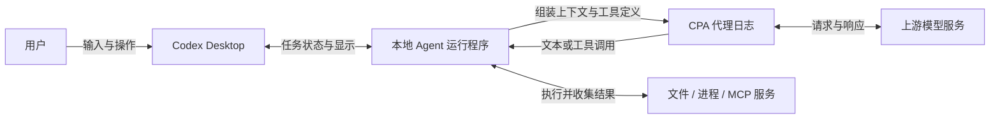

# Codex 的一次完整运行

在一个真实的 TypeScript 小项目里，给 Codex Desktop 发一句“你好”，然后让它读文件、遵循项目规则、使用 Skill、运行测试，最后修好一个总价计算错误。我们把这些操作对应的 CPA 请求、模型输出和本地执行结果放在一起，沿着实际发生的过程理解 Agent。

这个项目很小：单价 `10` 元、数量 `3`，程序却输出 `13` 元。错误留在[初始快照](../examples/01-baseline/README.md)里；第 7 节修好后输出 `30`。后续商品目录 MCP、折扣功能和恢复实验继续使用这个项目，不需要先学一套陌生业务。

## 先分清三个观察位置

**Desktop 界面**告诉我们输入了什么、用户看到了什么；**CPA 日志**告诉我们实际发往模型的请求与流式返回；**本地记录与项目文件**告诉我们工具做了什么、文件变了什么、测试是否通过。三个位置相互对应，才能解释一次任务。

这是根据本次实验绘制的职责示意图，不是 Codex 内部实现源码。模型返回一条“读取文件”的工具调用之后，本地程序才执行读取；执行结果会作为后续请求的输入，再交给模型继续工作。这个**请求 → 输出 → 执行 → 反馈 → 下一次请求**的循环，就是我们要沿日志看清的 Agent loop。

## 按同一条线读下去

前七节是一段逐步增加能力的实验：

| 界面中的动作 | 这一步要解释的问题 |
| --- | --- |
| [01 · 发送“你好”](01-hello.md) | 输入框只有两个字，模型为什么收到七个输入项？应用指令放在哪里？ |
| [02 · 问“我刚才说了什么”](02-context.md) | 前一轮的消息怎样进入下一次请求？ |
| [03 · 请它读取 README](03-readme.md) | 工具定义、模型调用、工具结果分别是什么？ |
| [04 · 加入 AGENTS.md](04-agents.md) | 全局与项目规则怎样拼在一起，回答有没有体现规则？ |
| [05 · 使用项目 Skill](05-skills.md) | 技能目录、技能正文与执行步骤怎样进入运行过程？ |
| [06 · 运行测试](06-tests.md) | 模型怎样收到退出码和失败原因？ |
| [07 · 修复错误](07-fix.md) | 一条用户要求为什么产生五次模型请求？怎样证明修好了？ |

之后依次展开上下文与记忆、MCP 与协作、错误与中断恢复。目录用于定位问题，正文可以一直向下读。每节保留公开的输入、输出及逐阶段证据：在内嵌工作台选择实验与请求阶段，逐项查看输入、输出、工具配对及 CPA 两侧数据，也可以展开、复制或下载已脱敏原文。原生计划、压缩和中断另有对应记录，不把它们改写成普通聊天回复。

读某一段 JSON 时，先确认**它属于哪一次请求、谁发出的、来自哪个位置**。例如 `user` 角色既可能是输入框文字，也可能是客户端附加的环境与规则；`response.completed` 表示一份模型响应结束，不能单独证明整个任务完成。

## 实验材料和边界

本教程基于 2026 年 9 月 29—30 日的真实实验，保存了 [26 组实验索引](../evidence/desktop-lab/index.json)和 74 个阶段的请求／输出，其中 3 次预热单独标记。项目提供[故障版](../examples/01-baseline/README.md)、[修复版](../examples/07-fixed/README.md)、[MCP 版](../examples/13-mcp/README.md)与[折扣版](../examples/14-discount/README.md)四套快照。截图由实验者提供，第一节会对照截图中的前三轮消息；其余实验以各自的日志和本地记录为证据，不以重画界面充当截图。

公开日志是保留结构的脱敏副本。认证头没有导出，个人目录、凭据和加密内容作了替换；具体处理路径在各实验 `manifest.json`。`output-items.json` 是从流式事件提取的衍生文件，原始完成事件里的空 `output` 没有被改写。正文中的节选会说明省略范围，工作台可以查看该阶段的完整公开文件。

本次能看到的是 CPA 经过的请求数据。它不能证明上游服务内部没有其他处理，也不能展示日志未记录的隐藏信息。原生 Memories 的自动生成和召回尚未实测；文件笔记、会话历史和原生记忆在第 12 节分别讨论。

如果要跟着操作，把[起始项目](../examples/01-baseline/README.md)复制到自己的目录，安装 Node.js 24 或更高版本，将它加入 Codex Desktop 项目区，并开启 CPA 请求日志。代码运行命令只是验证 TS 项目所需；学习入口始终是 Desktop 中的真实任务。

从下一节开始，先看一次最简单的真实输入。
