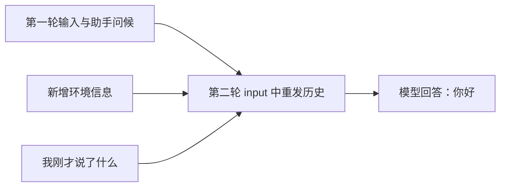

# 再说一句话，怎样接着聊？

Codex 能回答“你刚才说了什么”，不等于它拥有一份独立于请求的永久记忆。本章直接检查第二轮请求，找出它继续对话所需的信息从哪里来。

沿用上一章的同一个 Desktop 任务，不新建任务。这样只改变用户输入，便于比较两次请求。

## 接着发送一句话

通过输入框发送：

```text
我刚才说了什么？
```

实际回答是：

> 你刚才说的是：“你好”。

本轮有 1 次正式请求、0 次工具调用，记录的输入 token 为 32,930，输出 token 为 12。它无需打开项目文件，就能回答这个关于当前对话的问题。

## 先把两个用户轮次与请求对应起来

| 用户轮次 / 网络阶段 | 实际发给模型的内容 | 输出在哪里 | 工具调用与回传 |
| --- | --- | --- | --- |
| 第 1 轮 `01-hello / 01-request` | 7 项初始输入，末项“你好” | [一条最终问候](../../evidence/desktop-lab/01-hello/01-request.output-items.json) | 无 `call_id`，无工具结果 |
| 第 2 轮 `02-context / 00-request` | 10 项输入：保留前 7 项，再加入上次回答、环境更新和新问题 | [一条最终回答](../../evidence/desktop-lab/02-context/00-request.output-items.json) | 同样没有工具调用；[流式事件](../../evidence/desktop-lab/02-context/00-request.events.json)属于这一次响应 |

第一章的预热是另一个网络阶段，不是第三次用户输入。这里先建立最简单的对应：两个用户轮次各有一次正式模型请求。第 3 章一旦引入工具，同样“一次用户输入”就会展开成两次模型请求。

## 请求带回了历史

打开[第二轮请求](../../evidence/desktop-lab/02-context/00-request.request.json)。`input` 从上一轮的 7 项增加到 10 项。与其只看数量，不如找到新增和重发的具体内容：

| 位置 | 内容 |
| --- | --- |
| `input[6]` | 第一轮用户输入“你好” |
| `input[7]` | 第一轮助手回复 |
| `input[8]` | 更新后的环境信息 |
| `input[9]` | 本轮问题“我刚才说了什么？” |

前 7 项与第一章的输入逐项深比较相同。这意味着工具定义、developer 指令、原规则环境以及“你好”，都仍直接写在这份请求里。`input[8]` 则是新增的环境更新，其中日期变为 `2026-09-30`；所以本轮增加了 3 项，而不只是“一条回答 + 一条新问题”。这些环境消息同样是 `user` 角色，不代表读者曾在输入框里输入了日期。

下面节选 `input[6]` 与 `input[7]`，保留嵌套结构，省略 `id`、`phase` 等字段；它们在完整请求中位于 `input` 数组内：

```json
[
  {
    "type": "message",
    "role": "user",
    "content": [{ "type": "input_text", "text": "你好\n" }]
  },
  {
    "type": "message",
    "role": "assistant",
    "content": [{ "type": "output_text", "text": "你好！今天想一起做点什么？" }]
  }
]
```

此处展示的是数组节选，不是一份可直接发送的完整请求。实际记录中，前面的工具信息、应用指令和规则也再次出现了。因此能从请求正文直接找到支持回答的历史证据。

把当前问题和前一轮内容放在一起，模型能够看到这样的语义顺序：用户说“你好” → 助手问候 → 用户问“我刚才说了什么”。回答来自当前请求中提供的历史，不需要假定模型在请求之外永久保存了这个人的每句对话。

## response ID 与 message ID 先分清

第一章的完整响应 ID 是 `resp_0e37249022131978016abbdd7cb40c87d09c1a684b05dbefc1`。其中问候消息的 ID 是 `msg_0e37249022131978016abbdd7e07e487d0a741daf042c801e0`，第二轮 `input[7].id` 保留了这个消息 ID。

前者标识模型的一次响应，后者标识其中一条消息。一次响应以后可能同时产出进度消息和工具调用，所以二者不能互换。此时还没有工具调用，也就没有用来配对执行结果的 `call_id`。

## 两种接续方式，要看具体请求

请求可以把当前所需历史重新放进 `input`，也可以携带 `previous_response_id` 引用已有响应，再附上新增输入。不要提前认定某个产品始终只用一种方式。

**本轮请求没有 `previous_response_id` 字段。** 实验索引中的 `previousResponseId: null` 是采集器为了统一展示而记录的“无引用”，不是给原始请求增加了一个同名字段。这里观察到的是历史重发。

下一章会出现另一种真实情况：同一用户任务内部，读取文件后的第二次请求使用 `previous_response_id`，而 `input` 只包含工具结果。这两种方式都服务于上下文接续，但证据形态不同。



图只描述本轮。这里没有经过 `previous_response_id` 这条边；如果把引用接续画进来，就会把一个常见机制冒充成本样本的实际路径。

第二轮[上游请求](../../evidence/desktop-lab/02-context/00-request.upstream.json)与客户端正文按值相同，重发的历史没有被 CPA 改成另一种输入形式。至于上游怎样组织内部计算状态，这些正文没有直接展示。

在本章，“模型看到了上轮问候”有直接证据；“模型依靠跨任务长期记忆回答”没有证据。新建任务、恢复旧任务和持久记忆，需要分别设计实验，不能由一次答对推导出来。

## 请求长度不等于新增内容

本轮用户输入很短，输入 token 仍超过三万，因为用量包含了有效上下文。请求重新携带历史，和是否命中缓存是两个问题；只看 JSON 大小不能认定缓存命中率或费用。

本轮实际报告 `cached_tokens: 13568`。因此“历史重新出现在 JSON 里”与“服务报告部分输入被缓存”可以同时成立。缓存不等于删除上下文，也不等于本次没有传输那段文字；完整的用量拆解在第 11 章。

本章统计来自[完成事件](../../evidence/desktop-lab/02-context/00-request.response.json)，排除预热。以后遇到多次正式请求时，教程会按响应求和；重复出现的上下文也可能反复进入统计，不能把求和结果理解为“独有知识量”。

## 换一种结果，你会怎样判断？

假设一份新记录的 `input` 只有最新问题，但携带了 `previous_response_id`。能否据此认定 Codex 已经忘掉上轮对话？请说出还需要核对的对象。

<details>
<summary>参考解释</summary>

不能。先沿 `previous_response_id` 找到被引用的响应，再检查关联的历史和本次输入。当前请求没有重复写出旧文字，只能说明正文没有重发，不能单独证明旧信息不可用。本章样本本身没有使用这种引用方式。

</details>

[上一章：只说一句“你好”，实际发送了什么？](01-hello.md) · [下一章：请它读 README，谁执行了操作？](03-readme.md)
