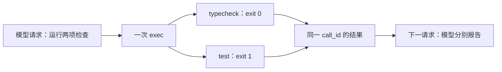

# 测试失败了，Codex 怎样知道？

上一章只从源码推算出了 13。本章真正运行检查，区分“类型正确”“行为符合要求”和“工具成功返回结果”这三件事。

继续上一章的 Desktop 任务，发送：

```text
请运行 npm run typecheck 和 npm test，分别报告退出码和测试结果。不要修改文件，也不要修复错误。
```

上轮 Skill 用于只读概览，这一轮用户明确要求执行检查。Codex 按当前任务运行两条命令，保留业务代码不变，方便下一章使用同一故障做修复实验。

## 从上一轮的文件阅读，接到这一轮的命令执行

本轮首请求只有一条新用户消息，通过 `previous_response_id` 接到第 5 章的最后响应。它没有重发整份 Skill、规则和文件结果，但这些前文也不能因此被视为自动遗忘。上轮技能限制的是只读概览流程，本轮用户明确要求执行检查，实际动作随当前任务变化。

| 阶段 | 请求内容 | 模型输出 | 工具回传去向 |
| --- | --- | --- | --- |
| `00-request` | 一条用户消息 + 上一轮响应引用 | 进度说明与一次 `exec` 调用，`call_4WQ06tMXNBdMizNTpdUKgRAl` | 批量执行两条检查命令；[请求](../../evidence/desktop-lab/06-tests/00-request.request.json)、[输出项](../../evidence/desktop-lab/06-tests/00-request.output-items.json) |
| `01-request` | 一条 `custom_tool_call_output`，引用第一响应 `resp_0061bd7340416e34016abbe333571887d0a121cf3b28a26801` | 最终表格，分别报告退出码 0 和 1 | 没有修复调用；[请求](../../evidence/desktop-lab/06-tests/01-request.request.json)、[输出项](../../evidence/desktop-lab/06-tests/01-request.output-items.json) |

第一项输出的实际代码使用 `Promise.allSettled` 包含两次 `tools.exec_command`，命令分别是 `npm run typecheck` 与 `npm test`。因此这次是一次模型提出的外层调用，运行层执行两条命令，然后用一个 `call_id` 返回两份结果。它不是“模型先看到类型检查通过，再决定运行测试”的两次独立决策。

流式层的顺序保留在[第一阶段事件](../../evidence/desktop-lab/06-tests/00-request.events.json)与[第二阶段事件](../../evidence/desktop-lab/06-tests/01-request.events.json)中。第一份产生进度消息和调用，第二份产生最终报告；失败发生在它们之间的工具执行，而不是一次失败的模型生成。

## 两条命令给出不同结果

| 命令 | 实际退出码 | 工具输出 |
| --- | --- | --- |
| `npm run typecheck` | `0` | `tsc` 完成，没有报告类型错误 |
| `npm test` | `1` | 1 个测试，0 通过、1 失败；实际 13，预期 30 |

打开[第二阶段请求](../../evidence/desktop-lab/06-tests/01-request.request.json)，这两份结果位于 `input[0].output` 中。测试输出包含：

```text
AssertionError [ERR_ASSERTION]: Expected values to be strictly equal:

13 !== 30
```

这是实际运行结果中的文字节选，空白做了压缩。报错同时提供测试位置、`actual: 13` 和 `expected: 30`，足以支持“该测试未通过”的判断。

## 为什么类型检查通过，程序仍然算错？

看看[初始计算函数](../../examples/01-baseline/src/price.ts)：

```typescript
export function calculateTotal(unitPrice: number, quantity: number): number {
  return unitPrice + quantity;
}
```

两项输入和返回值都符合 `number` 类型，`+` 也允许用于数字运算。TypeScript 能检查这些类型关系，却无法仅凭这些声明得知商品总价必须使用乘法。

项目的 [package.json](../../examples/01-baseline/package.json) 把 `typecheck` 绑定到 `tsc`，把 `test` 绑定到 `node --test tests/price.test.ts`；[tsconfig.json](../../examples/01-baseline/tsconfig.json) 设置 `noEmit: true`。这帮助我们区分类型分析与运行断言，它们是两个入口，不是同一个检查的两种显示方式。

测试中的关键断言原样是：

```typescript
assert.equal(calculateTotal(10, 3), 30);
```

这里把业务预期“30”写成可执行判断。当前函数返回 13，`assert.equal` 因此抛出 `AssertionError`，Node 测试运行器记录一个失败用例，并让进程以 1 退出。我们能够从要求一路追到失败原因，而不只是看到一个红色图标。

[行为测试](../../examples/01-baseline/tests/price.test.ts)把具体业务要求写成断言：输入 10 和 3，结果应为 30。这次失败揭示了类型检查没有覆盖的行为错误。两项检查回答的问题不同，需要分别报告。

## “fulfilled”不是“测试通过”

模型通过一次外层 `exec`，用 `Promise.allSettled` 安排两条命令，再把结果一起回传。每份结果都有 `status: "fulfilled"`，但其中一条命令的 `exit_code` 是 1。

第二请求的 `input[0]` 保留 `call_4WQ06tMXNBdMizNTpdUKgRAl`，其内容可以按三层读取：

| 路径 | 实际内容 | 应怎样解释 |
| --- | --- | --- |
| `input[0].type` | `custom_tool_call_output` | 这是之前外层调用的结果，不是新的用户指令 |
| `input[0].output[0].text` | `Script completed`、耗时、`Output:` | 外层代码执行包装 |
| `input[0].output[1].text` 解析后 | `command: "npm run typecheck"`，`status: "fulfilled"`，`value.exit_code: 0` | 类型检查命令成功返回 |
| `input[0].output[2].text` 解析后 | `command: "npm test"`，`status: "fulfilled"`，`value.exit_code: 1` | 测试命令正常返回了“失败”的结果 |

每个 `text` 内层 JSON 的 `value.output` 才是实际命令输出。不要停在外面的 `fulfilled`，也不要只读模型之后对结果的归纳。

下面是把 `input[0].output[2].text` 中的 JSON 字符串解析后所得的字段节选，省略耗时、完整输出等字段：

```json
{
  "command": "npm test",
  "status": "fulfilled",
  "value": {
    "exit_code": 1
  }
}
```

这里 `fulfilled` 表示工具调用的 Promise 正常返回了一份结果。返回的结果可以明确报告程序失败。若只找“Script completed”或“fulfilled”就宣布测试通过，会跳过真正决定结果的退出码和断言输出。

同样，聊天界面能够继续显示回答，也不代表前一条命令成功。执行状态、程序退出码和业务断言，应该分别读取，再组合成结论。

还要再区分模型侧的 `response.completed`：它表示这一份模型响应结束，不表示模型提出的所有业务检查都成功。第一阶段响应完成后，工具才执行；第二阶段可以在明确报告测试失败的同时正常完成文本生成。这四层“结束或成功”分别属于模型、外层脚本、Promise 与子进程。

## 错误怎样进入下一次回答

第一阶段的模型输出包含 `custom_tool_call`，其 `call_id` 是 `call_4WQ06tMXNBdMizNTpdUKgRAl`。第二阶段请求中的 `custom_tool_call_output` 携带相同编号，把成功的类型检查和失败的测试一并交回模型。

[最终回答](../../evidence/desktop-lab/06-tests/01-request.output-items.json)据此分别报告退出码 0 和 1。错误没有被吞掉，也没有被当成会话必须立即结束的异常；它成为后续判断可以使用的信息。本轮用户要求不修复，因此模型报告结果后结束。



本轮有失败证据，但尚无修复证据。读者已经可以把下一章的完成条件写清楚：改变实现之后，原来这条行为测试应从 `fail 1` 变为 `pass 1`，并且测试预期仍然是 30。

本轮有 2 次正式模型请求、1 次外层工具调用，内部执行 2 条命令。输入 token 合计 69,963、输出 token 合计 269，排除预热。这些是响应用量求和，不是费用或唯一上下文大小。

## 练习：找出真正的判据

如果日志同时写着 `Script completed`、`status: "fulfilled"`、`exit_code: 1` 和 `fail 1`，你会怎样报告结果？再指出什么证据还不足以声称已经修复。

<details>
<summary>参考解释</summary>

工具执行过程返回了结果，测试命令失败，且有一个失败用例。退出码与测试明细是行为验证依据。只有失败日志和原因分析，还不能证明代码修复；需要检查实际修改，并在修改后重新执行相关验证。

</details>

[上一章：把检查流程写成 Skill，怎样被用上？](05-skills.md) · [下一章：总价算错了，怎样完成修复？](07-fix.md)
