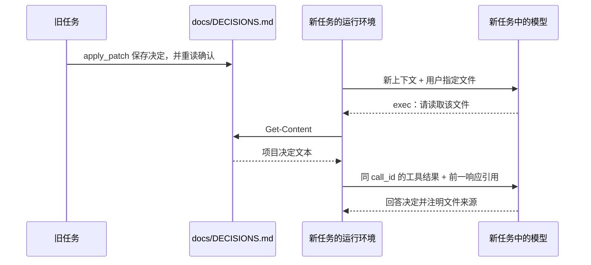

# 新任务知道了旧决定，是从哪里知道的？

新任务答出了之前确定的项目约定，可能因为读取了文件，也可能因为使用了原生 Memories。两条路径都能帮助跨任务工作，但证据不同。本章先实测文件笔记，再核对原生记忆的设置入口与官方机制。

## 把一条决定写进项目文件

在原任务中发送：

```text
把这条项目约定写入 docs/DECISIONS.md：当前商品总价使用元，暂不支持折扣。只记录这一条，不修改业务代码。
```

Codex 检查适用规则和文件是否存在，用 `apply_patch` 创建文档，然后重新读取确认。文件只有一条：

```markdown
- 当前商品总价使用元，暂不支持折扣。
```

可在[写入阶段输出](../../evidence/desktop-lab/12-memory-write/02-request.output-items.json)查看补丁，在后续阶段查看重读结果。信息已经进入项目文件，不需要依赖原任务一直保持在上下文里。

## 写一行笔记，为什么经过五次请求？

这不是模型直接在回复里写一句“已记住”就结束。写入实验有一条完整的工具闭环，所有阶段的 `input.length` 都为 1，后续请求用 `previous_response_id` 接上前一响应：

| 阶段 | 本次模型新获得的信息 | 本次模型提出的动作 |
| --- | --- | --- |
| [00 请求](../../evidence/desktop-lab/12-memory-write/00-request.request.json) | 明确写入决定的用户要求 | 搜索适用规则与已有 `DECISIONS.md` |
| [01 请求](../../evidence/desktop-lab/12-memory-write/01-request.request.json) | 搜索结果只有项目 `AGENTS.md` 等信息 | 读取规则，检查 `docs` 及目标文件是否存在 |
| [02 请求](../../evidence/desktop-lab/12-memory-write/02-request.request.json) | 规则正文与存在性检查结果 | `apply_patch` 创建决定文件 |
| [03 请求](../../evidence/desktop-lab/12-memory-write/03-request.request.json) | 修改工具返回 `{}` | 读取刚写入的文件核对 |
| [04 请求](../../evidence/desktop-lab/12-memory-write/04-request.request.json) | 实际文件正文、退出码 0 | 汇报已记录一条决定 |

例如，[阶段 02 输出](../../evidence/desktop-lab/12-memory-write/02-request.output-items.json)中的外层调用编号是 `call_DSJ0OJJ2QNh19LfsKRsx1o5A`；下一请求以相同编号回传结果。`{}` 没有给出完整落盘后的正文，所以模型又读了一次。最终确认来自第 04 请求中的真实文件内容，而不是从补丁文本推断“应该写成这样”。

现在信息存在于两个地方：旧任务的对话历史记录了写入过程，磁盘上的 `docs/DECISIONS.md` 保存了决定。后者可以被另一个任务独立读取，这是持久化起作用的位置。

## 新任务通过读取获得决定

在同一项目下新建任务，发送：

```text
读取 docs/DECISIONS.md，告诉我当前项目决定，并明确说明信息来自哪个文件。不要修改任何内容。
```

实际执行了一次 `Get-Content`，随后回答：商品总价使用“元”为单位，暂不支持折扣，并明确引用 `docs/DECISIONS.md`。

两个实验的 `threadId` 不同。新任务首请求没有引用旧任务的响应，而是在[工具结果请求](../../evidence/desktop-lab/12-memory-read/01-request.request.json)中获得文件内容。下面是解析 `input[0].output[1].text` 后的字段节选：

```json
{
  "exit_code": 0,
  "output": "- 当前商品总价使用元，暂不支持折扣。\n\r\n"
}
```

再把新任务的两次请求展开：[`00` 请求](../../evidence/desktop-lab/12-memory-read/00-request.request.json)包含 7 项基础上下文和新用户要求，没有 `previous_response_id`；[`00` 输出](../../evidence/desktop-lab/12-memory-read/00-request.output-items.json)生成 `Get-Content` 调用。调用编号 `call_Lrw0R8e67zTmGTkq5mPT5GAj` 在 `01` 请求的 `custom_tool_call_output` 中再次出现，连接了这次读取与上面的正文。`01` 再引用 `00` 的响应，最后[输出](../../evidence/desktop-lab/12-memory-read/01-request.output-items.json)带文件来源回答。

这一次的文件读取路径，是由新用户明确指出的。不能据此宣称应用会自动扫描所有 Markdown，也不能把“知道去哪读”和“文件内容已经在上下文里”合并。



图按这次证据整理。两个任务之间传递内容的媒介是磁盘文件；新任务内从第一次请求到第二次请求，则又使用了普通工具结果与响应引用。跨任务持久化与同任务上下文接续在这里配合，不能统称为一个“记忆开关”。

## 原生 Memories 的入口确实存在

我们通过 Desktop 界面只读检查了 `Settings > Personalization`。在这次[设置观察记录](../../evidence/desktop-lab/ui-observations.json)的 `native-memory-settings` 项中，出现了“Codex 记忆”与 `Enable Codex memories` 开关。

记录时主开关处于关闭状态，界面呈灰色、圆点在左；`Allow memories from tool-assisted chats` 控件不可用。本次仅核对入口与状态，没有导出个人记忆内容。

这里应分别表述“产品提供原生记忆功能”和“本次实验实际使用了它”。前者有界面证据，后者目前没有生成或自动召回的实测证据。

## 官方怎样描述后台记忆？

根据 [OpenAI 官方 Memories 文档](https://learn.chatgpt.com/docs/customization/memories)（本章核对日期：2026-09-30），本地 Codex Memories 启用后，可以从符合条件的旧聊天中提取有用上下文，在后台更新本地记忆文件。

文档说明：活跃或短暂会话会被跳过，结束后也可能需要等待足够的闲置时间；剩余额度低于配置阈值时，后台生成可能跳过。当前聊天能否使用已有记忆、能否作为未来记忆的输入，也有各自的控制。

这些是官方机制说明，不是本章测出的等待时长或成功率。不能因为刚结束一个聊天，新任务立即没答出某句话，就断言后台记忆失效；也不能只凭一次答对，就确定发生了自动召回。

## 两种机制应该怎样使用？

| 对比项 | 项目文件笔记 | 原生本地 Memories |
| --- | --- | --- |
| 内容怎样保存 | 明确写入指定文档 | 按设置与资格条件后台生成 |
| 怎样进入新任务 | 指定或触发文件读取 | 由记忆使用机制提供上下文 |
| 本章验证范围 | 已实测跨任务写入与读取 | 已核对入口，后台生成与召回未实测 |
| 适合的依据 | 可审阅、可版本管理的项目决定 | 帮助回想先前工作的补充信息 |

官方建议把必须持续适用的团队规则放在 `AGENTS.md` 或纳入版本管理的文档中。记忆可以辅助回想，不应成为重要规则的唯一来源。

文件写入实验有 5 次正式请求、4 次外层工具调用；新任务读取有 2 次正式请求、1 次外层调用。两者统计排除预热。这里不把它们计作原生记忆后台任务，也不从这些 token 估算记忆功能费用。

## 练习：证明信息来源

看到新任务回答“不支持折扣”，你至少要补查什么证据，才能区分它读取了项目笔记、接续旧历史，还是使用了原生记忆？

<details>
<summary>参考解释</summary>

先检查请求中的已有文字与响应引用，再检查文件读取及工具结果；若要归因于原生记忆，还需要相关记忆上下文或召回证据。最终回答的正确性本身不足以确定来源。本章只能直接证明指定文档提供了这条决定。

</details>

[上一章：输入很少，为什么仍然有很多 token？](11-cache.md) · [下一章：外部工具怎样接入项目？](13-mcp.md)
